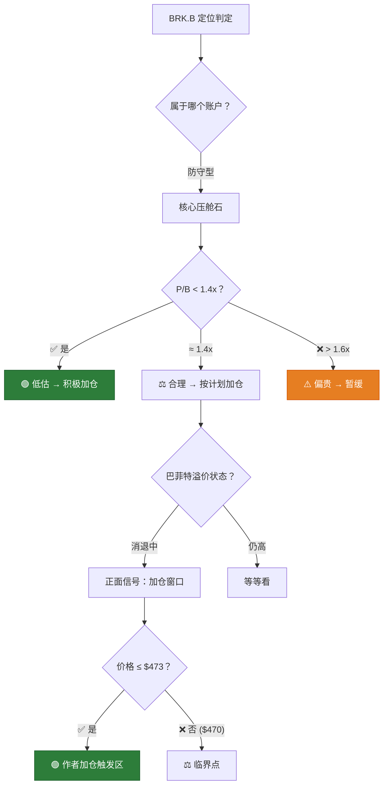

# BRK.B 深度研判 — 金渐成视角

> ⚠️ 以上仅为个人看法，不构成投资建议。投资有风险，入市需谨慎。
> 本分析基于"金渐成"投资哲学框架的逻辑推演，所有数据截至 2026年4月24日。

---

## 第一步：Fact Check（实时数据校验）

### 核心财务指标

| 指标 | 数值 | 来源 / 备注 |
|---|---|---|
| **BRK.B 股价** | ~$470.55 | Robinhood / MacroTrends (2026-04-23) |
| **BRK.A 股价** | ~$705,825 | 1 A股 = 1,500 B股 |
| **市值** | ~$1.07万亿 | MarketBeat |
| **现金及短期投资** | **$3,733亿** | 2025年末年报（公司历史最高） |
| **FY2025 运营利润** | $444.86亿 | BRK年报 (2026-02-28发布) |
| **FY2024 运营利润** | $474.37亿 | 同比下降 -6.2% |
| **每股账面价值 (A股)** | **$498,823** | 2025年末年报 |
| **P/B Ratio** | **~1.41x** | GuruFocus (2026-04-22) |
| **BRK.B 对应账面价值** | ~$332.5 | $498,823 / 1,500 |
| **Q1 FY2026 财报日** | **2026年5月初** (预计) | TipRanks |

### 持仓集中度（2025年末 13F 披露）

| 排名 | 持仓 | 占公开股票组合比重 | 价值（约） |
|---|---|---|---|
| 1 | **苹果 (AAPL)** | **~23%** | ~$620亿 |
| 2 | **美国运通 (AXP)** | ~20.5% | ~$551亿 |
| 3 | **美国银行 (BAC)** | ~10.4% | ~$280亿 |
| 4 | **可口可乐 (KO)** | ~10.2% | ~$274亿 |
| 5 | **雪佛龙 (CVX)** | ~7.2% | ~$194亿 |
| **Top 5 合计** | — | **~71.3%** | ~$1,919亿 |
| **Top 10 合计** | — | **~88%** | — |

> [!NOTE]
> **关键数据解读**：
> - 现金储备 $3,733亿 ≈ BRK 总市值的 **35%**。相当于手握 "1/3个自己" 的现金。
> - P/B 1.41x，历史中位数约 1.4-1.5x，处于合理区间中部。
> - 2025年运营利润同比微降 6.2%，主要受保险承保利润波动影响，投资收益仍稳健。
> - 苹果占比从巅峰 ~50% 主动削减至 23%，回收大量现金。

### BRK 特殊估值体系

> [!IMPORTANT]
> 伯克希尔不适用 PE/PEG 等常规成长股估值框架。作为"类保险+控股集团"，**P/B 是核心锚定指标**，辅以"运营利润增速"和"现金储备/市值比"。

| 估值维度 | 当前值 | 历史区间 | 判定 |
|---|---|---|---|
| P/B Ratio | **1.41x** | 1.1x-1.7x (5年) | ⚖️ 中位 |
| 现金/市值比 | **~35%** | 15-35% (5年) | ⚠️ 历史最高 |
| 运营利润增速 | **-6.2%** | -10% ~ +20% | ⚖️ 偏弱 |
| 2025 BV增长率 | **+10.5%** | 5-15% | ✅ 健康 |

---

## 第二步：Logic Mapping（金渐成逻辑模型提炼）

### 逻辑标准 #1：BRK = 防守型账户的"压舱石"

> **原文**（2026-01-17）：
> *"防守型账户形成以美债为核心，中间最厚实的部分是伯克希尔（现金要加仓），外层是可口可乐、强生、SCHD等高股息个股的架构。"*
> — [26-01](file:///Users/johnny/Documents/jjc-money/26year/26-01.md#L1829)

**关键词**：**"中间最厚实的部分"** — BRK在作者防守体系中，定位仅次于美债，高于所有其他防守型个股。

### 逻辑标准 #2：创富→守富资产链条中的核心"守"

> **原文**（2025-10-05）：
> *"改变未来的科技龙头股，以及不被未来改变的消费/避险股。"*
> *"科技龙头股等赚到的高收益，陆续套现，转向攻守均衡偏'守'的产品。"*
> *"'创富'阶段完成并继续的同时，还做好未来的'守富'。"*
> — [2025-10](file:///Users/johnny/Documents/jjc-money/22-25year/2025-10(共22篇).md#L320-L331)

> **原文**（2025-10-01）：
> *"赚到了钱，还要克服人性的贪，把钱守住。富得很稳定，是优点。"*
> *"这是风险控制和资产轮动的一种思路，过去的老钱家族很有效印证过的一种路径。"*
> — [2025-10](file:///Users/johnny/Documents/jjc-money/22-25year/2025-10(共22篇).md#L20-L26)

### 逻辑标准 #3：巴菲特溢价消退 = 买入窗口

> **原文**（2025-11-03）：
> *"巴菲特退位、伯克希尔巨额现金在手导致基本踩空这一轮科技股牛市（只持有苹果），已经让伯克希尔的溢价率在消退，这是好事...巴菲特年事已高，随时可能故去，到时市场又会有一波下跌。"*
> *"我会按原计划在450以下的几个节点重点加仓买入，长期持有。"*
> — [2025-11](file:///Users/johnny/Documents/jjc-money/22-25year/2025-11(共9篇).md#L53-L56)

> **原文**（2025-11-03 回复）：
> *"巴菲特的溢价率开始消退了。我希望它再跌，不过从财报来看，有点难度。耐心等吧。"*
> — [2025-11](file:///Users/johnny/Documents/jjc-money/22-25year/2025-11(共9篇).md#L270)

> **原文**（2025-08-07 回复）：
> *"我是68万美元以内会小买，巴菲特去世会砸个小坑，有机会再买点。中长期持有，还是合适的。"*
> — [2025-08](file:///Users/johnny/Documents/jjc-money/22-25year/2025-08(共9篇).md#L675)

### 逻辑标准 #4：2026年实际操作节点 — 极其详细

> **原文**（2026-01-29）：
> *"伯克希尔B大跌，至473美元，我分四档账户批量设定了买入，后面跌下去还设有四个买入节点设置。"*
> *"防守账户里重点加仓的主要是伯克希尔、SCHD、可口可乐...目标是加到仓位占比的10-12%左右。"*
> — [26-01](file:///Users/johnny/Documents/jjc-money/26year/26-01.md#L4381-L4383)

> **原文**（2026-01-27）：
> *"伯克希尔跌得傻，如果它进473这个价格，我就准备开始加仓了...伯克希尔目前占比太低，A类只有A股，B类不足4.5万股，两个都需要加仓，加仓重点放在455美元以下。"*
> — [26-01](file:///Users/johnny/Documents/jjc-money/26year/26-01.md#L2992-L2996)

> **原文**（2026-02-22）：
> *"防守型账户中，美债+美债ETF占比突破65%，后续我准备把伯克希尔的仓位占比提升到10~15%。"*
> *"伯克希尔加仓主要在455美元以下，一共4个加仓区间，如果都能触发，那有机会买够计划的仓位。"*
> — [26-02](file:///Users/johnny/Documents/jjc-money/26year/26-02月.md#L2525-L2376)

> **原文**（2026-02 回复）：
> *"伯克希尔472-474之间是一个很密集的支撑点，再往下就是455，然后423好像。"*
> — [26-02](file:///Users/johnny/Documents/jjc-money/26year/26-02月.md#L784)

> **原文**（2026-03-21）：
> *"伯克希尔再跌到472美元左右，再买点，主要看455及以下几个节点，逐步加仓。"*
> — [2026-03](file:///Users/johnny/Documents/jjc-money/26year/2026-03.md#L630)

### 逻辑标准 #5："银行股替代论" — BRK一箭双雕

> **原文**（2026-02 回复）：
> *"防守型，我个人的情况是美债+相关ETF+伯克希尔+SCHD+可口可乐+强生，就足够了，甚至后面两个都可以去掉。银行股不太想拿，不感冒，而且伯克希尔已经持有银行股。"*
> — [26-02](file:///Users/johnny/Documents/jjc-money/26year/26-02月.md#L2651)

### 综合逻辑模型图



---

## 第三步：Synthesis（数据代入模型 → 定性判断）

### 逐项校验

#### ✅ 校验 1：防守型资产定位

| 维度 | 作者标准 | BRK 实测 | 判定 |
|---|---|---|---|
| 资产类型 | "不被未来改变" | ✅ 保险+控股集团+现金堡垒 | ✅ 完美契合 |
| 在防守体系地位 | "中间最厚实" | 当前占防守账户 ~8.2% | ⚠️ 未达目标(10-15%) |
| 可替代性 | — | "银行股不拿，BRK已持有" | ✅ 一箭双雕 |
| 长期持有意愿 | "长期持有" | ✅ 只买不卖 | ✅ |

→ **BRK 是作者防守体系中不可替代的核心资产，且当前配置比例尚未达标，仍有增配空间。**

#### ✅ 校验 2：P/B 估值区间

```
当前 P/B = 1.41x
5年范围  = 1.1x - 1.7x
中位数   ≈ 1.4x
巴菲特回购线（历史）≈ 1.2x-1.3x

判定：1.41x ≈ 历史中位数，属 "合理偏中" 区间
```

> [!TIP]
> 巴菲特在 P/B < 1.2x 时曾大规模回购，但近期已暂停回购。P/B 1.41x 虽不是"便宜"，但远非"昂贵"。作者自己的操作表明，他在 $473（P/B ~1.42x）时已开始加仓，说明他个人对这一估值水平是接受的。

→ **P/B 处于合理区间，不贵不便宜，属于作者"可以买"的范围。**

#### ⚠️ 校验 3：巨额现金的双面性

```
现金 $3,733亿 / 市值 $10,700亿 ≈ 35%

正面解读（作者立场）：
  ✅ "巨额现金在手" = 危机时的弹药库
  ✅ 现金+美债组合 = 无风险收益 ~4.5-5%，年化 $168-187亿
  ✅ 现金流充裕 = 不受市场波动影响 = "守富"利器

负面解读（市场质疑）：
  ⚠️ "基本踩空这一轮科技股牛市"（作者原话）
  ⚠️ 大量现金拖累整体ROE
  ⚠️ 市场正因此压低估值（溢价消退）
```

> **作者态度**：*"这是好事"* — 作者认为溢价消退 = 买入机会。

→ **现金多是"守富"的核心优势。市场嫌它现金太多，恰好给了作者期望的买入窗口。**

#### ⚠️ 校验 4：作者价位体系对照

| 作者操作/设置 | 价格 | 与当前 $470 偏差 | 状态 |
|---|---|---|---|
| 第一档加仓触发 | **$473** | 当前低于 **-0.6%** | ✅ 已触发/临界 |
| 密集支撑区 | **$472-$474** | 当前价格在区间内 | ✅ 支撑区 |
| 第二档加仓节点 | **$455** | 当前高于 **+3.3%** | ❌ 未达 |
| 第三档加仓节点 | **$437** (推测) | 当前高于 **+7.5%** | ❌ 未达 |
| 第四档加仓节点 | **$413-$423** (推测) | 当前高于 **+11-14%** | ❌ 未达 |
| A股买入门槛 | **<$680,000** | 当前A股 ~$705K | ⚠️ 偏高 |

→ **当前 $470 恰好在作者第一档加仓触发区（$472-$474）——他已经开始买了。后续更甜蜜的节点在 $455 以下。**

#### ✅ 校验 5："守富哲学" 完整链路

```
作者的资产大厦结构：

┌────────────────────────────────────────────────────────┐
│  进取型 (40%) — 科技巨头 "印钞机"                        │
│  英伟达48% + 谷歌18% + 微软9% + 台积电8% + ...          │
│  → 赚高收益 → 做负成本 → 利润套现 ↓                     │
├────────────────────────────────────────────────────────┤
│  稳健型 (20%) — 宽基ETF + 消费 + 医药                    │
│  QQQ/SPY 56% + 沃尔玛/Costco + 礼来/联合健康             │
│  → 中间缓冲层                                           │
├────────────────────────────────────────────────────────┤
│  防守型 (40%) — "守富堡垒"                               │
│  美债 65% → BRK 10-15%（目标）→ KO/JNJ/SCHD 20%         │
│  → 接住从上面流下来的利润，稳稳守住                        │
│  → "进攻赢得球迷，防守赢得冠军"                           │
└────────────────────────────────────────────────────────┘

                     💰 现金流方向：上 → 下
                     🛡️ 安全边际方向：下 → 上
```

> **原文**（2026-02-27）：
> *"赚多少钱是运气，守下多少钱是能力；打江山难，守江山更难。"*
> *"保值永远优先于增长，防御永远＞进攻。"*
> *"巴菲特和李嘉诚是其中的佼佼者。"*
> — [26-02](file:///Users/johnny/Documents/jjc-money/26year/26-02月.md#L2729-L2753)

---

## 🎯 总判定：BRK 作为"守富"资产，目前性价比如何？

### 一句话结论

> **性价比 = "合理" — P/B 1.41x处于历史中位，$3,733亿现金提供极强的安全垫，巴菲特溢价消退正在制造买入窗口。当前$470恰在作者第一档加仓区，是"守富"阶段资产的合理配置时点，但非最甜蜜区（$455以下）。**

### 用金渐成的话来说

> *"进攻赢得球迷，防守赢得冠军。"*
> — 标志性语录

BRK 就像一座**城堡**——它不会给你英伟达那样肾上腺素飙升的进攻快感，但当市场风暴来临时，它是你能安心待着的地方。$3,733亿现金 = 城堡里堆满了粮草弹药，就算围困三年也饿不死。

城堡现在的"门票价格"（P/B 1.41x）既不打折也不加价，作者已经开始往里搬粮了。

---

## 📐 2-3-3-2 操作建议

### 情景 A：防守型账户建仓/加仓（作者自身情景）

```
操作 = 分批加仓 · 越跌越买 · 长期持有
═══════════════════════════════════════
📌 加仓计划（2-3-3-2）：
   Phase 1 (20%): $473-$470 → ✅ "试探性建仓"（作者已触发）
   Phase 2 (30%): $455 → 密集支撑位确认
   Phase 3 (30%): $437 → 深度回调
   Phase 4 (20%): $413-$423 → 终极加仓 / 巴菲特去世砸坑

📌 仓位目标：
   · 防守型账户占比 → 10-15%
   · 总账户占比 → ~8%
   · B类目标持仓 → 4.5万股+

📌 特殊催化事件：
   · 巴菲特去世 → "砸个小坑" → 终极加仓机会
   · 市场大跌 → BRK现金可抄底 → 长期利好
```

### 情景 B：新手配置防守型资产

```
操作 = 核心配置 · 简单持有 · 不做波段
═══════════════════════════════════════
📌 作者对读者的建议原话：
   "买完了就扔着，很久才看一眼账户的类型...
    反而很适合买标普500ETF和纳指100ETF，还有伯克希尔这类个股。"

📌 建议配比（防守型组合参考）：
   美债/美债ETF    → 60-65%
   伯克希尔        → 10-15%
   可口可乐/SCHD   → 15-20%
   现金储备         → 5-10%

📌 注意事项：
   ⚠️ 不要追高 — 当前$470是合理价，不是便宜价
   ⚠️ 不做波段 — BRK波动小，做T不划算
   ⚠️ 长期持有 — 作者定义为"只买不卖"的标的
```

### 情景 C：已有仓位，等更好价位

```
操作 = 持有 · 等回调 · 设好节点
═══════════════════════════════════════
📌 参考作者节点设置：
   $455 → 加大量
   $423 → 继续加大
   $413以下 → 最后一批

📌 不建议减仓：
   BRK在作者体系中 = "只买不卖"
   当前P/B 1.41x 不构成减仓理由
   巨额现金 = 内在价值的安全垫
```

---

## ⏰ 关键时间节点

| 日期 | 事件 | 影响 |
|---|---|---|
| **2026年5月初** | BRK Q1 FY2026 财报 | 验证运营利润企稳、现金部署计划 |
| **2026年5月3日**（预计） | 伯克希尔年度股东大会 | Greg Abel首次独立主持，接班过渡关键 |
| **不确定** | 巴菲特健康/离世 | 作者明确：会砸坑 → 终极买入机会 |
| 持续 | 美联储利率政策 | 高利率 → BRK现金收益更高 → 利好 |
| 持续 | 市场整体估值 | 市场越贵 → BRK越不动 → 现金越有价值 |

---

## 🔑 风险清单

| 风险 | 严重度 | 作者态度 |
|---|---|---|
| **巴菲特去世/退位** | ⚠️ 短期冲击 | "会砸个小坑"→ 视为机会不是风险 |
| **接班人能力不确定** | ⚠️ 中期 | "还需要再观察，看能走多远" |
| **现金过多拖累回报** | ⚠️ 已发生 | "踩空科技牛市"→ 但作者认为是"好事" |
| **保险承保波动** | ⚖️ 周期性 | 正常波动，不影响长期逻辑 |
| **错过AI浪潮** | ⚖️ 结构性 | 只持有苹果，不参与AI → 溢价消退 |

### 作者对风险的核心判断

> *"还需要再观察观察，目前市场的问题是，这个接班人离开了巴菲特的这位'顾问'，能独立掌舵带伯克希尔走多远。"*
> — [2025-08](file:///Users/johnny/Documents/jjc-money/22-25year/2025-08(共9篇).md#L995)

> *"伯克希尔过去涨得有点凶，今年适当慢点也正常，更何况它还要面临接盘人水平考验、巴菲特离开等等问题。"*
> — [2025-07](file:///Users/johnny/Documents/jjc-money/22-25year/2025-07(共7篇).md#L830-L831)

→ **作者完全了解风险，但仍将 BRK 定位为防守核心 — 说明他认为 BRK 的"守富"功能远大于这些风险。**

---

## 💡 BRK vs NVDA：金渐成体系中的"矛与盾"

| 维度 | NVDA（矛） | BRK（盾） |
|---|---|---|
| **账户类型** | 进取型 | 防守型 |
| **仓位占比** | ~48% 进取账户 | 目标10-15% 防守账户 |
| **操作风格** | 高频做T、减仓/加仓 | 只买不卖 |
| **核心指标** | Forward PE / PEG | P/B / 现金储备 |
| **波动性** | 极高 | 极低 |
| **心理作用** | 肾上腺素 + 纪律 | 安心 + 睡好觉 |
| **作者原话** | "印钞机" | "压舱石" |
| **资金流向** | 利润 → 流出 ↓ | ← 接住利润 |

> *"用科技股做'印钞机'，不断赚到收益，并转向配置能守住财富的资产品类。"*
> — [2025-10](file:///Users/johnny/Documents/jjc-money/22-25year/2025-10(共22篇).md#L328)

---

> 以上仅为个人看法，不构成投资建议。投资有风险，入市需谨慎。
> "进攻赢得球迷，防守赢得冠军。" — 金渐成
