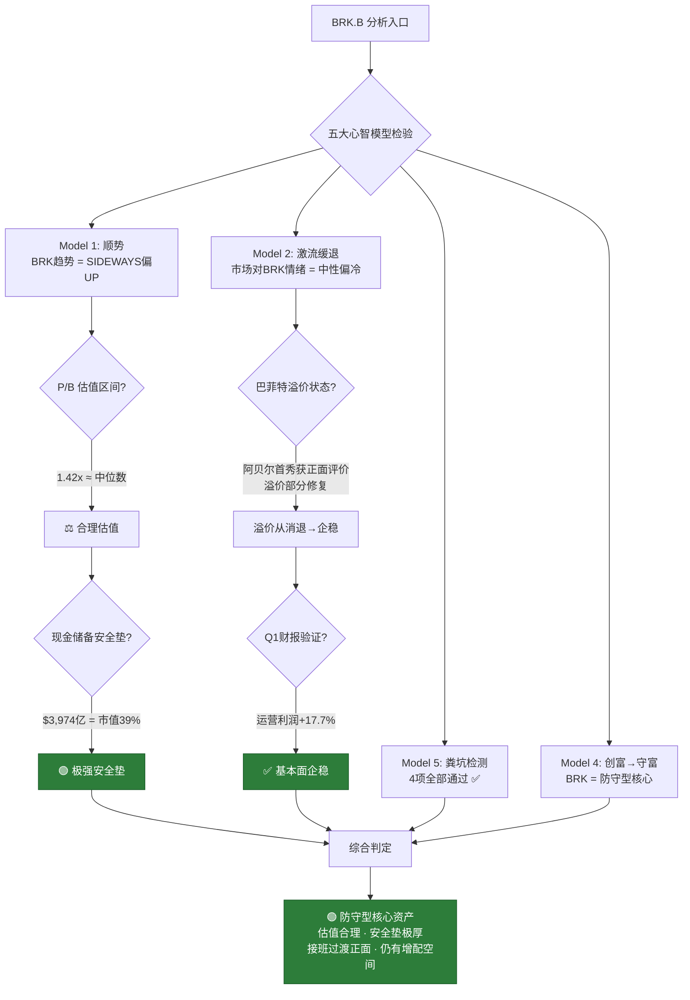

# 伯克希尔·哈撒韦 (BRK) 深度研判 — 金渐成视角

> ⚠️ 以下为基于"金渐成"投资哲学框架的历史逻辑推演与实时数据结合分析。
> 本分析数据截至 **2026年5月3日**，包含 Q1 FY2026 最新财报（2026-05-02 发布）及 2026 年度股东大会信息。

> **时间框架**：年度展望 + 战术操作
> **本地证据**：`26year/2026-04.md`、`22-25year/2025-11(共9篇).md`、`22-25year/25-12月.md`、`22-25year/2025-07(共7篇).md`、`22-25year/2025-08(共9篇).md`、`22-25year/2025-10(共22篇).md`

---

## 第一章：实时数据校验（Fact Check）

### 1.1 核心财务指标

| 指标 | 数值 | 来源 / 备注 |
|---|---|---|
| **BRK.B 股价** | **~$473.75** | MarketBeat (2026-05-03) |
| **BRK.A 股价** | **~$710,625** | 1 A股 = 1,500 B股 |
| **市值** | **~$1.02-1.03万亿** | MarketBeat / FinanceCharts |
| **Q1 FY2026 运营利润** | **$113.46亿** | BRK 财报 (2026-05-02 发布) |
| **Q1 FY2025 运营利润** | $96.41亿 | 同比增长 **+17.7%** |
| **FY2025 全年运营利润** | $444.86亿 | BRK年报 (2026-02-28) |
| **现金及短期投资** | **$3,974亿** | Q1 FY2026 财报 (**历史新高**) |
| **每股账面价值 (A股)** | **~$498,823** | 2025年末年报 |
| **P/B Ratio** | **~1.42-1.43x** | MarketBeat (2026-05-03) |
| **BRK.B 对应账面价值** | ~$332.5 | $498,823 / 1,500 |

### 1.2 Q1 2026 财报关键变化

> [!IMPORTANT]
> **现金储备再创历史新高**：从 2025 年末的 $3,733亿 → Q1 2026 末的 **$3,974亿**，单季增加 $241亿。
> **运营利润同比增长 17.7%**：扭转了 FY2025 全年同比下降 6.2% 的颓势，保险承保利润强势回暖。

| 对比维度 | FY2025 全年 | Q1 FY2026 | 趋势 |
|---|---|---|---|
| 运营利润增速 | -6.2% (同比) | **+17.7%** (同比) | 📈 强劲反弹 |
| 现金储备 | $3,733亿 | **$3,974亿** | 📈 再创新高 |
| 现金/市值比 | ~35% | **~39%** | 📈 继续攀升 |
| P/B | ~1.41x | **~1.42x** | ⚖️ 基本持平 |

### 1.3 持仓集中度（2025年末 13F 披露）

| 排名 | 持仓 | 占公开股票组合比重 | 价值（约） |
|---|---|---|---|
| 1 | **苹果 (AAPL)** | **~23%** | ~$620亿 |
| 2 | **美国运通 (AXP)** | ~20.5% | ~$551亿 |
| 3 | **美国银行 (BAC)** | ~10.4% | ~$280亿 |
| 4 | **可口可乐 (KO)** | ~10.2% | ~$274亿 |
| 5 | **雪佛龙 (CVX)** | ~7.2% | ~$194亿 |
| **Top 5 合计** | — | **~71.3%** | ~$1,919亿 |

> [!NOTE]
> 2026 股东大会上，阿贝尔重新确认"核心四巨头"：苹果、美国运通、穆迪、可口可乐。
> 苹果占比从巅峰 ~50% 主动削减至 23%，回收大量现金 — 这与作者"负成本 → 守富"的操作逻辑高度一致。

### 1.4 BRK 特殊估值体系

> [!IMPORTANT]
> 伯克希尔不适用 PE/PEG 等常规成长股估值框架。作为"类保险+控股集团"，**P/B 是核心锚定指标**，辅以"运营利润增速"和"现金储备/市值比"。

| 估值维度 | 当前值 | 历史区间 | 判定 |
|---|---|---|---|
| P/B Ratio | **1.42x** | 1.1x-1.7x (5年) | ⚖️ 中位偏下 |
| 现金/市值比 | **~39%** | 15-35% (5年) | ⚠️ **突破历史最高** |
| Q1运营利润增速 | **+17.7%** | -10% ~ +20% | ✅ 强劲 |
| 2025 BV增长率 | **+10.5%** | 5-15% | ✅ 健康 |

### 1.5 2026 股东大会关键信号 (2026-05-02)

| 信号 | 内容 | 对投资者意义 |
|---|---|---|
| **阿贝尔首次独立主持** | 巴菲特卸任CEO，仍任董事长并出席 | 接班过渡进入"实战验证"阶段 |
| **运营风格转变** | 阿贝尔把子公司负责人请上台回答问题 | 从"一人秀"转向"体系化运营" |
| **AI态度谨慎** | "不会为了AI而AI"，仅在有实质价值时部署 | 与作者"看不懂就不碰"理念契合 |
| **资本纪律不变** | $3,974亿现金不急于投出，"不会被迫投入次优机会" | 防守哲学的延续 |
| **巴菲特评价** | "阿贝尔做了我以前做的一切——甚至更多——每个方面都做得更好" | 信任背书，降低接班风险溢价 |

---

## 第二章：金渐成逻辑模型提炼（Logic Mapping）

### 2.1 逻辑标准 #1：BRK = 防守型账户的"压舱石"

> **原文**（2026-04-07）：
> *"我把原来用于现金管理的BIL的仓位置换成伯克希尔，伯克希尔在防守型账户中的持仓占比目标是30%..."*
> — [2026-04](file:///Users/johnny/Documents/jjc-money/26year/2026-04.md#L22)

> **原文**（2026-04-07）：
> *"买入一股472美元的伯克希尔能间接持有165美元左右的现金。"*
> *"如果股市下跌有一些特别好的资产浮现，而我的能力和精力不足以挖掘或发现它们，伯克希尔出手买入，等于我也抄底到这类优质资产。"*
> — [2026-04](file:///Users/johnny/Documents/jjc-money/26year/2026-04.md#L16-L20)

**核心洞见**：作者把BRK定位从"防守个股"升级为**"带着氧气瓶上战场的现金替代品"** — 用BRK取代BIL（短期国债ETF），让巴菲特/阿贝尔帮他配置现金。

### 2.2 逻辑标准 #2：创富→守富链条中的核心"守"

> **原文**（2025-10-05）：
> *"改变未来的科技龙头股，以及不被未来改变的消费/避险股。"*
> *"科技龙头股等赚到的高收益，陆续套现，转向攻守均衡偏'守'的产品。"*
> — [2025-10](file:///Users/johnny/Documents/jjc-money/22-25year/2025-10(共22篇).md#L320-L331)

> **原文**（2025-12）：
> *"我今年做得最好最正确的，是防守型账户的构建，其中伯克希尔是很重要的一个股。"*
> — [25-12月](file:///Users/johnny/Documents/jjc-money/22-25year/25-12月.md#L124)

> **原文**（2025-12）：
> *"伯克希尔A，我持有五六年了，只在之前77.5万美元时减仓过1股，其他的都拿着，准备长期拿着。伯克希尔B 持有至今没减仓过。"*
> — [25-12月](file:///Users/johnny/Documents/jjc-money/22-25year/25-12月.md#L153)

### 2.3 逻辑标准 #3：巴菲特溢价消退 = 买入窗口

> **原文**（2025-11-03）：
> *"巴菲特退位、伯克希尔巨额现金在手导致基本踩空这一轮科技股牛市（只持有苹果），已经让伯克希尔的溢价率在消退，这是好事...巴菲特年事已高，随时可能故去，到时市场又会有一波下跌。"*
> *"我会按原计划在450以下的几个节点重点加仓买入，长期持有。"*
> — [2025-11](file:///Users/johnny/Documents/jjc-money/22-25year/2025-11(共9篇).md#L53-L56)

> **原文**（2025-11-03 回复）：
> *"资金体量摆在那，本身就意味着投资具有巨大的优势，而且伯克希尔自身的模式，哪怕选上来的人能力一般，也能做得很不错。更何况选上来的人水平很不错。"*
> — [2025-11](file:///Users/johnny/Documents/jjc-money/22-25year/2025-11(共9篇).md#L137-L138)

### 2.4 逻辑标准 #4：2026年作者实际操作与持仓结构

> **原文**（2026-04-10）：
> *"防守型账户，美债及相关ETF的仓位占比65%，伯克希尔占比13.5%，可口可乐、强生、SCHD、VISA占比约21.3%...主要用于吃派息分红+防守，每个月生的钱可以构筑现金流。"*
> — [2026-04](file:///Users/johnny/Documents/jjc-money/26year/2026-04.md#L389)

> **原文**（2026-04-12）：
> *"6.5成是美债及相关ETF，1.4成是伯克希尔，余下的为可口可乐/强生/SCHD等适合防守的个股。这个账户每年的派息分红构筑出一条新的现金流，用于科技股和宽基指数在机会出现时加仓用。"*
> — [2026-04](file:///Users/johnny/Documents/jjc-money/26year/2026-04.md#L666)

### 2.5 逻辑标准 #5：BRK = 复合型防守引擎

> **原文**（2026-04-25）：
> *"伯克希尔主要是用于防守，市场出现机会时，由它来负责把握，毕竟它这个组合体很适合做防守：*
> *保险+公用事业能源+铁路+制造/零售/服务+巨额投资组合+3700多亿美元的天量现金/类现金。"*
> — [2026-04](file:///Users/johnny/Documents/jjc-money/26year/2026-04.md#L2388-L2390)

> **原文**（2026-04-25）：
> *"目前伯克希尔市值在1万亿美元左右，不贵也不便宜：*
> *现金/类现金约3730亿+股票等投资约3180亿+铁路约850亿+能源约680亿+制造/零售/服务约1800亿+保险承保约950亿。"*
> — [2026-04](file:///Users/johnny/Documents/jjc-money/26year/2026-04.md#L2392-L2394)

### 2.6 逻辑标准 #6："银行股替代论" — BRK一箭双雕

> **原文**（2026-02 回复）：
> *"防守型，我个人的情况是美债+相关ETF+伯克希尔+SCHD+可口可乐+强生，就足够了，甚至后面两个都可以去掉。银行股不太想拿，不感冒，而且伯克希尔已经持有银行股。"*
> — [26-02](file:///Users/johnny/Documents/jjc-money/26year/26-02月.md#L2651)

### 2.7 逻辑标准 #7：作者价位体系（2025-2026 全时间线）

| 时间 | 原文摘要 | 价位锚点 |
|---|---|---|
| 2025-07 | "68万以内才会考虑" (A股) | A股 < $680,000 |
| 2025-08 | "440-445美元可以考虑买入长期持有" (B股) | B股 $440-$445 |
| 2025-08 | "巴菲特去世会砸个小坑，有机会再买点" | 黑天鹅 = 终极买入 |
| 2025-11 | "持有4股A类，还有小两万股B类" | 作者持仓量级 |
| 2025-11 | "A类低于68(万)，B类低于450都会买入" | B股 < $450 |
| 2025-12 | "近期正把部分科技仓位挪到伯克希尔B" | BIL→BRK 仓位切换 |
| 2026-01 | "伯克希尔B大跌至473，分四档批量设定买入" | 第一档 $473 |
| 2026-01 | "加仓重点放在455美元以下" | 第二档 $455 |
| 2026-02 | "伯克希尔472-474之间是密集支撑点，再往下就是455，然后423" | 三档梯度 |
| 2026-03 | "顺利买入470的伯克希尔" | ✅ 触发 |
| 2026-03 | "伯克希尔455的买入设置有望触发" | 等待中 |
| 2026-03 | "让它从原计划占防守型账户的12%提升到占总量的8%左右" | 目标比例上调 |
| 2026-04 | "472左右买了一点，觉得挺划算" | ✅ 再次触发 |
| 2026-04 | "伯克希尔在防守型账户中的持仓占比目标是30%" | **最新目标：30%** |
| 2026-04 | "伯克希尔占比13.5%" → "希望能再下跌3%，进入另一个加仓节点" | 当前vs目标仍有缺口 |

---

## 第三章：综合逻辑模型图



---

## 第四章：数据代入模型 → 定性判断（Synthesis）

### 4.1 校验 1：防守型资产定位

| 维度 | 作者标准 | BRK 实测 | 判定 |
|---|---|---|---|
| 资产类型 | "不被未来改变" | ✅ 保险+控股集团+现金堡垒 | ✅ 完美契合 |
| 在防守体系地位 | "中间最厚实" → 目标30% | 当前占防守账户 ~13.5% | ⚠️ 仍有大幅增配空间 |
| 可替代性 | — | "银行股不拿，BRK已持有" | ✅ 一箭双雕 |
| 现金替代功能 | BIL仓位→BRK | ✅ "买入一股间接持有165美元现金" | ✅ 升级版现金管理 |
| 长期持有意愿 | "只买不卖" | ✅ A股持有五六年，B股从未减仓 | ✅ |

→ **BRK 是作者防守体系中不可替代的核心资产。从12%目标上调至30%，说明作者在加大防守力度的过程中，BRK的战略地位在持续提升。**

### 4.2 校验 2：P/B 估值区间

```
当前 P/B = 1.42x
5年范围  = 1.1x - 1.7x
中位数   ≈ 1.4x
巴菲特回购线（历史）≈ 1.2x-1.3x

Q1 2026 BV增长预估：
  2025年末 BV = $498,823/A股
  Q1运营利润 $113亿 + 投资收益（估）→ BV可能已上升至 ~$510,000+
  → 实际 P/B 可能已降至 ~1.39x

判定：1.42x ≈ 历史中位数，属 "合理偏中" 区间
      如果算入Q1 BV增长，可能已略低于中位数
```

> [!TIP]
> Q1 运营利润同比暴增 17.7%，意味着 BV 在加速增长。P/B 1.42x 是基于 2025 年末 BV 计算的，
> 如果用 Q1 末的 BV 重新计算，实际 P/B 可能已经降到 ~1.39x — 进入合理偏低区间。

### 4.3 校验 3：巨额现金的战略价值（升级版）

```
现金 $3,974亿 / 市值 $10,300亿 ≈ 39%

🔺 Q1 2026 新变化：现金占比从35%提升至39%
  → 巴菲特/阿贝尔仍在"囤粮"而非"出击"
  → 按当前利率，年化现金收益 ~$179-199亿（无风险）

正面解读（作者立场）：
  ✅ "巨额现金在手" = 危机时的弹药库
  ✅ 现金+美债组合 = 无风险收益 ~4.5-5%
  ✅ 阿贝尔股东大会明确："不会被迫投入次优机会"
  ✅ "买伯克希尔就算都不涨，也值得" — 作者原话
  ✅ 市场每次大跌，BRK都有可能出手抄底 = 投资者的"外包抄底团队"

负面解读（市场质疑）：
  ⚠️ 现金占比创新高 → 是否过于保守？
  ⚠️ 大量现金拖累整体ROE
  ⚠️ 完全不参与AI → 错过最大增长引擎
```

> **作者对质疑的回应**：
> *"都在说巴菲特的现金储备创新高，美股的风险即将来临，但市场很少有提及他的持仓占比近7成。"*
> → 作者认为市场忽视了BRK持仓部分的价值，只盯着现金。

### 4.4 校验 4：作者价位体系对照（2026-05-03 更新版）

| 作者操作/设置 | 价格 | 与当前 $473.75 偏差 | 状态 |
|---|---|---|---|
| 第一档加仓触发 | **$473** | 当前高于 **+0.16%** | ✅ 已触发 |
| 密集支撑区 | **$470-$474** | 当前价格在区间内 | ✅ 支撑区 |
| 第二档加仓节点 | **$455** | 当前高于 **+4.1%** | ❌ 未达 |
| 第三档加仓节点 | **$423** (推测) | 当前高于 **+12%** | ❌ 未达 |
| A股买入门槛 | **<$680,000** | 当前A股 ~$710K | ⚠️ 偏高 |
| 防守账户占比目标 | **30%** | 当前 ~13.5% | ⚠️ 仍有16.5%缺口 |

→ **当前 $473.75 恰好在作者第一档加仓触发区 — 他已经在买。后续更甜蜜的节点在 $455 以下。但从仓位占比看（13.5% vs 目标30%），作者仍有大量增配需求。**

### 4.5 校验 5：五大心智模型逐项过堂

| 模型 | BRK检验结果 | 详细 |
|---|---|---|
| **Model 1 · 顺势** | ⚖️ 中性偏UP | BRK长期趋势上行，短期震荡整理 |
| **Model 2 · 激流缓退** | 🟢 "无人问津" | 市场注意力全在AI/科技股，BRK相对冷门 |
| **Model 3 · 负成本** | ⚖️ 不适用 | BRK定位"只买不卖"，不做负成本操作 |
| **Model 4 · 创富→守富** | 🟢 核心适用 | BRK = 守富层的压舱石，资金从进取型流入 |
| **Model 5 · 粪坑检测** | ✅ 全部通过 | 4项检测无一为"是" |

**粪坑检测明细**：

| 检测项 | BRK 情况 | 结果 |
|---|---|---|
| 行业 >12月下行趋势？ | ❌ 保险+控股集团稳定 | 通过 ✅ |
| 基本面恶化 Q-over-Q？ | ❌ Q1运营利润同比+17.7% | 通过 ✅ |
| 同行违约/退市？ | ❌ 无 | 通过 ✅ |
| 监管紧缩无缓解？ | ❌ 无 | 通过 ✅ |

---

## 第五章：2026 股东大会深度解读 — 阿贝尔时代的信号

### 5.1 对作者投资逻辑的验证

| 股东大会信号 | 作者之前的判断 | 验证结果 |
|---|---|---|
| 阿贝尔风格：务实、体系化 | "选上来的人水平很不错" | ✅ 超出预期 |
| $3,974亿现金不急于投出 | "现金像氧气，关键时刻能救命" | ✅ 完全一致 |
| AI态度谨慎 | "看不懂就不碰" | ✅ 哲学契合 |
| 巴菲特仍参与决策 | "还需要观察接班人能走多远" | ✅ 风险缓冲期 |
| 子公司负责人上台 | — | 🟢 新增正面信号：体系>个人 |

### 5.2 阿贝尔时代的核心评估

```
巴菲特评价："阿贝尔做了我以前做的一切——甚至更多——
           每个方面都做得更好。"

作者评价（2026-04-30 回复）：
  "巴菲特还是非常非常强的，只不过规模是复利的敌人，
   伯克希尔再要高增长比较不容易。"
  "阿贝尔时代，他如果独立拿出成绩来，
   巴菲特离席，影响就会很小。"

判定：
  ✅ 阿贝尔首秀正面，市场信心初步建立
  ⚠️ 但仍需 2-3 个季度的独立运营验证
  🟢 巴菲特仍在"顾问"角色，提供安全缓冲
```

---

## 第六章：操作框架

### 6.1 三账户体系中的精确定位

```
作者的资产大厦结构（2026-04 最新版）：

┌────────────────────────────────────────────────────────┐
│  进取型 (40%+) — 科技巨头 "印钞机"                       │
│  NVDA 46% + GOOGL 17.5% + MSFT 15.6% + ...            │
│  → 赚高收益 → 做负成本 → 利润套现 ↓                     │
├────────────────────────────────────────────────────────┤
│  稳健型 (17%) — 宽基ETF + 消费 + 医药                    │
│  QQQ/SPY 66% + WMT/COST/MCD + LLY/JNJ/UNH             │
│  → 中间缓冲层                                           │
├────────────────────────────────────────────────────────┤
│  防守型 (43%) — "守富堡垒"                               │
│  美债/ETF 65% → 【BRK 13.5%→目标30%】→ KO/JNJ/SCHD 21% │
│  → 接住从上面流下来的利润，稳稳守住                        │
│  → "进攻赢得球迷，防守赢得冠军"                           │
└────────────────────────────────────────────────────────┘

                     💰 资金流向：上 → 下，永不回流
                     🛡️ BRK = 防守层的"攻击型后卫"
```

### 6.2 操作建议 — 2-3-3-2 框架

#### 情景 A：防守型账户建仓/加仓

```
操作 = 分批加仓 · 越跌越买 · 长期持有
═══════════════════════════════════════
📌 加仓计划（2-3-3-2）：
   Phase 1 (20%): $473-$470 → ✅ 作者已触发
   Phase 2 (30%): $455 → 密集支撑位
   Phase 3 (30%): $437 → 深度回调
   Phase 4 (20%): $413-$423 → 终极加仓 / 巴菲特离席事件

📌 仓位目标（作者最新版）：
   · 防守型账户占比 → 30%（从12%大幅上调）
   · 总账户占比 → ~8%

📌 特殊催化事件：
   · 巴菲特离席 → "砸个小坑" → 终极加仓机会
   · 市场大跌 VIX>40 → BRK现金$3,974亿可抄底
   · 阿贝尔独立拿出成绩 → 溢价修复
```

#### 情景 B：新手配置防守型资产

```
操作 = 核心配置 · 简单持有 · 不做波段
═══════════════════════════════════════
📌 作者原话：
   "买完了就扔着，很久才看一眼账户的类型...
    反而很适合买标普500ETF和纳指100ETF，
    还有伯克希尔这类个股。"

📌 建议配比（防守型组合）：
   美债/美债ETF    → 55-65%
   伯克希尔        → 15-25%
   可口可乐/SCHD   → 15-20%
   现金储备         → 5-10%

📌 注意事项：
   ⚠️ 不要追高 — 当前$473是合理价，不是便宜价
   ⚠️ 不做波段 — BRK波动小，做T不划算
   ⚠️ 长期持有 — "只买不卖"
   ⚠️ 买B股即可 — A股门槛~$71万/股
```

---

## 第七章：风险清单与反方论点

### 7.1 风险矩阵

| 风险 | 严重度 | 作者态度 |
|---|---|---|
| **巴菲特离世** | ⚠️ 短期冲击大 | "会砸个小坑" → 视为终极买入机会 |
| **阿贝尔能力不确定** | ⚠️ 中期 | 首秀正面，仍需验证 |
| **现金过多拖累回报** | ⚠️ 已发生 | "踩空科技牛市"→ 但作者认为是"好事" |
| **错过AI浪潮** | ⚖️ 结构性 | 只持有苹果，不参与AI → 溢价消退 |
| **保险承保巨灾** | ⚖️ 周期性 | Q1已回暖，正常波动 |
| **回购暂停** | ⚖️ 信号性 | P/B高于回购线，不影响长期逻辑 |

### 7.2 反方最强论点

```
反方论点：
  "BRK 现金 $3,974亿，占市值39%。
   如果只是要持有现金/国债，为什么不直接买 BIL/SHV？
   省去 BRK 的控股折价。"

作者的回应逻辑：
  1. BRK 的现金不是静态的 — 它是"弹药"，会在市场恐慌时出击
  2. BRK 的运营业务提供额外的"免费期权"
  3. "如果我的能力和精力不足以挖掘优质资产，
      伯克希尔出手买入，等于我也抄底到这类优质资产"
  4. BIL 只给你无风险收益，BRK 给你"无风险收益 + 阿贝尔的眼光"

结论：BRK = BIL + 免费的"抄底看涨期权"
```

→ **作者完全了解风险，但仍将 BRK 防守目标从12%上调至30% — 说明他认为 BRK 的"守富"功能远大于这些风险。**

---

## 第八章：BRK vs NVDA — "矛与盾"

| 维度 | NVDA（矛） | BRK（盾） |
|---|---|---|
| **账户类型** | 进取型 | 防守型 |
| **仓位占比** | ~46% 进取账户 | 目标30% 防守账户 |
| **操作风格** | 高频做T、分批减仓/加仓 | **只买不卖** |
| **核心指标** | Forward PE / PEG | **P/B / 现金储备** |
| **波动性** | 极高 | 极低 |
| **心理作用** | 肾上腺素 + 纪律 | 安心 + 睡好觉 |
| **作者原话** | "印钞机" | "压舱石""带着氧气瓶上战场" |
| **资金流向** | 利润 → 流出 ↓ | ← 接住利润 |
| **适合人群** | 能盯盘、能承受高波动 | "买完扔着，很久才看一次" |

---

## 🎯 总判定

### 一句话结论

> **BRK 当前性价比 = "合理偏低" — P/B 1.42x（实际可能~1.39x）处于历史中位偏下，$3,974亿现金（创历史新高）提供市值39%的安全垫，Q1运营利润同比+17.7%扭转颓势，阿贝尔首秀获正面评价。作者正在积极增配，从12%目标上调至30%，当前$473在第一档加仓区。**

### 用金渐成的话来说

> *"进攻赢得球迷，防守赢得冠军。"*

BRK 就像一座**装满粮草弹药的城堡** — 城堡里有 $3,974亿 现金（能买下两个英伟达还有零头），有保险公司每天收保费，有铁路每天运货，有能源每天发电。

城墙上站着的大将军刚换了人（阿贝尔），但老帅（巴菲特）还坐在后面喝可乐看局势。第一仗（Q1财报+股东大会）打得漂亮：运营利润涨了17.7%，全场鼓掌。

城堡的"门票价格"（P/B 1.42x）既不打折也不加价。作者已经开始往里搬粮了，而且搬的速度越来越快 — 从占防守账户12%的目标，直接上调到30%。

**"现金像氧气，关键时刻能救命；伯克希尔像带着氧气瓶上战场。"**

### 关键时间节点

| 日期 | 事件 | 影响 |
|---|---|---|
| **2026-05-02** ✅ | Q1 FY2026 财报 + 股东大会 | 运营利润+17.7%，阿贝尔首秀正面 |
| **2026-08（预计）** | Q2 FY2026 财报 | 验证阿贝尔独立运营能力 |
| **不确定** | 巴菲特健康/离世 | "会砸坑" → 终极买入机会 |
| **持续** | 美联储利率政策 | 高利率 → BRK现金收益更高 → 利好 |
| **2026下半年** | 市场可能的深度回调 | VIX>40 → BRK可能出手抄底 → 长期利好 |

---

> 以上仅为个人看法，不构成投资建议。投资有风险，入市需谨慎。
> "进攻赢得球迷，防守赢得冠军。" — 金渐成
> "不赚最后一个铜板。" — 金渐成
> "富一世 > 富一时。" — 金渐成
