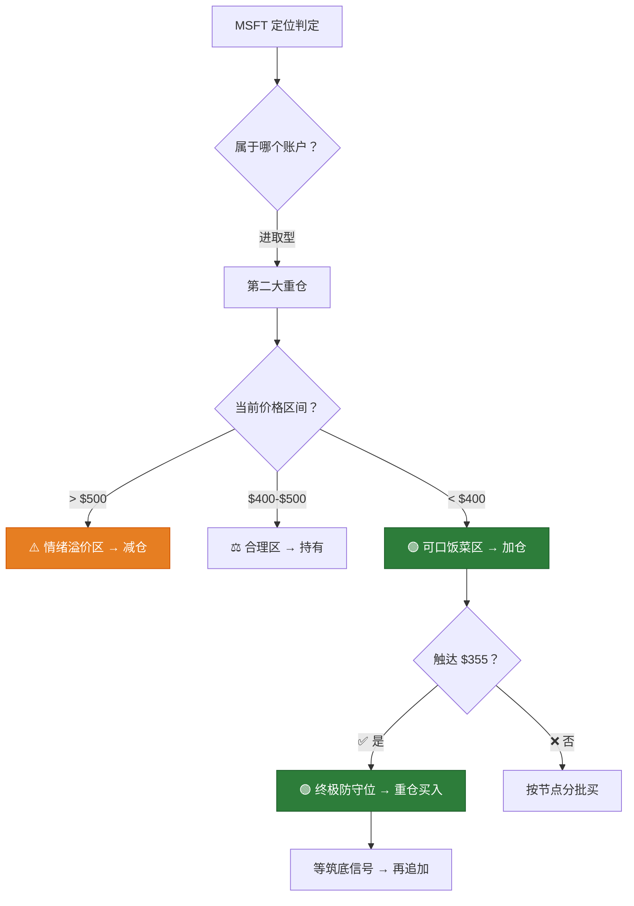

# MSFT 深度研判 — 金渐成视角

> ⚠️ 以上仅为个人看法，不构成投资建议。投资有风险，入市需谨慎。
> 本分析基于"金渐成"投资哲学框架的逻辑推演，所有数据截至 2026年4月24日。

---

## 第一步：Fact Check（实时数据校验）

### 核心财务指标

| 指标 | 数值 | 来源 / 备注 |
|---|---|---|
| **MSFT 股价** | ~$415.75 | 2026-04-24 开盘价 |
| **市值** | ~$3.1万亿 | — |
| **FY2026 EPS 预估** | ~$16.54 | 分析师共识 |
| **FY2027 EPS 增速预估** | ~14.5% | StockAnalysis |
| **Forward PE (FY2027)** | **~23.7-25.2x** | 多源综合（PE已压缩） |
| **PEG Ratio** | **~0.90-1.63** | 取决于增长基准 |
| **FCF Margin** | **~21.5-25.4%** | 受 CapEx 激增压缩（历史常态 30%+） |

### Azure 云业务表现（Q3 FY2025，截至2025年3月31日）

| 指标 | 数值 | 同比 |
|---|---|---|
| **Azure 及其他云服务增速** | **+33%**（固定汇率 +35%） | 强于预期 |
| **AI 对 Azure 增速的贡献** | **16个百分点** | 约占总增速的 ~48% |
| **云业务核心驱动力** | AI工作负载需求激增 + 新数据中心产能提前上线 | — |

> [!IMPORTANT]
> **AI 已贡献 Azure 增速的近一半** — 这意味着 Azure 正在从"传统云迁移"驱动转向"AI需求拉动"的新增长曲线。

### 资本支出 (CapEx) 演变 — 核心争议点

| 财年 | CapEx（亿美元） | 同比增速 | 关键信息 |
|---|---|---|---|
| FY2023 | $281 | — | 基础水平 |
| FY2024 | $445 | +58% | 开始大幅加速 |
| FY2025 | $646 | +45% | 加速持续 |
| **FY2026 H1** | **$724** | **+66%** (Q2 YoY) | 半年已超 FY2025 全年 |
| **FY2026 全年预测** | **~$1,000+** | +55%+ | 有望突破千亿美元大关 |

> [!WARNING]
> **CapEx 两年翻 3.5 倍（$281亿→~$1,000亿）**，其中约 2/3 用于 GPU/CPU 等"短期资产"。
> - 正面：产能提前上线 → Azure增速加快 → AI收入兑现
> - 负面：FCF Margin 被压缩至 ~22%（历史常态 30%+）→ 短期利润承压
> - **核心问题：花出去的 $1,000亿何时变成回报？** 市场正在拷问 ROI。

### 近期股价走势回顾

```
高点: $558.9 (2025年7月底财报盘后)
     ↓ 下跌了约 25.6%
当前: ~$415.75 (2026年4月24日)
     ↓ 距作者最后防守节点 $355
差距: 当前价高于 $355 约 +17%

关键事件时间线：
2025.07   财报盘后大涨 8.9% → $558
2025.09   $495-$500 区间整理
2025.10+  从 $550 开始下跌
2026.01   跌至 $465，作者设 $423/$396 加仓
2026.02   资本支出激增消息 → 暴跌至 $382+
2026.02   作者 $395/$382 加仓触发
2026.03   继续下探至 $355-$366 区间
2026.04   反弹至 $415，筑底迹象初现
```

---

## 第二步：Logic Mapping（金渐成逻辑模型提炼）

### 逻辑标准 #1：微软是 AI 产业链的"中间件"

> **原文**（2026-03 回复）：
> *"微软是云业务三巨头（微软、谷歌、亚马逊）之一，还持有OpenAI 27%的股权，跟我持有的英伟达、台积电是一条链上的，刚好覆盖了人工智能在芯片、云计算、芯片制造的链条，我个人会选微软。"*
> — [2026-03](file:///Users/johnny/Documents/jjc-money/26year/2026-03.md#L1136)

**关键逻辑**：作者持有 NVDA + TSM + MSFT = **芯片→云计算→芯片制造** 的完整 AI 链条。微软不是"软件公司"，而是 AI 基建的中间层。

### 逻辑标准 #2：20年来仅有的"两次重注"之一

> **原文**（2026-02-25）：
> *"在美股这么多年，还没有试过让一只个股的仓位占比突破过50%，真正下重注的，就两个，一个是以前的微软，一个是现在的英伟达。"*
> *"微软是我在美股前15年最重仓的个股，仓位占比一直在40%+。"*
> — [26-02](file:///Users/johnny/Documents/jjc-money/26year/26-02月.md#L2499-L2509)

> **原文**（2025-07）：
> *"微软虽然有25倍收益，但那会资金体量小，不可同日而语。和微软一样，它（英伟达）会成为我长期持有的个股。"*
> *"至于如何能长期拿住，吃到10倍甚至像微软一样25倍+的收益，其实秘诀就一个：活在欲望之外。"*
> — [2025-07](file:///Users/johnny/Documents/jjc-money/22-25year/2025-07(共7篇).md#L702-L715)

**关键逻辑**：微软是作者投资生涯中感情最深的个股（07年持有至今，19年）。25倍收益 = 极致的长期陪跑。

### 逻辑标准 #3：云业务 = 未来的确定性风口

> **原文**（2025-09-08 回复）：
> *"除了是人工智能三巨头外，谷歌基本盘很好，而且云业务也是未来的业绩增长亮点之一，是未来的风口。我大量持有微软和亚马逊、谷歌，除了人工智能外，还有很重要的一点就是看好云业务。"*
> — [2025-09](file:///Users/johnny/Documents/jjc-money/22-25year/2025-09(共12篇).md#L670-L672)

> **原文**（2025-11-16）：
> *"现在云服务三巨头（微软、谷歌、亚马逊）的涨点、跌点，都和云业务密切相关，这也就是之前所说的，人工智能浪潮除了芯片股外，利好云业务。"*
> — [2025-11](file:///Users/johnny/Documents/jjc-money/22-25year/2025-11(共9篇).md#L336-L337)

### 逻辑标准 #4：$500 以上 = 情绪溢价；$400 以下 = "可口型饭菜"

> **原文**（2025-09-08）：
> *"微软500美元是合理的，也能接受，高于500美元，我是觉得市场情绪助推得有些狂热，之前的减仓操作可以验证这一点。"*
> — [2025-09](file:///Users/johnny/Documents/jjc-money/22-25year/2025-09(共12篇).md#L523-L524)

> **原文**（2026-02 回复）：
> *"如果是192左右的亚马逊，那在我眼里和400以内的微软一样，都是可口型饭菜。"*
> — [26-02](file:///Users/johnny/Documents/jjc-money/26year/26-02月.md#L1125)

> **原文**（2026-02 读者引用+认同）：
> *"近6年微软，20年疫情跌了30.5%；22年全年下跌最多跌了38.8%；25年关税战跌24.3%；目前这轮最多跌去29.2%，400的价格对应PE才25，400以下是非常诱人的价格。"*
> — [26-02](file:///Users/johnny/Documents/jjc-money/26year/26-02月.md#L2266)

### 逻辑标准 #5：SaaS 被暴打 ≠ 微软基本面恶化

> **原文**（2026-02 回复）：
> *"说明多数人不了解微软，微软现在不仅仅有软件，是多元化投资的，仅仅它的云业务+持有的OpenAI股权，我都觉得很香。"*
> — [26-02](file:///Users/johnny/Documents/jjc-money/26year/26-02月.md#L2615)

> **原文**（2026-02 回复）：
> *"对微软核心业务没有那么大影响，对其他上市SaaS公司是有影响的，软件股现在处于严重超卖的状态。"*
> — [26-02](file:///Users/johnny/Documents/jjc-money/26year/26-02月.md#L2657)

### 逻辑标准 #6：作者的完整买入路径图

| 时间 | 操作 | 价格 | 仓位占比变化 |
|---|---|---|---|
| 2025-01 | 加仓 | $421 | — |
| 2025-03 | 加仓（两个新账户） | $380-$397 | — |
| 2025-07 | 减仓5%底仓，做低成本 | $503 | 负成本持股 |
| 2025-09 | 儿子减仓 | $550 | 高位控仓 |
| 2026-01 | 加仓设置 | $465, $450 | — |
| 2026-01 | 新设加仓节点 | $436 | — |
| 2026-02 | 加仓触发 | $395 | 仓位占比 → 8.5% |
| 2026-02 | 加仓触发 | $382+ | 希望跌到 $355 |
| 2026-03 | 加仓 | $383 | 仓位占比 → 11%+ |
| 2026-03 | 设置最后防守节点 | **$355** | 触发后仓位 → ~15% |
| 2026-03 | 目标 | 回升后仓位 → **20%+** | 第二大重仓 |

> [!TIP]
> 作者的路径极其清晰：**$550 减仓 → $400 以下吃饭菜 → $355 最终防守 → 筑底确认后仓位突破 20%。**
> 这是一个教科书级的"高位减仓→低位重仓→负成本长期持有"的循环操作。

### 综合逻辑模型图



---

## 第三步：Synthesis（数据代入模型 → 定性判断）

### 估值快扫（§2.1 Heuristic）

```
Step 1 — 识别增长体制
  FY2027 EPS 增速预估 ~14.5%
  → 对应 "Mature" 增长区间 (10-20%)
  → 可接受 Forward PE: 12-18x

  ⚠️ 但！微软不是普通 Mature 公司：
  → Azure AI 16ppt贡献 = 新增长引擎正在点火
  → 持有 OpenAI 27% 股权 = "看涨期权"未计入 PE
  → 市场公认云三巨头享有溢价
  → 合理修正区间: 22-28x

Step 2 — PEG 交叉验证
  Forward PE ~24x / EPS Growth ~14.5% = PEG ~1.65
  → 偏高但未到"红旗"（2.0）
  → 考虑 OpenAI 股权和 Azure AI 加速，"深护城河溢价"可接受

Step 3 — 现金流健康度
  FCF Margin ~22% (受 CapEx 压缩)
  → 仍然 > 20% ✓
  → 但历史常态 30%+ → 下降 8-10ppt ⚠️
  → 原因明确：AI基建投入 ≠ 经营恶化

Step 4 — 历史自我对比
  当前 Forward PE ~24x
  5年中位数 ~30-32x
  → 处于 ★历史低位★ (底部十分位)
  → "400的价格对应PE才25" = 作者认同的逻辑

Step 5 — 综合判定
  "估值偏低，可以考虑分批建仓"
```

### 核心问题：MSFT 处于"逻辑扩张期"还是"估值透支期"？

#### 🔍 两派论据对比

| 维度 | "逻辑扩张期"论据 ✅ | "估值透支期"论据 ⚠️ |
|---|---|---|
| **Azure 增速** | 33% 增速强劲，AI贡献16ppt | CapEx激增→ROI回收周期不确定 |
| **AI 收入** | AI已占 Azure 增速的一半 | 尚未体现在整体净利润率上 |
| **CapEx** | "短期资产"(GPU)→可快速变现 | 两年翻3.5倍→FCF被严重压缩 |
| **OpenAI** | 持有27%股权，潜在万亿级IP | OpenAI诉讼+竞争加剧 |
| **估值** | PE 历史最低十分位区间 | EPS增速放缓至14.5% |
| **作者操作** | 连续6次加仓 $421→$355 | 儿子重仓被套回撤严重 |

#### 🎯 金渐成框架判定

> **答案：处于"逻辑扩张期"的阵痛阶段** — 类比"种田的夏天"。

让我用作者的原话逻辑来解释：

```
作者说："投资像种田，春天播下种子，夏天除草、松土、施肥，
        秋天才有机会获得丰收。"

MSFT 当前状态：
  春天 = 2023-2024，Azure + OpenAI 布局 → 股价 $300→$558
  夏天 = 2025-2026.Q1，CapEx 狂烧千亿施肥 → 股价 $558→$355
  秋天 = 2026.H2-2027，AI 收入规模化兑现 → 股价 ？

  种田最丑的时候 = 夏天
  但作者说的最多的一句话 = "耐心等"
```

**而作者的操作本身就是答案** — 他在"最丑的夏天"（$382-$355）不但没跑，反而把仓位从 8.5% 逐步加到 11%+，目标 20%。

一个在微软上已持有 19 年、赚过 25 倍的人，在此刻选择大幅加仓而非撤退 — **这本身就是最有力的判定。**

> *"微软从07年拿到现在，遇到跌了还敢加仓抄底买进来，反正用的也是之前掏出来的成本和利润，没什么压力。"*
> — [2025-07](file:///Users/johnny/Documents/jjc-money/22-25year/2025-07(共7篇).md#L714-L715)

---

## 🎯 总判定

### 一句话结论

> **MSFT 当前处于"逻辑扩张期的阵痛阶段" — Azure AI 增速强劲验证了逻辑正确，但千亿级 CapEx 暂时压制了利润和 FCF，导致估值被压缩到历史底部区间。$415 处于作者"可口饭菜区"的上沿，非最佳击球点（$355-$380），但远非估值透支。**

### 用金渐成的话来说

> *"微软好软，亚马逊都逐渐硬起来了，感觉它还在找底。"*  
> *"我也想微软跌到395左右，380也行，这可不能微软，应该巨软🤪"*

他嘴上嫌弃微软"太软"，手上却在不停地买。嘴和手的方向不一致时——**看手。**

---

## 📐 2-3-3-2 操作建议

### 情景 A：已有仓位，参考作者路径加仓

```
操作 = 分批加仓 · 左侧交易 · 负成本长期持有
═══════════════════════════════════════════
📌 作者实际操作路径（已完成）：
   $465 → $450 → $436 → $423 → $395 → $382 → $383 → $355(设)

📌 基于 2-3-3-2 的分批建议：
   Phase 1 (20%): $410-$420 → ✅ 当前区间，"试探性建仓"
   Phase 2 (30%): $380-$395 → 筑底确认区
   Phase 3 (30%): $355-$365 → 作者终极防守位
   Phase 4 (20%): $345以下 → 极端情况（"完美了"原话）

📌 仓位规划：
   · 进取型账户目标占比 → 15-20%
   · 作者当前已达 11%+，目标突破 20%
   · 与 NVDA (48%) 构成双引擎

📌 减仓参考节点（秋收时）：
   · $500+ → 开始试探性减仓（作者标准：情绪助推）
   · $550+ → 逐步落袋，做低成本
   · $600+ → 如果出现，大胆减仓控风险

📌 特殊催化事件：
   · OpenAI IPO → 微软持27%股权，估值重估
   · Azure AI收入从16ppt扩大到20ppt+ → 确认AI回报
   · CapEx增速放缓信号 → FCF修复 → 估值扩张
```

### 情景 B：新手想建仓 MSFT

```
操作 = 右侧交易 · 等底部信号 · 不追高
═══════════════════════════════════════════
📌 作者对新手的忠告：
   "资金体量小的，就等筑底信号明显了再买，不要着急做左侧交易，耐心点。"

📌 筑底信号判断（作者方法论）：
   ✅ 缩量下跌 = 卖盘力量衰竭
   ✅ 假破位能收回 = 空头用尽弹药
   ✅ 筹码稳定 = 换手率降低

📌 建议策略：
   等 $380-$400 区间筑底确认 → 用 2-3-3-2 分批买入
   不要在 $415 急于建重仓（离底部支撑有距离）
   买入后准备长期持有 1-3年
```

### 情景 C：已被套在高位

```
操作 = 不割肉 · 做T降成本 · 耐心等待
═══════════════════════════════════════════
📌 作者儿子的案例参考：
   大儿子重仓 MSFT，从 $550 被套
   操作：$423 + $395 + $380 加仓
   作者评价："操作没问题...控回撤做得一般般"

📌 建议：
   · 有资金 → 在 $380-$400 分批补仓拉低成本
   · 没资金 → 持有等待，不割肉
   · 微软基本面无恶化 → 时间换空间
   · 作者原话："微软07-11年那么久的下跌都熬过去了，现在这算啥"
```

---

## ⏰ 关键时间节点

| 日期 | 事件 | 影响 |
|---|---|---|
| **2026年4月29日**（预计） | MSFT Q3 FY2026 财报 | ⚡ 核心关注：Azure增速能否维持33%+，AI 贡献是否继续扩大 |
| **2026年H2** | OpenAI 潜在IPO窗口 | 微软持27%股权，估值重估催化剂 |
| 持续 | CapEx 增速拐点 | FCF修复的先导信号 |
| 持续 | AI应用端大规模商业化 | 验证"CapEx→Revenue"转化效率 |
| 持续 | 美联储利率政策 | 降息利好高估值成长股 |

---

## 🔑 风险清单

| 风险 | 严重度 | 作者态度 |
|---|---|---|
| **CapEx ROI 回收慢于预期** | ⚠️ 中期 | AI产能已提前上线，倾向乐观 |
| **Azure 增速放缓** | ⚠️ 关键 | "盯着云增速" — 跌破 30% 需警惕 |
| **OpenAI 竞争/诉讼风险** | ⚠️ 中期 | $500亿诉讼 + Anthropic 崛起 |
| **SaaS 模式被 AI 颠覆** | ⚖️ 低 | "对微软核心业务没那么大影响" |
| **FCF Margin 持续压缩** | ⚠️ 中期 | CapEx 不会无限增长，拐点迟早来 |
| **宏观衰退风险** | ⚖️ 周期性 | 微软是七巨头中最"稳"的之一 |

---

## 💡 MSFT vs NVDA vs GOOG：AI 链条中的"矛 · 盾 · 链"

| 维度 | NVDA（矛·芯片） | MSFT（链·云+软件） | GOOG（盾·搜索+云） |
|---|---|---|---|
| **仓位占比** | 48%（第一大） | 11%+→目标20%（第二大） | 18.5%（第三大） |
| **AI链条角色** | 卖铲子 | 云基建+应用平台 | 搜索+云+DeepMind |
| **当前估值** | Forward PE ~24x | Forward PE ~24x | Forward PE ~19x |
| **作者原话** | "印钞机" | "从07年拿到现在" | "再给谷歌多一点耐心" |
| **历史收益** | 10倍 | **25倍** | 数倍 |
| **波动性** | 极高 | 中等 | 中等偏低 |
| **当前状态** | 负成本，等$240减仓 | 加仓中，等筑底 | 持有等修复 |

> *"集中在一两只个股上就行，不要太分散。要有逻辑链条，比如芯片、云服务、芯片制造这些都是一个链条。"*
> — [2026-03](file:///Users/johnny/Documents/jjc-money/26year/2026-03.md#L1161)

---

## 📊 CapEx 回报率 — 金渐成逻辑的深层解读

市场最大的分歧在于：**微软疯狂烧钱建 AI 基建，值吗？**

作者的逻辑框架给出了间接但清晰的回答：

```
作者的投资链条：NVDA (芯片) → MSFT (云) → TSM (制造)

= 他在对冲 AI 投入的风险：

如果 AI 基建烧钱成功 → MSFT 云业务收入暴增 → MSFT 涨
如果 AI 基建烧钱过度 → 但 NVDA 芯片卖得多 → NVDA 涨
无论哪种 → TSM 芯片都得造 → TSM 涨

三者互为安全网。这也是为什么作者说：
"要有逻辑链条，比如芯片、云服务、芯片制造这些都是一个链条。"
```

至于 CapEx 回报率本身：

```
Azure Q3 FY2025: AI 贡献 16ppt / 33% = 48.5% 的增速来自 AI

如果 AI 贡献从 16ppt → 20ppt（趋势延续）：
  Azure 年化收入 ~$800亿+ × 20% AI增量 = ~$160亿+ AI新增收入
  vs CapEx ~$1,000亿 (非全部用于Azure)

  回收周期 ≈ 3-5年（考虑到产能可复用、客户粘性）

这在科技基建投资中属于正常范畴。
Amazon AWS 早期也是"烧钱→质疑→反转→印钞"的路径。
```

> *"微软一向以稳著称...基本面没有恶化，只是市场对它的预期太高。"*
> — [26-01](file:///Users/johnny/Documents/jjc-money/26year/26-01.md#L4409)

---

> 以上仅为个人看法，不构成投资建议。投资有风险，入市需谨慎。
> "赚钱有多难？方向对了，吃饭喝水一样简单。" — 金渐成
