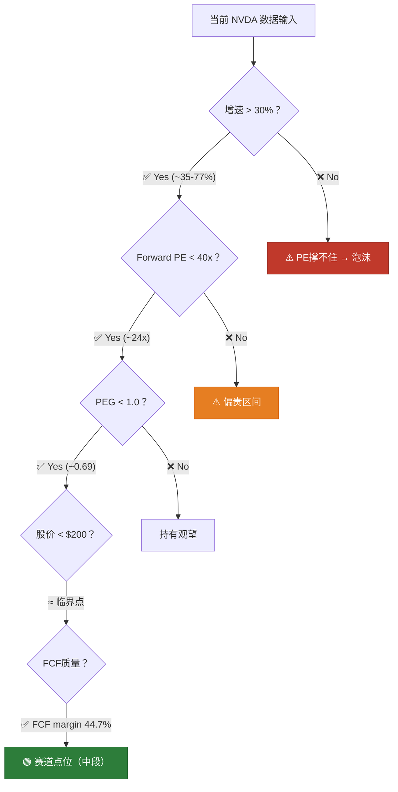

# NVDA 深度研判 — 金渐成视角

> ⚠️ 以上仅为个人看法，不构成投资建议。投资有风险，入市需谨慎。
> 本分析基于"金渐成"投资哲学框架的逻辑推演，所有数据截至 2026年4月24日。

---

## 第一步：Fact Check（实时数据校验）

### 核心财务指标

| 指标 | 数值 | 来源 / 推算 |
|---|---|---|
| **股价** | ~$199.50 - $200.40 | Robinhood / FinanceCharts (2026-04-24) |
| **市值** | ~$4.85万亿 | MarketBeat |
| **FY2026 全年营收** | $2,159亿 | NVIDIA官方 (Q4 FY2026财报) |
| **Q4 FY2026 营收** | $681亿 | NVIDIA官方 |
| **Q4 FY2026 YoY增速** | **+73%** | NVIDIA官方 |
| **Q1 FY2027 营收指引** | $780亿 (±2%) | NVIDIA官方 |
| **Q1 FY2027 预期YoY增速** | **~77%** | 推算 |
| **FY2027 Consensus EPS** | ~$7.86 - $8.43 | MarketBeat / WallStreetZen |
| **FY2028 Consensus EPS** | ~$11.36 | WallStreetZen |
| **Forward PE (基于FY2027)** | **~23.7x - 25.4x** | $199.50 / $7.86-$8.43 |
| **Forward PE (基于FY2028)** | **~17.6x** | $199.50 / $11.36 |
| **FY2026 FCF Margin** | **~44.7%** | Finbox |
| **FY2026 年度 FCF** | ~$967亿 | 推算 (44.7% × $2,159亿) |
| **FCF > Net Income？** | ✅ 是 | 高质量盈利 |
| **Q1 FY2027 财报日** | **2026年5月20日** | NVIDIA官方 |

> [!NOTE]
> 数据差异说明：Forward PE 数据因不同平台使用不同财年（FY2027 vs FY2028）的 EPS 而差异巨大。**本报告以 FY2027 EPS ~$7.86-$8.43 为基准**，对应 Forward PE 约 **23.7x - 25.4x**。

---

## 第二步：Logic Mapping（金渐成逻辑模型提炼）

### 量化标准 #1：增速-PE 撑得住法则

> **原文**（2024-11-11）：
> *"目前主要还是看英伟达的增速，能不能撑得起68-70的PE，增速低于30%的话，够呛。"*
> — [2024-11](file:///Users/johnny/Documents/jjc-money/22-25year/2024-11(共21篇).md#L1536-L1537)

**量化公式**：若 EPS增速 < 30%，则 PE 68-70 = 泡沫。

### 量化标准 #2：200美元泡沫线

> **原文**（2025-07-31）：
> *"200以内的价格合理，高于200都有泡沫。"*
> — [2025-07](file:///Users/johnny/Documents/jjc-money/22-25year/2025-07(共7篇).md#L1573)

> *"130以上我就不再追高了，慢慢分批减仓。"*
> — [2025-07](file:///Users/johnny/Documents/jjc-money/22-25year/2025-07(共7篇).md#L1540)

### 量化标准 #3：5万亿市值 = 出货线

> **原文**（2025-11-03）：
> *"5万亿左右，我也陆陆续续出掉了30%底仓，写过，平均卖价187.5美元，90万股。等240以后再考虑减仓一些底仓。"*
> — [2025-11](file:///Users/johnny/Documents/jjc-money/22-25year/2025-11(共9篇).md#L233-L234)

**量化节点**：$187.5 触发减仓，$240 触发进一步减仓。

### 量化标准 #4：AI泡沫定义 — "适度泡沫 vs 过度泡沫"

> **原文**（2025-11-11）：
> *"适当的泡沫反而是好的，能助推发展，但如果泡沫太大，就需要注意风险。"*
> — [2025-11](file:///Users/johnny/Documents/jjc-money/22-25year/2025-11(共9篇).md#L643-L644)

> **原文**（2024-12-06）：
> *"不要因为当前的AI没有满足个人的预期，就以为这东西只是个泡沫，给它时间。"*
> — [2024-12](file:///Users/johnny/Documents/jjc-money/22-25year/2024-12(共18篇).md#L679-L680)

> **原文**（2025-08-14）：
> *"人工智能目前正处于早期，要说泡沫破裂，为时尚早。"*
> — [2025-08](file:///Users/johnny/Documents/jjc-money/22-25year/2025-08(共9篇).md#L1055)

### 量化标准 #5：2026年实际操作节点

> **原文**（2026-03-21）：
> *"英伟达170以下会考虑加仓。"*
> *"具体的设置是165-155-145-130，买单倍数是1.5-1.5-2-3。"*
> — [2026-03](file:///Users/johnny/Documents/jjc-money/26year/2026-03.md#L630,L680)

> **原文**（2026-03-31）：
> *"英伟达之前被我以187.5美元的价格减仓30%，现在正好补仓。"*
> *"英伟达现在163+，真高兴它能跌下来。"*
> — [2026-03](file:///Users/johnny/Documents/jjc-money/26year/2026-03.md#L1638,L1768)

> **原文**（2026-01-01）：
> *"175-200区间以平均187.5的价格减仓30%的英伟达。"*
> *"英伟达收益率翻倍+。"*
> — [26-01](file:///Users/johnny/Documents/jjc-money/26year/26-01.md#L22,L38)

> **读者评论**（2026-01）：
> *"英伟达波段收益很好，170左右适合入，190适合出。"*
> — [26-01](file:///Users/johnny/Documents/jjc-money/26year/26-01.md#L1951)

### 综合逻辑模型图



---

## 第三步：Synthesis（数据代入模型 → 定性判断）

### 逐项校验

````carousel

### ✅ 校验 1：增速-PE 匹配原则

| 维度 | 作者门槛 | 当前实测值 | 判定 |
|---|---|---|---|
| Q4 FY2026 YoY营收增速 | >30% | **73%** | ✅ 远超门槛 |
| Q1 FY2027 预期YoY增速 | >30% | **~77%** | ✅ 继续超门槛 |
| FY2027→FY2028 EPS增速 | >30% | **~35-45%** | ✅ 符合 |
| Forward PE (FY2027) | 与增速匹配 | **~24x** | ✅ 属"High-growth"合理区间(27-40x)的下限 |

**结论**：73-77% 的营收增速完全撑得住 24x PE。作者2024年11月担心的"增速<30%撑不住68-70x PE"的情况——**现在恰好反过来了**：增速仍然高企（77%），而PE已经从68x压缩到24x。

→ **估值 = 被压缩的成长股，远非泡沫。**

<!-- slide -->

### ✅ 校验 2：PEG 指标 — 金渐成"越涨越便宜"检验

```
PEG = Forward PE / 预期 EPS 增速
    = 24x / 35% ≈ 0.69

参照 SKILL.md 判定：
  PEG < 0.8 → 潜在低估 ★
```

作者原话（2024-05）：*"从PEG指标来看，英伟达一直都不贵。股价明明在涨，估值却越涨越便宜，这就是成长的力量。"*

→ **PEG 0.69 = 作者体系中明确的"低估"信号。**

<!-- slide -->

### ✅ 校验 3：FCF 现金流质量

```
FCF Margin = 44.7%  → 高质量盈利 ✓ (>20% 门槛)
年度 FCF ~$967亿 >> Net Income → 盈利有现金支撑 ✓
回购计划 = 50% FCF 返还股东 → 管理层信心充足 ✓
```

→ **现金流健康度 = 满分，没有"会计泡沫"的嫌疑。**

<!-- slide -->

### ⚠️ 校验 4：作者价位体系对照

| 作者历史操作 | 价格 | 与当前$199.50的偏差 |
|---|---|---|
| **减仓线**（2025年11月） | $187.5 (均价) | 当前高于减仓线 **+6.4%** |
| **二次减仓触发线** | $240 | 当前距二次减仓 **-16.9%** |
| **加仓第一节点**（2026-03） | $170 | 当前高于加仓线 **+17.4%** |
| **加仓第二节点** | $165 | 当前高于 **+20.9%** |
| **加仓第三节点** | $155 | 当前高于 **+28.7%** |
| **加仓第四节点** | $145 | 当前高于 **+37.6%** |
| **读者观察的波段区间** | $170入/$190出 | 当前超出出货上限 **+5%** |

→ **当前$199.50 处于作者"减仓线"与"二次减仓线"之间的中间地带。**
不是他加仓的甜蜜区（$165以下），也没到进一步减仓的位置（$240+）。

<!-- slide -->

### ⚠️ 校验 5：泡沫定性框架

| 泡沫检验项 | 状态 |
|---|---|
| AI产业逻辑是否崩塌 | ❌ 未崩塌，Q1指引$780亿说明需求强劲 |
| 市场情绪是否"人声鼎沸" | ⚠️ 中性偏乐观，非极端狂热 |
| 估值是否处于历史高位区间 | ❌ Forward PE 24x 处于5年中下区间 |
| 增速是否在放缓 | ✅ 从200%+降至77%，仍高但趋势下行 |
| 作者用词 | "人工智能正处于早期"、"要说泡沫破裂为时尚早" |

→ **按金渐成框架，这不是泡沫。是"赛道中段，估值已压缩"。**

但风险在于：**增速从200%→73%→35%的减速轨迹，如果继续下滑至<30%，叙事就会切换。**

````

---

## 🎯 总判定：在作者的价值体系里，NVDA 属于什么点位？

### 一句话结论

> **"赛道点位"的上沿 — 估值已充分压缩（PE 24x / PEG 0.69），成长逻辑未破，但价格处于作者操作体系中的"持有观望区"（$187.5-$240），不是加仓甜蜜点，也远未到泡沫区。**

### 用金渐成的话来说

> *"钱是在估值合理的时候坚定持有+买入，并通过时间等待来的。"*
> — 2026年3月

用他的钓鱼比喻：**鱼（$199）已经游到了鱼竿旁边，但还没碰到鱼饵（$170以下）。**你可以安心守着鱼竿，但现在不是猛力扬竿的时候。

---

## 📐 2-3-3-2 操作建议

基于金渐成体系，针对**不同仓位状态**给出分层建议：

### 情景 A：已有较大仓位（如作者本人 42%）

```
当前操作 = 持有 · 不动 · 等
═══════════════════════════════════════
✋ 不追高：$199 处于减仓线($187.5)和二次减仓线($240)之间
✋ 不减仓：PE 24x / PEG 0.69 不构成减仓理由
📌 设防守节点：$240+ 开始 2-3-3-2 减仓
   Phase 1 (20%): $240 → "试探性减仓"
   Phase 2 (30%): $260 → 情绪升温
   Phase 3 (30%): $280 → "人声鼎沸"
   Phase 4 (20%): $300+ → 或保留为"负成本永久仓"
📌 设进攻节点：若回落到$170-$165 → 补仓
```

### 情景 B：轻仓或空仓，想建仓

```
操作 = 等回调 · 分批进 · 不追高
═══════════════════════════════════════
⚠️ 当前$199不是好的建仓点：作者自己的加仓节点在$170以下
📌 建仓节点参考（2-3-3-2）：
   Phase 1 (20%): $170 → "试探性建仓"
   Phase 2 (30%): $165 → 价格确认支撑
   Phase 3 (30%): $155 → 深度回调区
   Phase 4 (20%): $145 → 最后加仓 / 留给意外
📌 买单倍数跟随下跌放大：1.5-1.5-2-3（作者原始设置）
```

### 情景 C：中仓（10-20%），想优化

```
操作 = 持有 + 高抛低吸
═══════════════════════════════════════
📌 波段参考区间：$170-$190（读者验证过的区间）
📌 5月20日财报前注意：财报可能成为催化剂
   → 如果Q1指引超预期 → $220+，考虑减仓20%控制成本
   → 如果Q1指引不及预期 → 回落到$170-$180区间加仓
📌 核心原则：做负成本，让利润奔跑
```

---

## ⏰ 关键时间节点

| 日期 | 事件 | 影响 |
|---|---|---|
| **2026-05-20** | NVIDIA Q1 FY2027 财报 | 关键催化剂：验证$780亿营收指引 |
| 2026-06（预计）| 美联储利率决议 | 降息预期影响科技股估值 |
| 2026-08（预计）| Blackwell 超级芯片出货量更新 | AI需求验证 |
| 2026-10-11月（预计）| 作者历史上的"高位减仓季" | 关注是否再次操作 |

---

## 🔑 风险清单

1. **增速减速风险**：73%→35%→？若降至<30%，作者的"撑不住"逻辑将被触发
2. **出口管制风险**：对华芯片出口限制仍存不确定性
3. **竞争格局**：AMD MI300系列、Google TPU、自研芯片的竞争压力
4. **地缘政治**：霍尔木兹海峡局势、中美科技脱钩对供应链的影响
5. **市场情绪切换**：若AI落地不及预期，"宏大叙事泡沫"风险（作者反复强调过）

---


---

## 📘 附录：财报专业名词入门指南（小白友好版）

为了方便理解文档中的深度分析，这里对涉及的专业术语做通俗易懂的备注：

1.  **YoY (Year over Year) - 同比增长**：今年这个季度和去年同一个季度相比的增长情况。比如 Q4 YoY +73%，就是说比去年的第四季度多赚了 73%。
2.  **EPS (Earnings Per Share) - 每股收益**：公司赚的总净利润除以股票总数。代表你手里拿的每一股股票今年帮你赚了多少钱。
3.  **Forward PE - 远期市盈率**：现在的股价 / 预估未来一年的每股收益。数值越低通常代表股票越“便宜”。
4.  **PEG Ratio - 市盈率相对盈利增长比率**：用 PE 除以增长率。这是金渐成最看重的指标，他认为 PEG < 0.8 是非常便宜的捡钱机会。
5.  **FCF Margin - 自由现金流利润率**：公司赚到的钱里，扣除维持运营和买设备后，真正能装进兜里随便花的“真钱”占比。
6.  **CapEx (Capital Expenditure) - 资本支出**：公司为了未来赚钱而投入的大钱，比如买服务器、盖数据中心、买芯片。
7.  **Azure / AWS / GCP**：分别是微软、亚马逊、谷歌的云计算平台（出租服务器和算力）。它们是 AI 时代的核心基础设施。
8.  **ppt (percentage point) - 百分点**：注意不是幻灯片。比如增速从 30% 变成 33%，就是增长了 3 个百分点（ppt）。
9.  **Beat - 超预期**：指公司交出的成绩单比华尔街那些分析师事先猜的要好。
10. **ROI (Return on Investment) - 投资回报率**：投入 1 块钱能换回几块钱利润。
11. **SaaS (Software as a Service) - 软件即服务**：按月/按年订阅的软件模式（如 Office 365）。
12. **IPO (Initial Public Offering) - 首次公开募股**：指公司第一次在股市挂牌上市。
13. **GPU/CPU - 算力芯片**：AI 的“大脑”。GPU（图形处理器）在处理 AI 计算时比传统的 CPU 快得多。
14. **Growth Regime - 增长体制**：根据公司赚钱的速度（增速）来划分的“等级”。金渐成会根据它是“超高增长”还是“成熟稳健”来决定给它多少估值。
15. **Median - 中位数**：一组数字从大到小排列，最中间那个数。用来判断现在的估值是偏高还是偏低。
16. **Decile / Percentile - 分分位（如：十分位、底部 20%）**：把历史数据按高低排列，看现在的数值处于什么水平。
17. **Consensus Estimate - 共识预期**：市场上几十个专业分析师对公司未来业绩的平均预测值。
18. **FY (Fiscal Year) - 财年**：公司的“会计年度”。很多公司的财年不一定和自然年重合。
19. **Q1-Q4 / H1-H2 - 季度与半年**：Q 代表季度（Quarter），H 代表半年（Half）。
20. **Forward - 远期/预估**：指“看向未来”，投资是买未来，所以金渐成更看重 Forward 数据。
21. **Margin - 利润率**：公司扣除成本后剩下的钱占收入的比例。
22. **Thesis Invalidation - 投资逻辑失效/证伪**：指的是当初你买入这只股的理由不再成立了。
23. **Catalyst - 催化剂**：能引爆股价上涨（或大跌）的特定事件。
24. **Revenue - 营收/收入**：公司卖产品总共收进来的钱（还没扣掉成本和税）。
25. **Moat - 护城河**：指公司抵御竞争对手、保护利润的能力。

---

> 以上仅为个人看法，不构成投资建议。投资有风险，入市需谨慎。
> "不要盲目跟风，要有自己的思考和见解。" — 金渐成
