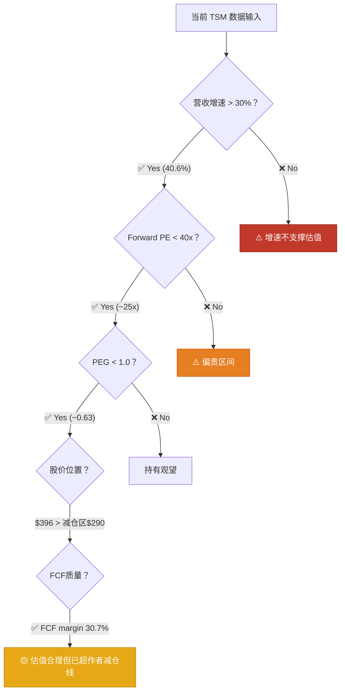

# TSM（台积电）深度研判 — 金渐成视角

> ⚠️ 以上仅为个人看法，不构成投资建议。投资有风险，入市需谨慎。
> 本分析基于"金渐成"投资哲学框架的逻辑推演，所有数据截至 2026年5月1日。

---

## 第一步：Fact Check（实时数据校验）

### 核心财务指标

| 指标 | 数值 | 来源 / 推算 |
|---|---|---|
| **股价** | ~$396 | FinanceCharts / GuruFocus (2026-05-01) |
| **市值** | ~$2.05万亿 | 推算 |
| **Q1 2026 营收** | $359亿 (NT$1,134亿) | TSMC官方 (2026-04-16) |
| **Q1 2026 YoY营收增速** | **+40.6%** | TSMC官方 |
| **Q1 2026 QoQ营收增速** | +6.4% | TSMC官方 |
| **Q1 2026 毛利率** | **66.2%** | TSMC官方 |
| **Q1 2026 营业利润率** | **58.1%** | TSMC官方 |
| **Q1 2026 净利润率** | **50.5%** | TSMC官方 |
| **Q1 2026 净利润** | NT$572.48亿 (+58.3% YoY) | TSMC官方 |
| **Q1 2026 EPS** | NT$22.08 | TSMC官方 |
| **Q1 2026 CapEx** | $111亿 | TSMC官方 |
| **Q1 2026 经营现金流** | ~NT$699亿 | TSMC官方 |
| **Q1 2026 FCF Margin** | **~30.7%** | GuruFocus |
| **2025全年 FCF** | NT$1,002.57亿 (~$313.5亿) | TSMC年报 |
| **2025全年 FCF Margin** | ~28.1% | FinBox / FinanceCharts |
| **Q2 2026 营收指引** | $390亿-$402亿 | TSMC官方 |
| **Q2 2026 毛利率指引** | 65.5%-67.5% | TSMC官方 |
| **Q2 2026 营业利润率指引** | 56.5%-58.5% | TSMC官方 |
| **2026全年营收增速指引** | **>30% (USD)** | TSMC管理层 |
| **2026全年 CapEx 指引** | $520亿-$560亿 | TSMC官方（倾向高端） |
| **Forward PE** | **~25.3x** | GuruFocus |
| **2026 Consensus EPS** | ~$15.24-$18.97 | ADVFN / 多平台共识 |
| **2026 EPS增速** | **~38%-45%** | 分析师共识 |
| **TTM PE** | ~32.9x-38.7x | 多平台 |
| **5年平均PE** | ~22x-23x | Macrotrends / FinBox |
| **10年中位PE** | ~19.7x | FinanceCharts |
| **全球晶圆代工市占率** | **~72%** | Counterpoint Research |

> [!NOTE]
> 数据差异说明：Forward PE 因不同平台使用不同年度 EPS 而有差异。**本报告以 2026 Consensus EPS ~$15.65（中位数）为基准**，对应 Forward PE 约 **25.3x**。TTM PE 较高（~35x）是因为滞后的历史盈利基数，不代表前瞻估值。

---

## 第二步：Logic Mapping（金渐成逻辑模型提炼）

### 量化标准 #1：AI链条的"铲子的铲子"定位

> **原文**（2026-03）：
> *"英伟达、台积电是一条链上的，刚好覆盖了人工智能在芯片、云计算、芯片制造的链条。"*
> — [2026-03](file:///Users/johnny/Documents/jjc-money/26year/2026-03.md)

> **原文**（2026-03）：
> *"要有逻辑链条，比如芯片、云服务、芯片制造这些都是一个链条。"*
> — [2026-03](file:///Users/johnny/Documents/jjc-money/26year/2026-03.md)

**量化公式**：
```
NVDA（芯片设计·卖铲子）→ TSM（芯片制造·铲子的铲子）→ MSFT/GOOGL/AMZN（云计算·用铲子）
↕ 三者互为安全网，无论AI基建成败，至少一环受益
```

### 量化标准 #2：$125 抄底 → 7个月负成本的经典操作

> **原文**（2025-10-02）：
> *"台积电290减仓5%的设置被触发，整体已经负成本。从今年最低点至今，台积电的涨幅已经达到119%+。去年中我在160左右建仓，去年8月初下跌时125加仓，年底190-225减仓；今年初下跌逐步加仓，最低时140以内爆买，随后在225-232减仓做低成本，如今台积电288美元，持仓占比8.27%。"*
> — [2025-10](file:///Users/johnny/Documents/jjc-money/22-25year/2025-10(共22篇).md#L262-L264)

### 量化标准 #3：市场占有率70%+ = 垄断级护城河

> **原文**（2025-10-06）：
> *"台积电作为市场占有率达到70%+的人工智能芯片制造商龙头，每次这种高端芯片需求量大增的信息，对它都是一种利好。"*
> — [2025-10](file:///Users/johnny/Documents/jjc-money/22-25year/2025-10(共22篇).md#L363-L365)

### 量化标准 #4：基本面中长期利好，护城河极深

> **原文**（2024-11-07）：
> *"这家公司的基本面中长期都是利好，护城河太深了，高端芯片加工制作绕不过去的存在。"*
> — [2024-11](file:///Users/johnny/Documents/jjc-money/22-25year/2024-11(共21篇).md#L720)

> **原文**（2024-12）：
> *"台积电基本面中长期都向好，连一直不太被看好的美国工厂，也有望在2028年启动2纳米工艺量产。"*
> — [2024-12](file:///Users/johnny/Documents/jjc-money/22-25year/2024-12(共18篇).md#L22)

### 量化标准 #5：2026年操作锚点

> **原文**（2026-03）：
> *"台积电300以下会考虑加仓。"*
> — [2026-03](file:///Users/johnny/Documents/jjc-money/26year/2026-03.md)

> **历史锚点**（topology 汇总）：
> 加仓甜蜜区 ≤$200 / 持有观望区 $200-$290 / 减仓触发区 $290+
> — [A_美股投资实战 §7.5](file:///Users/johnny/Documents/jjc-money/docs/topology-details/A_美股投资实战.md#L1063)

### 量化标准 #6：190以下建仓逻辑

> **原文**（2024-11-05）：
> *"如果我都没有台积电，那会在190以下买点，不重仓，然后每次有跌就逢低买入。"*
> — [2024-11](file:///Users/johnny/Documents/jjc-money/22-25year/2024-11(共21篇).md#L671)

> **原文**（2024-11-08）：
> *"对于台积电，我个人还是很好看的，79+美元的成本，未来一段时间不会卖出，只会看有没有机会逢低买入。"*
> — [2024-11](file:///Users/johnny/Documents/jjc-money/22-25year/2024-11(共21篇).md#L1046)

### 综合逻辑模型图



---

## 第三步：Synthesis（数据代入模型 → 定性判断）

### 逐项校验

````carousel

### ✅ 校验 1：增速-PE 匹配原则

| 维度 | 金渐成门槛 | 当前实测值 | 判定 |
|---|---|---|---|
| Q1 2026 YoY营收增速 | >30% | **40.6%** | ✅ 超越门槛 |
| 2026全年营收增速指引 | >30% | **>30% (USD)** | ✅ 管理层信心充足 |
| 2026 EPS增速 | >30% | **~38-45%** | ✅ 符合高增长区间 |
| Forward PE | 与增速匹配 | **~25.3x** | ✅ 属"High-growth"合理区间(27-40x)下限 |
| Q1 净利润增速 | — | **+58.3% YoY** | ✅ 利润增速远超营收增速 |

**结论**：40.6% 的营收增速完全撑得住 25.3x 的 Forward PE。按金渐成的增速-PE匹配法则，TSM 处于 **"High-growth"区间（EPS增速30-40%对应合理PE 27-40x）的下沿** — 估值并没有透支增长。

<!-- slide -->

### ✅ 校验 2：PEG 指标 — "越涨越便宜"检验

```
PEG = Forward PE / 预期 EPS 增速
    = 25.3x / 40% ≈ 0.63

参照 SKILL.md 判定：
  PEG < 0.8 → 🟢 潜在低估 ★
```

作者曾在 NVDA 上用同样逻辑（PEG 0.69）判定"低估"。TSM 的 PEG 0.63 甚至比 NVDA 更低。

→ **PEG 0.63 = 金渐成体系中明确的"低估"信号。**

但要注意：**低估不等于便宜到可以追**。作者的操作锚点（$300以下加仓）远低于当前$396。PEG低估 + 价格高于减仓线 = 基本面好但位置尴尬。

<!-- slide -->

### ✅ 校验 3：FCF 现金流质量

```
Q1 2026 FCF Margin = 30.7%  → 高质量盈利 ✓ (>20% 门槛)
2025全年 FCF ~$313.5亿 → 巨额现金流 ✓
Q1 经营现金流 NT$699亿 >> 资本开支 NT$351亿 → FCF有充足盈余 ✓
毛利率 66.2% / 净利率 50.5% → 印钞机级别的利润结构 ✓
```

→ **现金流健康度 = 满分。66.2%的毛利率，全球半导体行业独一份，这不是"会计泡沫"，是真金白银的垄断溢价。**

<!-- slide -->

### ⚠️ 校验 4：作者价位体系对照

| 作者历史操作 | 价格 | 与当前$396的偏差 |
|---|---|---|
| **建仓价**（2024-06） | $160 | 当前高于 **+147.5%** |
| **恐慌抄底价**（2024-08） | $125 | 当前高于 **+216.8%** |
| **减仓做低成本**（2024-10） | $189-$190 | 当前高于 **+109%** |
| **负成本减仓**（2025-10） | $290 | 当前高于 **+36.6%** |
| **进一步减仓**（2025-10） | $305 | 当前高于 **+29.8%** |
| **2026加仓考虑线**（2026-03） | $300以下 | 当前高于 **+32%** |
| **作者成本** | 负成本（$79+原始成本已全部回收） | — |

→ **当前$396 远高于作者的所有加仓节点，甚至高于他$290-$305的减仓线。**

在作者的价位体系中，$396 处于"已经减仓过、等待回调再补"的区间。他在2026-03说"300以下会考虑加仓"，这意味着 $396 离他的加仓甜蜜区还有 **-24%** 的距离。

<!-- slide -->

### ✅ 校验 5：护城河 — 粪坑检测 4 项

| 检验项 | 状态 | 证据 |
|---|---|---|
| 行业是否>12个月下行？ | ❌ 否 | AI半导体持续上行，CapEx暴增 |
| 基本面是否恶化？ | ❌ 否 | Q1营收+40.6%，净利+58.3%，毛利率66.2% |
| 同业是否违约/退市？ | ❌ 否 | Samsung/Intel竞争力弱化，反而利好TSM |
| 监管是否收紧？ | ⚠️ 部分 | 对华出口管制存在，但Arizona扩产对冲 |

→ **粪坑检测 4 项全部通过 ✅。台积电不仅不是粪坑，它是全球半导体的"命门"。**

竞争格局进一步强化：
- 全球晶圆代工市占率 **72%**（Samsung ~6-7%，SMIC ~5%）
- 3nm 量产领先，2nm 已于 2025 年底启动量产
- 2nm 良率据报达 80-90%，Samsung 2nm 仍在追赶中
- "纯代工"模式 = 不与客户竞争 → NVDA/Apple/AMD/QCOM 的唯一选择

<!-- slide -->

### ⚠️ 校验 6：估值历史自比 — 当前处于什么分位？

| 时间段 | PE 范围 | 当前位置 |
|---|---|---|
| 2022 年 | 11.4x – 12.7x | — |
| 2023 年 | 17.6x – 19.5x | — |
| 2024 年 | 26.5x – 31.6x | — |
| 2025 年 | 29.0x – 31.5x | — |
| **当前 TTM PE** | **~35x** | **5年最高区间** |
| **当前 Forward PE** | **~25.3x** | **5年平均附近（22-23x）偏上** |
| **10年中位PE** | 19.7x | 当前 Forward PE 高于中位 28% |

→ **TTM PE 处于5年高位（top decile），但 Forward PE 因高增速支撑，落在5年均值附近偏上。**

这是典型的"增速拉高了PE中枢"现象。问题在于：如果增速从40%降到25%，Forward PE 就不再便宜。

````

---

## 🎯 总判定：在作者的价值体系里，TSM 属于什么点位？

### 一句话结论

> **基本面极强（PEG 0.63 / 毛利66% / 市占72%），但价格远超作者操作体系中的所有加仓节点，甚至超过了$290-$305的减仓线。这是一只"基本面让你想买、价格让你不敢追"的股票。**

### 用金渐成的话来说

> *"台积电作为市场占有率达到70%+的人工智能芯片制造商龙头，每次这种高端芯片需求量大增的信息，对它都是一种利好。"*
> — 2025年10月

用他的比喻：**台积电就是AI这条河上的唯一大坝。水量（需求）越大，大坝（TSM）越值钱。** 但现在大坝的"门票"（$396）已经从一年前$125的"白菜价"涨了3倍——你认可大坝的价值，但得问问自己：这个门票价，你能扛得住多大的回撤？

作者自己的答案很清楚：**负成本持有，不追高，$300以下才考虑加仓。**

---

## 📐 2-3-3-2 操作框架

基于金渐成体系，针对**不同仓位状态**给出分层建议：

### 情景 A：已有较大仓位 + 负成本（如作者本人 ~7-8%）

```
当前操作 = 持有 · 不动 · 不追高
═══════════════════════════════════════
✋ 不追高：$396 远超作者$300的加仓考虑线
✋ 暂不减仓：虽超$290-$305减仓线，但负成本 = 无压力
📌 设减仓节点（若继续上涨）：
   $420 → 减仓 5%，试探性
   $450 → 减仓 5%，控制仓位占比
   $480+ → 减仓 5-10%，利润瀑布流入防守型账户
📌 设加仓节点（若回调）：
   $300 → 开始观察（作者2026-03原话）
   $280 → 20% 试探性加仓
   $250 → 30% 确认性加仓
   $220 → 30% 深度回调区
   $200 → 20% 最终加仓
```

### 情景 B：空仓 / 想建仓

```
操作 = 等回调 · 不追高 · 耐心
═══════════════════════════════════════
⚠️ 当前$396 绝不是好的建仓点
   → 作者的加仓甜蜜区在 ≤$200（topology历史锚点）
   → 2026年修正后加仓考虑线：$300以下
   → 距$300还需回调 -24%

📌 如果一定要参与，框架参考（2-3-3-2 + 金字塔）：
   Phase 1 (20%): $310-$320 → "试探性建仓"（需确认支撑）
   Phase 2 (30%): $280-$300 → 价格回到作者舒适区
   Phase 3 (30%): $250-$270 → 深度回调 / 恐慌区
   Phase 4 (20%): $220以下 → 最后加仓 / 留给意外

📌 买单倍数参考（越低越多）：
   1 → 1 → 1.5 → 2 → 2.5
```

### 情景 C：中仓（3-5%），想优化

```
操作 = 持有 + 逢高减一点 + 等回调再补
═══════════════════════════════════════
📌 如成本在$200以下 → 已有足够安全边际，持有为主
📌 如成本在$250-$350 → 考虑$420+减仓10%做低成本
📌 核心原则：做负成本，让利润奔跑
   → 减仓资金流入防守型账户（BRK/TLT/SCHD）
   → 不把减仓资金重新追高买回
```

---

## 📈 TSM 决策时间线回顾 — AI链条的"铲子的铲子"

```
2024-06  ┃ 建仓 $160 附近     "去年中我在160左右建仓"
         ┃
2024-08  ┃ ★ 加仓 $125       8月初大暴跌，$125抄底
         ┃                   "如果出现125美刀，我会加仓"
         ┃
2024-10  ┃ 减仓 $189-$190     两次减仓共20%，成本降至$103
         ┃                   "后续200刀突破，继续减仓20-30%"
         ┃
2024-11  ┃ 加仓 $188          回调时加仓，"建仓不到半年"
         ┃                   成本$79+，浮盈约40%
         ┃                   "这家公司的基本面中长期都是利好，
         ┃                    护城河太深了"
         ┃
2024-12  ┃ 减仓 $225-$232     年底高位减仓
         ┃                   "180左右甚至190以下，属于很不错的机会"
         ┃                   "台积电基本面中长期都向好"
         ┃
2025-01  ┃ 继续减仓计划       设$225/$232各减5%
         ┃
2025-06  ┃ 减仓 $205          5%减仓触发，控制仓位占比
         ┃
2025-07  ┃ 减仓 $232          "成本已经很低，几乎可以忽略"
         ┃
2025-10  ┃ ★ 负成本达成       $290减仓5%
         ┃                   "从最低点涨幅119%+"
         ┃                   "又会是一个经典的负成本操作"
         ┃                   仓位占比8.27%，$305继续减仓5%
         ┃
2025-11  ┃ 减仓 $305          "在305美元临时减仓了5%"
         ┃
2026-03  ┃ 设补仓节点         "台积电300以下会考虑加仓"
         ┃                   关税战→370-390减仓的部分准备回补
         ┃
2026-04  ┃ Q1财报超预期       Q1营收+40.6%，净利+58.3%
         ┃                   毛利率66.2%，CapEx $111亿
         ┃                   管理层上调全年增速>30%
         ┃
         ▼ 当前 $396：负成本，PEG 0.63，超出作者加仓区

```

**核心逻辑演变**：AI链条制造端→ $125 勇气抄底→ 半年做成负成本→ $290-$305逢高减仓→ 利润瀑布流入防守型账户→ 等$300以下再补

---

## ⏰ 关键时间节点

| 日期 | 事件 | 影响 |
|---|---|---|
| **2026-04-16** | Q1 2026 财报（已发布） | ✅ 超预期：营收+40.6%，毛利66.2% |
| **2026-07（预计）** | Q2 2026 财报 | 关键验证：$390-$402亿营收指引能否兑现 |
| **2026 下半年** | 2nm 产能爬坡进展 | AI GPU 下一代制程，决定2027增长预期 |
| **2026 全年** | CapEx $520-$560亿执行 | 验证管理层对AI需求的信心 |
| 持续关注 | 中美芯片出口管制动态 | 对华高端芯片代工限制 → 影响部分收入 |
| 持续关注 | Arizona 工厂进展 | 地缘风险对冲 → 美国本土产能的战略意义 |
| 持续关注 | NVDA 新一代芯片需求 | TSM 作为唯一制造商，订单能见度 |

---

## 🔑 风险清单

### 🔴 核心风险

1. **地缘政治风险 — 台海**
   这是悬在台积电头顶最大的达摩克利斯之剑。任何台海局势升级，都会导致股价剧烈波动。Arizona工厂是对冲手段，但产能远不及台湾本岛。
   > 作者的应对：**负成本持有 = 心理零压力。** 如果真出大事，负成本的好处是"跌到多少都是纯利润在波动，不是本金"。

2. **增速放缓风险**
   当前40.6%的增速不可能永续。如果2027年增速降至20%以下，Forward PE 会从25x被压缩到18x — 那就是$280的事。
   > 验证指标：CapEx → 云业务收入兑现 → FCF修复。这个链条断裂 → 重新评估。

3. **CapEx 回报率下降风险**
   2026年CapEx高达$520-$560亿，占全年营收比例极高。如果AI需求不及预期、产能利用率下降，巨额资本开支会拖累FCF和估值。

### 🟡 次要风险

4. **客户集中度风险**
   NVDA + Apple 合计占TSM收入比重极高。任何一家大客户的订单波动，都会直接影响业绩。

5. **竞争格局变化**
   Samsung 2nm 如果突破良率瓶颈，Intel Foundry 如果获得大客户，TSM的72%市占率可能松动。目前看概率不大，但不能忽视。

6. **2nm 成本上升**
   2nm 晶圆成本预计比3nm高30%，如果下游客户（手机厂商为主）无法承受涨价，可能影响2nm产能利用率。

7. **汇率风险**
   TSM以新台币报告业绩，但客户大多以美元计价。美元走弱对其以美元计价的收入有正面影响，反之则有负面影响。

---

## 📊 与其他核心持仓的估值对比

| 标的 | Forward PE | PEG | 估值信号 | 当前位置 vs 作者加仓区 |
|------|:---------:|:---:|:--------:|:---------------------:|
| **NVDA** | ~24x | **0.69** | 🟢 低估 | 高于加仓区 +21% |
| **TSM** | ~25x | **0.63** | 🟢 低估 | **高于加仓区 +32%** |
| **MSFT** | ~24x | 0.9-1.6 | 🟡 合理 | 接近加仓区上沿 |
| **META** | ~22x | 1.0 | 🟡 合理 | 高于加仓区 |
| **AMZN** | ~31x | 1.0-1.4 | 🟡 合理 | 高于加仓区 |
| **GOOGL** | ~23-30x | 1.5-2.5 | 🟠 偏贵 | 高于加仓区 |

> TSM 的 PEG 0.63 是所有核心持仓中最低的 — 单纯从估值角度看，它是最"便宜"的。但价格离作者加仓区也是最远的之一。**这再次印证：好公司 ≠ 好价格。**

---

## 💡 金渐成视角总结

台积电是作者投资体系中**AI链条的制造端核心**——NVDA设计芯片，TSM制造芯片，两者互为安全网。

这家公司的护城河用一句话概括：**全球72%的先进制程芯片，只有一个地方能造。**

Q1 2026的财报把这句话的含金量又拉高了一截：40.6%的营收增速、66.2%的毛利率、50.5%的净利率、30.7%的FCF margin — 这不是一家普通的代工厂，这是一台比NVDA还要稳的印钞机。

但是——

"进攻赢得球迷，防守赢得冠军。"

$396的台积电，PEG 0.63确实不贵，基本面确实无可挑剔。但在金渐成的操作体系里，$300以下才考虑加仓，$290-$305已经是减仓区。**当前价格处于"基本面很好、但操作上没有安全边际"的尴尬区间。**

如果你已经持有且成本很低——恭喜，这就是负成本印钞机，让利润继续奔跑。

如果你空仓想建仓——别急。"不赚最后一个铜板"，也不要追第一个铜板。等它回到$300以下，甚至$250以下，用2-3-3-2分批进场，让自己始终处于好的安全边际。

"看不懂就不碰，看得懂也不追高。"

---

> 以上仅为个人看法，不构成投资建议。投资有风险，入市需谨慎。
> "不要盲目跟风，要有自己的思考和见解。" — 金渐成
