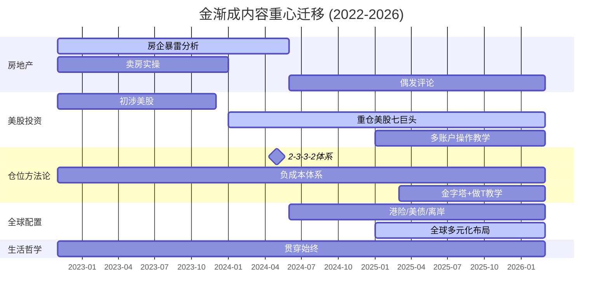

# 金渐成知识图谱目录 — 全局拓扑扫描 (2022.11 → 2026.03)

> **扫描范围**：`22-25year/` 30个月度文件 + `26year/` 3个月度文件 = **33个合集**  
> **总文章数**：约 **330+ 篇**（含评论区互动）  
> **总文字量**：约 **89,000 行 / 5.6 MB**  
> **扫描日期**：2026-04-24

---

## 1. 核心领域划分 (Taxonomy)

经过对全量文本的关键词频率分析、文章标题聚类和内容抽样，可将 4 年文章归纳为以下 **7 大版块**：

### 🏛️ 版块 A — 美股投资实战（最大权重，约 35%）
> **时间浓度**：2024下半年起急剧增加，2025年成为绝对主线

- 美股七巨头（英伟达、谷歌、微软、亚马逊、苹果、Meta、特斯拉）个股分析与操作记录
- 台积电、AMD、博通等芯片/AI 半导体链
- 消费股（可口可乐、沃尔玛、Costco、宝洁、麦当劳）
- 生物医药（礼来、默沙东、诺和诺德、强生、联合健康）
- 伯克希尔 / 巴菲特的投资哲学参照
- ETF（QQQ、SPY、TLT）操作
- 期权空单 / 对冲 / 做空操作（点到即止，不深入教学）
- 个人账户、家庭账户、新账户多账户管理

### 🏠 版块 B — 中国房地产行业分析（早期主线，约 20%）
> **时间浓度**：2022-2023 是核心期，2024 后逐步收缩为偶发评论

- 房企暴雷预测与验证（碧桂园、恒大、阳光城、荣盛等）
- 自研"对冲基金模型"推演房企走势
- 房价走势判断（一线 vs 二三四线）
- 卖房实操经验（定价策略、经纪人管理）
- 存量房贷利率下调政策解读
- 购房建议：期房 vs 现房、自住 vs 投资
- 城投债与地方财政

### 💰 版块 C — 仓位管理与资产配置方法论（约 15%）
> **贯穿始终**，是整个体系的"底层操作系统"

- **2-3-3-2 法则**（建仓/减仓的分步协议）
- **负成本 / 低成本印钞机**（卖出回本，余仓纯利润）
- **金字塔补仓法**（逢跌分级加仓）
- **做T精髓**（留 60-70% 底仓，30-40% 波段套利）
- **创富→守富→传富**三层资产瀑布（进攻→攻守→防守）
- **全球多元化配置**：美股为主 → 港股借道 → 美债/港险/不动产/信托
- 离岸账户开设（汇丰HK、盈透证券）
- 港险 / 新加坡保险 / 美元保险对比
- 汇率操作（美元、人民币、日元）

### 📊 版块 D — 宏观经济与政策解读（约 10%）
> **穿插于各期**，以"美联储利率周期"为主轴

- 美联储加息/降息周期判断
- 通胀 / CPI / 非农数据解读
- 关税 / 贸易战 / 中美脱钩
- 中国降息降准 / 财政政策
- 人民币汇率（重要节点 7.25-7.35）
- 房地产与宏观（M2、社融、贷款意愿）
- 消费降级 / 裁员 / 内卷

### 🧠 版块 E — 人生哲学与认知成长（约 10%）
> **穿插于每一篇**，是文章的"灵魂调味剂"

- 认知变现 / 认知体系 / 升维
- 人性弱点：贪婪、恐惧、从众
- 婚姻观（"最佳配偶是人生战场的盟友"）
- 人脉观（"人脉是自身价值的映射"）
- 知行合一 / 正向循环
- 佛学 / 修行 / 因果（轻度涉及）
- 阶层流动 / 圈层 / 中产困境
- 格局与选择 / "你有什么、要什么、愿意放弃什么"
- 健康管理（跑步、冥想/打坐、作息、饮食）

### 👨‍👧‍👦 版块 F — 育儿与家庭教育（约 5%）
> **2024 后明显增多**，以"父子投资对话"为特色载体

- 子女教育理念（引导 > 命令，严母慈父）
- 亲子投资教学（出题 → 孩子解题 → 分析纠偏）
- 孩子的自驱力培养
- 留学规划（国际教育路径选择）
- 教培行业政策评论

### 🐱 版块 G — 个人生活与自媒体运营（约 5%）
> **日常叙事**，构成文章的"烟火气"

- 养猫日常（蓝金渐层"金不换"）
- 山居生活 / 龙泉生活 / 武夷山隐居
- 酱酒收藏与酒厂收购
- 公众号运营反思（不搞付费、拒绝知识星球、反举报）
- 助农项目（天叙茶叶等）
- 旅行与美食（咖啡、茶）
- 加密货币（大饼/BTC量化做空，提及频率高但深度有限）

---

## 2. 高频标的词云 (Top 15)

基于全文本精确词频统计：

| 排名 | 标的 | 提及次数 | 分类 |
|:----:|------|:--------:|------|
| 1 | **英伟达** (NVDA) | **1,372** | 美股·AI芯片 |
| 2 | **大饼** (BTC) | **647** | 加密货币 |
| 3 | **台积电** (TSM) | **587** | 美股·芯片制造 |
| 4 | **谷歌** (GOOGL) | **516** | 美股·七巨头 |
| 5 | **特斯拉** (TSLA) | **512** | 美股·七巨头 |
| 6 | **微软** (MSFT) | **454** | 美股·七巨头 |
| 7 | **Meta** (META) | **508** | 美股·七巨头 |
| 8 | **亚马逊** (AMZN) | **338** | 美股·七巨头 |
| 9 | **苹果** (AAPL) | **320** | 美股·七巨头 |
| 10 | **AMD** | **307** | 美股·芯片 |
| 11 | **茅台** | **249** | A股·消费 |
| 12 | **腾讯** | **206** | 港股·互联网 |
| 13 | **博通** (AVGO) | **199** | 美股·芯片 |
| 14 | **伯克希尔** (BRK) | **136** | 美股·价值投资 |
| 15 | **平安** | **120** | A股·金融（反面教材） |

**资产类别补充**：
- ETF (396次)、美债/TLT (350次)、宽基指数 (171次)、保险 (247次)
- 美元 (2,344次) — 全文出现最多的金融名词

---

## 3. 核心方法论清单

以下为文中反复提及的**独创/标志性名词和模型**（仅列名称）：

### ⚙️ 操作系统级
| 方法论 | 提及频次 | 首次出现 |
|--------|:--------:|----------|
| **2-3-3-2 法**（建仓/减仓分步法） | 77 | 2024-05 《一般从来不一般》 |
| **负成本 / 低成本** | 436 | 2022-11（首篇即提及） |
| **印钞机**（个股盈利模式比喻） | 13 | 2023 |
| **金字塔补仓法** | — | 2025-03（系统阐述） |
| **做T精髓**（底仓 60-70% + 波段 30-40%） | — | 2025-03 |
| **创富→守富→传富**（资产三层瀑布） | 22+21 | 2024 |
| **激流缓退** | 5 | 2024-10 《激流缓退~》 |

### 🧭 决策原则级
| 名词 | 提及频次 |
|------|:--------:|
| **粪坑拾豆 / 粪坑** | 59 |
| **顺势** | 31 |
| **不赚最后一个铜板** | 7 |
| **买在无人问津处，卖在人声鼎沸时** | 12+7 |
| **看不懂就不碰** | ~7 |
| **能力圈** | 7 |
| **安全边际** | 138 |
| **进攻赢得球迷，防守赢得冠军** | — |
| **富一世 > 富一时** | — |
| **人是痛醒的，不是叫醒的** | — |
| **知行合一** | 77 |
| **锚点**（估值参考价） | 3 |

### 🛠️ 工具/模型
| 名称 | 说明 |
|------|------|
| **对冲基金推演模型** | 用于房企暴雷预测，喂入天量数据 |
| **空单护仓** | 下看跌期权对冲持仓风险 |
| **布林线 / MACD / 斐波契纳** | 技术分析工具（提及但不深入） |
| **多账户策略** | 个人/家庭/新账户分别定位进取/稳健 |

---

## 4. 异常值与跨界内容 (Outliers)

### 🔮 玄学 / 哲学 / 宗教
| 关键词 | 频次 | 说明 |
|--------|:----:|------|
| 佛 / 修行 | 118 / 35 | 偶尔以佛学比喻人生与投资（"投资是一场修行"） |
| 因果 / 觉悟 | 14 / 18 | 零星出现，非系统性讨论 |
| 风水 / 玄学 | 10 / 5 | 极少提及，未形成体系 |
| 心学 / 王阳明 | 10 | 偶有引用，不构成独立主题 |

### 📜 历史 / 人文
| 关键词 | 频次 | 说明 |
|--------|:----:|------|
| 历史 | 593 | 高频但多为"历史文章"/"历史性时刻"等日常用法 |
| 三国 | 38 | 用于比喻商战和人际关系（讲三国故事赚糖果的童年经历） |
| 曾国藩 | 2 | 极偶尔引用 |

### 🎮 游戏 / 科技奇闻
- **《魔域》搞钱经历**（2023-08《吃白食~》）— 少年时代游戏内商人经历，月入10万+
- **室温超导LK-99事件**（2023-08《历史性时刻~》）— 跟踪科学热点
- **马斯克脑机接口 Neuralink** — 偶尔提及未来科技

### 🌍 其他高频但非核心主题
| 主题 | 频次 | 说明 |
|------|:----:|------|
| **孩子/育儿/教育** | 2,052 / 160 / 395 | 频次极高，但穿插在各类文章中，非独立板块 |
| **公众号运营** | 362 | 自媒体生态反思、举报事件、付费争议 |
| **海外/移民/绿卡** | 181 / 31 / 10 | 涉及出海趋势、子女留学路径 |
| **咖啡/茶** | 46 / (高频) | 生活方式元素，天叙茶品牌运营 |
| **电影推荐** | 40 | 提及《大时代》《大空头》等金融电影 |
| **DeepSeek / OpenAI** | 27 / 49 | 2025年AI浪潮下新增讨论 |
| **大宗商品（铜/金/银）** | — | 2025-2026年新增版块，黄金"看不懂不追高" |

---

## 附录：时间线演化概览

> **核心演化轨迹**：  
> 房地产从业者视角（2022-2023）→ 美股实战投资者（2024）→ 全球多元化配置者（2025-2026）  
> 底层不变的是：**顺势、安全边际、负成本、知行合一**

---

*本目录仅为最高维度的知识分类体系扫描，未深入总结具体细节。后续可根据任一版块进行垂直深挖。*
