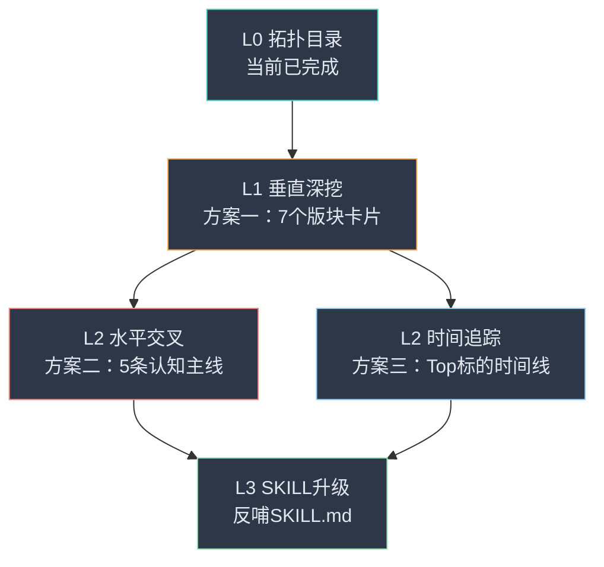

# 知识图谱细化方案 — 从"目录"到"百科全书"

> **现状诊断**：当前 [jinjiancheng-knowledge-topology.md](file:///Users/johnny/Documents/jjc-money/docs/jinjiancheng-knowledge-topology.md) 是一份 **L0 层级（最高维度目录扫描）**，它回答了"有什么"，但还没有回答"每个板块具体说了什么"、"板块之间怎么联动"、"观点如何演变"。

---

## 当前资产盘点

| 资产 | 说明 |
|------|------|
| 原始语料 | 33个月度合集，330+ 篇，5.6MB — 最终的"真理之源" |
| L0 拓扑目录 | `jinjiancheng-knowledge-topology.md` — 7大版块 + 词频 + 方法论清单 |
| 个股深度报告 | NVDA、GOOGL、MSFT、META、AMZN、BRK — 6份已完成 |
| SKILL 技能文件 | 5大心智模型 + 决策启发式 + 表达DNA — 已蒸馏 |
| 月度索引 | `docs/indexes/monthly/` — 文章级检索元数据 |

> **细化的本质**：在 L0 目录和原始语料之间，插入 L1 / L2 / L3 层级的结构化知识，让"查找"变成"直接调用"。

---

## 方案一：垂直深挖（Vertical Deep-Dive）

### 思路

对 7 大版块逐一展开，把每个版块从一段话膨胀为一份独立的"版块知识卡片"。

### 输出结构 — 每个版块一份 `.md`

```
docs/topology-details/
├── A_美股投资实战.md
├── B_中国房地产.md
├── C_仓位管理与配置.md
├── D_宏观经济政策.md
├── E_人生哲学认知.md
├── F_育儿家庭教育.md
└── G_生活与自媒体.md
```

### 每份文件的模板

```markdown
# 版块 X — [版块名称]

## 1. 核心论点清单 (Key Arguments)
- 论点 1：[一句话总结] — 首次出现于 [YYYY-MM 文章标题]
- 论点 2：...

## 2. 子主题分支 (Sub-Topics)
### 2.1 [子主题名]
- 核心观点：...
- 关键引文（原文摘录）：...
- 时间演化：[早期观点] → [后期修正/强化]

## 3. 操作模型与工具 (Applicable Models)
| 模型 | 在本版块的具体应用 |
|------|-------------------|
| 2-3-3-2 法 | [具体案例] |
| 负成本 | [具体案例] |

## 4. 反面教材 / 踩坑记录 (Lessons from Failures)
- [具体案例] — 出处 [YYYY-MM 文章标题]

## 5. 标志性金句 (Signature Quotes)
- "..." — [出处]

## 6. 与其他版块的交叉引用 (Cross-References)
- → 版块 C（仓位管理）：[关联说明]
- → 版块 E（人生哲学）：[关联说明]
```

### 优先级建议

| 优先级 | 版块 | 理由 |
|:------:|------|------|
| ⭐⭐⭐ | **A — 美股投资** | 权重最大（35%），且已有 6 份个股报告可复用 |
| ⭐⭐⭐ | **C — 仓位管理** | 是"底层操作系统"，SKILL 文件的根基 |
| ⭐⭐ | **D — 宏观经济** | 为美股判断提供上下文 |
| ⭐⭐ | **E — 人生哲学** | 是文章"灵魂"，但散落各处需要归集 |
| ⭐ | **B — 房地产** | 时效性递减，但早期文章密度高 |
| ⭐ | **F — 育儿** | 独立性强，可最后处理 |
| ⭐ | **G — 生活** | 辅助性内容，优先级最低 |

---

## 方案二：水平交叉（Horizontal Cross-Linking）

### 思路

不按版块切，而是按**跨版块的"认知主线"**来编织，回答"金渐成的核心信念体系是什么"。

### 输出结构

```
docs/topology-details/
├── 主线_顺势哲学.md        ← 从"房地产顺势逃顶"到"美股顺势追龙"
├── 主线_安全边际.md        ← 从"估值锚点"到"负成本"到"守富传富"
├── 主线_人性博弈.md        ← "贪婪恐惧"如何贯穿投资+人生+育儿
├── 主线_认知变现.md        ← 知识→决策→财富的完整链路
└── 主线_反脆弱配置.md      ← 多账户+多资产+多币种的防守体系
```

### 每份文件的模板

```markdown
# 认知主线：[主线名称]

## 核心命题
[一段话概括这条主线]

## 在各版块中的体现

### 美股投资中的体现
- ...

### 房地产中的体现
- ...

### 人生哲学中的体现
- ...

## 观点演化时间轴
| 时间 | 事件/文章 | 观点表述 |
|------|----------|---------|
| 2022-11 | 《xxx》 | "..." |
| 2024-05 | 《xxx》 | "..." (观点深化/修正) |

## 实践验证
- ✅ 验证成功：[案例]
- ❌ 验证失败：[案例]（诚实披露）
```

> **方案二的价值**：让知识从"按时间/板块堆放"变成"按逻辑脉络串联"。这是从"仓库"升级为"知识图谱"的关键一步。

---

## 方案三：时间序列追踪（Time-Series Evolution）

### 思路

针对高频标的（Top 15）和核心方法论，建立**纵向时间线**，追踪观点漂移。

### 输出结构

```
docs/topology-details/
├── 时间线_NVDA.md      ← 从首次提及到当前持仓的完整叙事
├── 时间线_BTC.md       ← 从量化做空到"看不懂"的态度变化
├── 时间线_房地产.md    ← 从暴雷预言到"偶发评论"的退出弧线
├── 时间线_2332法.md    ← 方法论的诞生、完善、标准化过程
└── 时间线_负成本.md    ← 从概念到实操到标志性身份的演化
```

### 模板

```markdown
# 时间线：[标的/方法论名称]

## 提及频次总览
- 总提及：XXX 次
- 月度分布热力图：[按月统计]

## 关键节点

### [YYYY-MM] — [事件标题]
- **背景**：[当时的市场环境]
- **观点**：[原文引用]
- **操作**：[买入/卖出/持有/观望]
- **事后验证**：[正确/错误/待验证]

### [YYYY-MM] — [下一个节点]
...

## 观点漂移摘要
[一段话总结观点如何从 A 演变到 B]
```

---

## 综合推荐：三步走策略



| 阶段 | 内容 | 预计工作量 | 产出 |
|:----:|------|:---------:|------|
| **第一步** | 方案一（垂直深挖） — 优先做 A + C 两个版块 | 每个版块约 1 轮对话 | 2 份版块卡片 |
| **第二步** | 方案三（时间追踪） — 优先做 NVDA + 房地产 | 每个标的约 1 轮对话 | 2 份时间线 |
| **第三步** | 方案二（水平交叉） — 在前两步基础上提炼 | 约 2-3 轮对话 | 5 条认知主线 |
| **最终** | 用所有产出反哺 SKILL.md，补充具体案例和校准参数 | 1 轮对话 | SKILL v2.0 |

---

## 操作建议

> 每一步都可以通过一轮对话完成。执行流程：
> 1. **扫描对应月度文件**（精确 grep + 上下文阅读）
> 2. **提取关键论点和原文引用**
> 3. **按模板结构化输出**到 `docs/topology-details/` 目录
> 
> 你只需要告诉我："从哪个开始"。

### 可选的快速启动命令

- `"先做版块A — 美股投资实战的垂直深挖"` → 扫描所有月度文件中的美股相关内容
- `"先做NVDA的时间线追踪"` → 按时间顺序追踪所有NVDA相关讨论
- `"先做'顺势哲学'这条认知主线"` → 跨版块搜集所有"顺势"相关论述
- `"先把现有6份个股报告整合进版块A"` → 最省力的起步方式，复用已有产出

---

*"不贪快、不贪多，一个版块一个版块地吃透。" — 这本身就是金渐成的方法论。*
