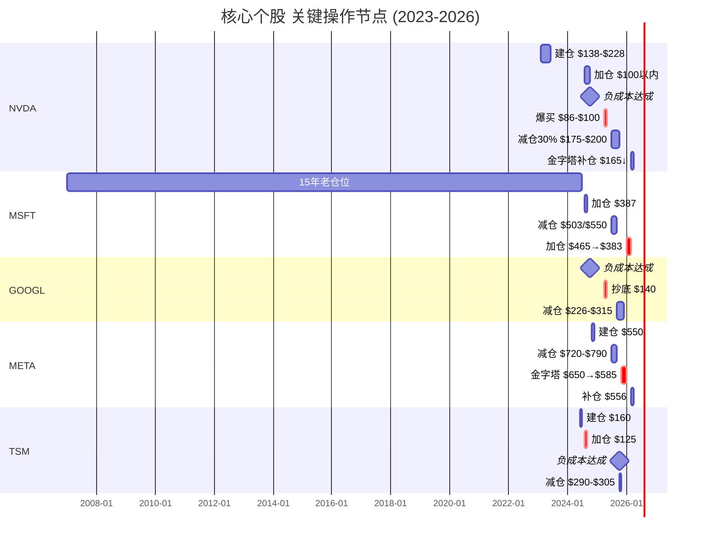
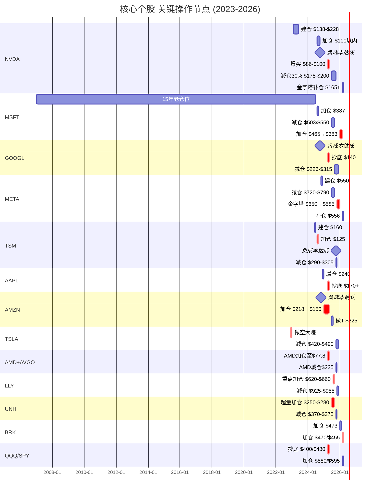
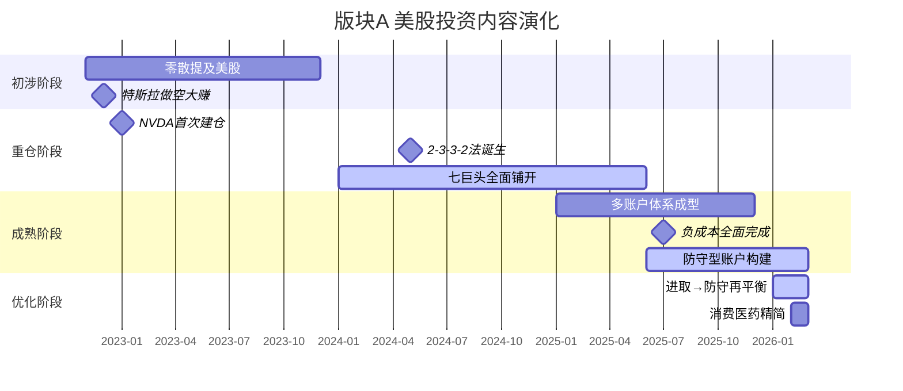

# 版块 A — 美股投资实战

> **权重**：约 35%（全部内容中占比最大）
> **时间浓度**：2024下半年起急剧增加，2025-2026年成为绝对主线
> **关联深度报告**：[NVDA](file:///Users/johnny/Documents/jjc-money/docs/nvda-deep-analysis-20260424.md) · [GOOGL](file:///Users/johnny/Documents/jjc-money/docs/google-deep-analysis-20260424.md) · [MSFT](file:///Users/johnny/Documents/jjc-money/docs/msft-deep-analysis-20260424.md) · [META](file:///Users/johnny/Documents/jjc-money/docs/meta-deep-analysis-20260424.md) · [AMZN](file:///Users/johnny/Documents/jjc-money/docs/AMZN_深度研判_金渐成视角.md) · [AAPL](file:///Users/johnny/Documents/jjc-money/docs/AAPL_深度研判_金渐成视角.md) · [BRK](file:///Users/johnny/Documents/jjc-money/docs/brk-deep-analysis-20260424.md)

---

## 1. 核心论点清单 (Key Arguments)

### 论点 1：「顺势而为，只做龙头」
> *"从来不是人赚钱，是钱在找寻人。"*
> *"干嘛非要在一个趋势下行的板块里找黄金呢？"*

- 只买行业第一或唯一，不买老二老三
- 美股七巨头 + 台积电 = 核心持仓，其余为配角
- **首次系统表述**：2024-05《一般从来不一般》

### 论点 2：「负成本持股，让利润奔跑」
> *"做低成本/负成本后，让利润继续奔跑。"*
> *"因为我的体量比较大，所以习惯性将持仓的个股和指数做成低成本或负成本，这样不会有什么压力和得失的焦虑，往往能拿得住。"*
> — 2024-12

- 所有核心持仓（NVDA/GOOGL/MSFT/META/AAPL/AMZN/TSM）均已实现负成本
- 负成本 = 心理零压力 → 拿得住 → 复利奔跑 → 超额收益
- **贯穿始终**，2022-11首篇即提及

### 论点 3：「越涨越便宜 — PEG 是核心估值武器」
> *"PEG越低，公司就越便宜。股价明明在涨，估值却越涨越便宜，这就是成长的力量。"*
> — 2024-05-24《拒绝新闻的生活》

- Forward PE + PEG + FCF 三重交叉验证
- PEG < 0.8 = 潜在低估，PEG > 2.0 = 红旗
- 典型案例：NVDA PEG 0.69（2026-04）= 明确低估信号

### 论点 4：「AI 不是泡沫，是早期」
> *"人工智能目前正处于早期，要说泡沫破裂，为时尚早。"* — 2025-08
> *"不要因为当前的AI没有满足个人的预期，就以为这东西只是个泡沫，给它时间。"* — 2024-12
> *"适当的泡沫反而是好的，能助推发展，但如果泡沫太大，就需要注意风险。"* — 2025-11

- AI 产业处于"适度泡沫"阶段，非"过度泡沫"
- CapEx 暴增（MSFT/GOOGL/META 合计数千亿）= 种田施肥，不是烧钱
- 关键验证：CapEx → 云业务收入兑现 → FCF 修复

### 论点 5：「多账户分层管理」
> *"进取型账户中，清一色美股七巨头+台积电+博通+AMD+少量奈飞。"*
> *"稳健型账户中，QQQ+SPY 占比超55%，消费+医药保健。"*
> *"防守型账户中，美债65%，伯克希尔10-15%，可口可乐/强生/SCHD。"*
> — 2026-03

- 进取型（科技龙头）→ 稳健型（宽基ETF+消费+医药）→ 防守型（美债+BRK+高息股）
- 资金流向：进取 → 防守（从不反向）
- 2025年比例 5.8:1.5:2.7 → 目标调整至 4:1.5:4.5

---

## 1.5 赛道选择逻辑 (Sector Thesis)

> *"改变未来的科技龙头股，以及不被未来改变的消费/避险股。"* — 2025-10
> 作者的选股逻辑建立在**赛道级判断**之上——先选对赛道，再在赛道中只买第一或唯一。

### 🔷 AI / 半导体 —「铲子股 → 云业务 → 芯片制造」完整链条

**核心判断**：AI 处于"适度泡沫"的早期阶段，远未到破裂时。

> *"人工智能目前正处于早期，要说泡沫破裂，为时尚早。"* — 2025-08
> *"适当的泡沫反而是好的，能助推发展，但如果泡沫太大，就需要注意风险。"* — 2025-11
> *"不要因为当前的AI没有满足个人的预期，就以为这东西只是个泡沫，给它时间。"* — 2024-12

**选股逻辑 — 三层链条互为安全网**：

> *"要有逻辑链条，比如芯片、云服务、芯片制造这些都是一个链条。"* — 2026-03
> *"英伟达、台积电是一条链上的，刚好覆盖了人工智能在芯片、云计算、芯片制造的链条。"* — 2026-03

```
NVDA（芯片设计·卖铲子）→ TSM（芯片制造·铲子的铲子）→ MSFT/GOOGL/AMZN（云计算·用铲子）
↕ 三者互为安全网，无论AI基建成败，至少一环受益
```

**关键验证指标**：CapEx 暴增 → 云业务收入兑现 → FCF 修复。若此链条断裂，需重新评估。

**粪坑检测结果**：4 项全部通过 ✅（行业上行、基本面强劲、无同业违约、监管温和）

---

### 🟢 消费 —「不被未来改变的」

**核心判断**：消费龙头是防守层的进攻选手，"只买不卖"。

> *"改变未来的科技龙头股，以及不被未来改变的消费/避险股。"* — 2025-10
> *"消费板块占比低于预期，它们和两个宽基指数ETF一样，短期内不会再考虑卖，属于只买不卖的操作。"* — 2026-01

**选股标准**：可循环商业模式 + 定价权 + 全球化 + 稳定现金流

| 定位 | 代表标的 | 核心逻辑 |
|------|---------|---------|
| 消费龙头（稳健型） | WMT / COST / MCD | 可循环模式，长牛股，负成本后只买不卖 |
| 防守型消费 | KO | 高息股代表，防守组合外层 |

**操作原则**：全部做成负成本后长期持有，不做波段，归属稳健型/防守型账户。

---

### 🟡 医药保健 —「配置但不下重注」

**核心判断**：板块整体需要中长期持有，短期没什么机会。属于稳健型账户的配角。

> *"生物医药板块整体还需要中长期持有，短期没什么机会。"* — 2025-11
> *"科技巨头是进攻；标普500和纳指100核心指数是稳健；消费类+医药保健这类很类似，需要时间守护。"* — 2025-12

**选股逻辑**：

| 标的 | 定位 | 选择理由 |
|------|------|---------|
| 礼来 | 稳健型·重点 | 减肥药确定性强，基本面和预期都好 |
| 强生 | 稳健+防守·压舱石 | "稳，基本面好，连续稳定分红" |
| 联合健康 | 稳健型·配角 | 业务不错但黑天鹅频发（→ 踩坑案例 4.4） |
| 诺和诺德 | 稳健型·备胎 | "完成备胎使命，准备清掉" |

**风险警示**：非核心持仓遇到黑天鹅时，支撑位可能全部被击穿（教训来自 UNH 深度套牢）。

---

### 🔵 美债 / 防守型资产 —「铠甲与安全垫」

**核心判断**：防守型资产是构筑资产大厦的"阻尼器"，目标从 27% 提升至 45%。

> *"美债和相关ETF是用来做防守和防范黑天鹅的，需要调配大资金涉险的时候再卖。"* — 2026-01
> *"TLT适合买入的价格在85以下，且适合长期持有吃息。"* — 2026-03
> *"整体来说，投资，需要不断构筑低风险的防御型产品，这是铠甲。"* — 2025-11

**配置结构**：

| 类别 | 代表标的 | 定位 |
|------|---------|------|
| 短期美债 | BIL + 1-3月直接美债 | 现金等价物，随时可调用 |
| 长期美债 | TLT + 10年/20年/30年 | 长期持有吃息，$85 以下买入 |
| 避险个股 | BRK + KO + JNJ | 防守层外围 |
| 红利 ETF | SCHD / VYM | 目标占防守型 30% |

---

### ⛔ 不碰的赛道 — 粪坑检测未通过 / 能力圈外

> *"看不懂就不碰。"* — 贯穿始终

| 赛道 | 作者态度 | 原因 | 对应心智模型 |
|------|---------|------|:----------:|
| **黄金** | 不追高 | *"黄金一直涨，我一直不敢追高"*；4000-5000区间*"还算能看得懂，再高就纯泡沫"* — 2025-10/11 | 能力圈外 |
| **A股个股** | 基本撤离 | *"在大A十几年，赚的还不如美股一个零头"*；*"不要把大A的操作习惯带到美股"* — 2025-10 | 粪坑检测 |
| **印度市场** | 小幅浮亏 | *"印度股市投资小幅浮亏0.91%"* — 2025-10；判断力不足，承认能力圈外 | 能力圈外 |
| **新能源** | 不涉及 | 文章中几乎不提及，未纳入投资体系 | 能力圈外 |
| **加密货币** | 仅 2% | *"不看好今年币圈的行情"*；*"牛市末尾/熊市将临"* — 2025-11；仅做大饼量化 | 风险控制 |

---

## 2. 子主题分支 (Sub-Topics)

### 2.1 美股七巨头 — 个股画像

| 标的 | 提及频次 | 持仓定位 | 仓位占比 | 核心评价 | 详细报告 |
|------|:--------:|---------|:--------:|---------|:--------:|
| **NVDA** | 1,372 | 进取型·第一重仓 | ~42-48% | "印钞机"，AI芯片垄断者 | [→](file:///Users/johnny/Documents/jjc-money/docs/nvda-deep-analysis-20260424.md) |
| **GOOGL** | 516 | 进取型·第二重仓 | ~18-20% | "需要更多耐心"，护城河深但涨得慢 | [→](file:///Users/johnny/Documents/jjc-money/docs/google-deep-analysis-20260424.md) |
| **MSFT** | 454 | 进取型·第三重仓 | ~11%→目标20% | "从07年拿到现在"，25倍收益 | [→](file:///Users/johnny/Documents/jjc-money/docs/msft-deep-analysis-20260424.md) |
| **META** | 508 | 进取型·第四 | ~6.5% | "社交巨无霸"，大起大落是常态 | [→](file:///Users/johnny/Documents/jjc-money/docs/meta-deep-analysis-20260424.md) |
| **AMZN** | 338 | 进取型·底仓 | 中等 | "不看PE看现金流"，机器人公司 | [→](file:///Users/johnny/Documents/jjc-money/docs/AMZN_深度研判_金渐成视角.md) |
| **AAPL** | 320 | 进取型·压舱石 | ~7% | "类债券资产"，现金奶牛 | [→](file:///Users/johnny/Documents/jjc-money/docs/AAPL_深度研判_金渐成视角.md) |
| **TSLA** | 512 | 进取型·边缘 | ~1.5-2% | "七巨头中最妖"，偏离基本面 | 无独立报告 |

#### 特斯拉特别说明

> *"美股七巨头+台积电，我唯一看不太准的，就是特斯拉。"* — 2024-11
> *"特斯拉已经偏离了基本面，都靠预期和情绪拉升。"* — 2025-10
> *"特斯拉是美股七巨头中散户最多的，很容易被情绪助推大涨或大跌，属于七巨头中的妖股。"* — 2024-11
> *"我最近一年的目标是将它的仓位占比控制在1.5%。"* — 2025-10

**操作策略**：不追高、不重仓、负成本后逢高持续减仓。2022年12月做空赚过一笔大的（"买套黄浦江全景大平层还是够的"）。

### 2.2 芯片/AI 半导体链

| 标的 | 提及频次 | 持仓定位 | 核心逻辑 |
|------|:--------:|---------|---------|
| **台积电 (TSM)** | 587 | 进取型·AI链核心 | 芯片制造垄断，与NVDA+MSFT构成完整AI链条 |
| **AMD** | 307 | 进取型·配角 | NVDA的竞品，持仓但远低于NVDA |
| **博通 (AVGO)** | 199 | 进取型·配角 | AI网络芯片，持仓较少 |

> *"要有逻辑链条，比如芯片、云服务、芯片制造这些都是一个链条。"* — 2026-03
> *"英伟达、台积电是一条链上的，刚好覆盖了人工智能在芯片、云计算、芯片制造的链条。"* — 2026-03

**AI链条持仓逻辑**：
```
NVDA（芯片设计·卖铲子）→ TSM（芯片制造）→ MSFT/GOOGL/AMZN（云计算·用铲子）
↕ 三者互为安全网，无论AI基建成败，至少一环受益
```

### 2.3 消费股板块（稳健型账户）

| 标的 | 账户归属 | 核心定位 |
|------|---------|---------|
| **沃尔玛** | 稳健型 | 转入纳斯达克后反超Costco，占比最大的负成本消费股 |
| **Costco** | 稳健型 | "可循环模式，长牛股"，只买不卖 |
| **麦当劳** | 稳健型 | 消费板块配置，2026-02创历史新高$323 |
| **宝洁** | 稳健型→清仓 | 2026-02完成清仓，简化组合 |
| **可口可乐** | 防守型 | 高息股代表，防守组合外层 |

> *"消费股板块占比低于预期，它们和两个宽基指数ETF一样，短期内不会再考虑卖，属于只买不卖的操作。"* — 2026-01

### 2.4 医药保健板块（稳健型账户）

| 标的 | 状态 | 说明 |
|------|------|------|
| **礼来** | 持有 | 减肥药逻辑，FDA审批延期曾导致大跌3%+ |
| **联合健康** | 持有 | 黑客事件+做空+Medicare费率争议，波动巨大（$460→$234→回升）|
| **强生** | 持有（稳健+防守均有）| 跨稳健/防守两个账户 |
| **诺和诺德** | 计划清仓 | "完成备胎使命，准备在$60-65清掉" — 2026-02 |

### 2.5 ETF操作

| ETF | 账户 | 核心策略 |
|-----|------|---------|
| **QQQ（纳指100）** | 稳健型 | 占稳健型50%→目标70%，VIX 30时开始买 |
| **SPY/VOO/IVV（标普500）** | 稳健型 | 与QQQ配对使用，VOO管理费更低适合长持 |
| **TLT/BIL/SHY（美债ETF）** | 防守型 | "TLT适合$85以下买入，长期持有吃息" |
| **SCHD/VYM（红利ETF）** | 防守型 | 目标占防守型30%，目前仅15% |
| **SQQQ（3倍做空纳指）** | 对冲工具 | "之前用过，现在有防守型账户了就不用了" |

> **VIX恐慌指数操作法**：
> - VIX = 30 → 开始捞宽基指数ETF
> - VIX = 40 → 开始买入个股 + 宽基
> - VIX = 50 → 重点加仓，资金至少打掉50%+

### 2.6 期权/对冲（点到即止）

> *"期权是大体量资金保驾护航的工具，尽量少用，不适合普通人使用。"* — 2026-02
> *"我做大了美股时会期权保护仓，其他的很少用期权。"* — 2026-02
> *"看空不做空，除非非常有把握。"* — 2026-02

**涉及但不深入教学的操作**：
- 期权护仓（持有正股时买 Put 保护）
- Covered Call（已有持仓时卖 Call 收权利金）
- 3倍杠杆做多/做空（特斯拉短期套利、SQQQ对冲）
- 2022年12月做空特斯拉 = 标志性成功案例

---

### 2.7 个股决策时间线 (Decision Timelines)

> 本节将散落在月度文章中的关键买卖节点，串联成**动态决策叙事**。
> 每只个股一条时间线，记录"为什么在这个价位做这个动作"。

#### 📈 NVDA 时间线 — 从 $138 到负成本印钞机

```
2023-02  ┃ 建仓 $138-$228    GPT-4.0消息面世，判断AI芯片是"铲子股"
         ┃                   "一开始也就买了微软的体量，结果一路上涨"
         ┃
2024-05  ┃ 持有·观察          Q1净利润150亿，连续3季营收大增
         ┃                   "PEG指标看，英伟达一直都不贵，越涨越便宜"
         ┃
2024-08  ┃ 加仓 $100 以内     8月初大暴跌，"跌到100内我就买，做中长期"
         ┃
2024-10  ┃ ★ 负成本达成       $181 减仓10% → 正式进入负成本
         ┃                   "100-120之间大把时间，很多人不敢买"
         ┃
2025-03  ┃ 等待·设防          从$135跌到$115，设$100加仓节点
         ┃
2025-04  ┃ ★ 爆买 $86-$100   4月大暴跌，盘前最低$83，"在86-100买了很多"
         ┃                   ← 粪坑检测4项全通过，勇气+资金+信心
         ┃
2025-07  ┃ 减仓 $170-$185     7个减仓节点逐步触发：$170/$175/$180/$185
         ┃                   4万亿市值，英伟达成为全球第一
         ┃
2025-10  ┃ 减仓 $185-$200     3个节点触发：$185/$190/$195/$200
         ┃                   "这轮共减仓30%，平均减仓价$187.5"
         ┃                   仓位占比 48% → 控制目标
         ┃
2025-12  ┃ 做T $169 接回      减仓后回调，$169接一点回来降综合成本
         ┃
2026-03  ┃ 加仓 $165-$130     设金字塔节点 $165/$155/$145/$130
         ┃                   倍数 1.5/1.5/2/3 ← 关税战暴跌补仓
         ┃
         ▼ 当前：负成本，PEG 0.69，持有观望区 $187-$240
```

**核心逻辑演变**：建仓（铲子股判断）→ 爆买（恐慌中的勇气）→ 负成本（激流缓退）→ 减仓30%（利润瀑布）→ 暴跌再补（金字塔加仓）→ 循环

---

#### 📈 MSFT 时间线 — 19年老仓位，从第一重仓到被NVDA替代

```
2007     ┃ 首次建仓           "微软是我在美股前15年最重仓的个股，仓位40%+"
         ┃
~2022    ┃ 持续持有·15年      15年累计约25倍收益
         ┃                   "一直持续三年前才逐步被英伟达替代"
         ┃
2024-08  ┃ 加仓 $387-$405     8月初大暴跌时抄底，两次加仓
         ┃                   "基本面没有恶化，只是市场预期太高"
         ┃
2024-12  ┃ 观望               修复至$443，"有点发力的迹象"
         ┃
2025-07  ┃ 减仓 $503          卖5%底仓，"把成本控制到100美元以内"
         ┃
2025-08  ┃ 观望               $400多来回磨蹭近一年，"股价跌跌不休"
         ┃
2025-09  ┃ 减仓 $550          逢高减仓，"减完后5.5成仓"
         ┃
2026-01  ┃ 加仓 $465→$450     "等了好几个月，终于回到去年5月底的价格"
         ┃                   设防守节点 $423/$396
         ┃
2026-02  ┃ 加仓 $395          仓位占比 6.7% → 8.5%
         ┃                   "微软筑底迹象更明显后，适当再加仓"
         ┃
2026-03  ┃ 加仓 $383          + 设最终防守 $355
         ┃                   "如果355触发，仓位占比将达15%"
         ┃                   "现在的微软是历史上最便宜的之一"
         ┃
         ▼ 当前：Forward PE ~24x（历史底部），目标仓位 → 20%
```

**核心逻辑**：19 年老仓位信念 → 被 NVDA 替代后降为第三 → 暴跌中"回归"加仓 → 目标从 8% 升至 20%

---

#### 📈 GOOGL 时间线 — "需要更多耐心"的第二重仓

```
~2023    ┃ 早期持有           成本极低（<$50），长期持有
         ┃
2024-10  ┃ ★ 负成本达成       盘后$181，卖了10%
         ┃                   "谷歌未来广告业务会受挑战，7.3%适当减仓"
         ┃
2025-01  ┃ 新账户建仓 $189    新增账户在此价位建仓谷歌
         ┃
2025-03  ┃ 等待               设$155加仓，"估计只能等大盘大跌时触发"
         ┃
2025-04  ┃ 抄底 ~$140         "谷歌也从140左右往上到226了，知足"
         ┃                   ← 反垄断利空压制，涨幅最小的巨头
         ┃
2025-07  ┃ 减仓 $260          盘后大涨后减仓
         ┃
2025-08  ┃ 做T $186/$192 清T  7成底仓不动，3成做波段
         ┃                   "220美元之前没考虑减仓做低成本"
         ┃
2025-09  ┃ 减仓 $226          盘后大涨6.6%至$226.5历史新高，减5%
         ┃
2025-10  ┃ 减仓 $305-$315     高位继续减仓少量
         ┃
2026-01  ┃ 苹果合作利好       仓位占比升至20%+，仅次于NVDA
         ┃
         ▼ 当前：成本<$50，7成底仓长期不动，3成做T
```

**核心逻辑**：极低成本 → 反垄断压制期"多一点耐心" → $140 抄底 → 逐步减仓做T → 自然升至第二重仓

---

#### 📈 META 时间线 — "大起大落是常态"的波段王

```
2024-11  ┃ 建仓 ~$550         "加仓至2%，目标4%"
         ┃
2025-04  ┃ 抄底 $480          4月大暴跌中抄底
         ┃
2025-07  ┃ 减仓 $720          高位减仓，"看好走到780"
         ┃
2025-08  ┃ 减仓 $780-$790     "人声鼎沸"区减仓
         ┃
2025-10  ┃ 观望               仓位占比6.5%
         ┃
2025-11  ┃ 财报利空·设节点    财报不及预期，股价从$637暴跌
         ┃                   "设了627和596两个买入节点"
         ┃
2025-12  ┃ ★ 金字塔加仓       $650/$627/$596/$585，倍数1/1/1.5/2
         ┃                   "1.1万股买入，均成本升至$175+"
         ┃                   "整体买入成本控制在相对底部"
         ┃
2026-01  ┃ 财报利好·反弹$720  Q4营收+24%，盘后逼近$720
         ┃                   "Meta波动很大，以控制风险为主"
         ┃
2026-03  ┃ 加仓 $556          关税战暴跌，$556节点触发
         ┃                   设 $515/$475 更深防守节点
         ┃                   "720/780减仓的，现在正好补仓"
         ┃
         ▼ 当前：成本$175+，Forward PE 22x / PEG 1.0
              设减仓节点 $720/$750/$780/$810
```

**核心逻辑**：接受"大涨大跌"本质 → 高位必减（$720/$780）→ 低位必接（$596/$585/$556）→ 波段做T + 底仓不动

---

#### 📈 TSM 时间线 — AI链条的"铲子的铲子"

```
2024-06  ┃ 建仓 $160 附近     "去年中我在160左右建仓"
         ┃
2024-08  ┃ 加仓 $125          8月初大暴跌，$125抄底
         ┃                   "如果出现125美刀，我会加仓"
         ┃
2024-10  ┃ 减仓 $189-$190     两次减仓共20%，成本降至$103
         ┃                   "后续200刀突破，继续减仓20-30%"
         ┃
2024-11  ┃ 加仓 $188          回调时加仓，"建仓不到半年"
         ┃
2024-12  ┃ 减仓 $225-$232     年底高位减仓
         ┃
2025-01  ┃ 继续减仓计划       设$225/$232各减5%
         ┃
2025-06  ┃ 减仓 $205          5%减仓触发，控制仓位占比
         ┃
2025-07  ┃ 减仓 $232          "成本已经很低，几乎可以忽略"
         ┃
2025-10  ┃ ★ 负成本达成       $290减仓5%，"从最低点涨幅119%+"
         ┃                   全程记录："又会是一个经典的负成本操作"
         ┃
2025-11  ┃ 减仓 $305          云业务利好，继续减仓
         ┃
2026-03  ┃ 设补仓节点         "台积电300以下会考虑加仓"
         ┃                   关税战→370-390减仓的部分准备回补
         ┃
         ▼ 当前：负成本，跟随AI链条逻辑，7个月从$125→$305
```

**核心逻辑**：AI链条的制造端 → $125 勇气抄底 → 半年做成负成本 → 与 NVDA 互为安全网

---

#### 📊 决策时间线总览



---

#### 📈 AAPL 时间线 — "类债券"的稳健型持仓

```
~2024    ┃ 早期持有           成本极低，负成本状态
         ┃
2024-12  ┃ 减仓 $240          "负成本后继续选择逢高减仓，将浮盈落袋"
         ┃
2025-01  ┃ 新账户设节点       设$225/$215各买入一些
         ┃                   "个人账户和家庭账户已负成本和低成本，短期不动"
         ┃
2025-03  ┃ 加仓 $213          新账户建仓成功
         ┃                   设$207/$195加仓节点
         ┃
2025-04  ┃ 抄底 $170+         4月大暴跌中，"86的英伟达、170的苹果"
         ┃
2025-09  ┃ 设减仓 $255/$260   "触发预计还需要大的利好刺激和时间"
         ┃
2025-10  ┃ 观望               仓位占比8.35%，$260减仓设置待触发
         ┃
         ▼ 当前：负成本，类债券持有，高抛低吸
```

**核心逻辑**：苹果 = 科技版债券 → 负成本后不积极操作 → 大跌时补、大涨时减 → 主要功能是"稳定器"

---

#### 📈 AMZN 时间线 — "还没发力"的耐心持股

```
~2023    ┃ 早期持有           成本极低，负成本状态
         ┃
2024-11  ┃ ★ 负成本确认       减仓5%，"持仓的亚马逊进入负成本阶段"
         ┃
2025-01  ┃ 加仓 $218          新账户建仓，设$213/$208/$198/$188节点
         ┃
2025-03  ┃ 加仓 $200          新账户$200节点成功买入
         ┃                   设$188/$175防守节点
         ┃
2025-04  ┃ 抄底 $150+         4月大暴跌中，"150+的亚马逊"
         ┃
2025-07  ┃ 做T $225/$230      做T部分减仓，7成底仓不动
         ┃
2025-11  ┃ 利好反弹 $254      OpenAI 380亿云协议利好
         ┃
         ▼ 当前：负成本，"不看PE看现金流"，7成底仓长期不动
```

**核心逻辑**：最有耐心的持仓 → 反复说"还没发力" → 不急不躁 → AWS云业务是核心估值锚

---

#### 📈 TSLA 时间线 — "七巨头中的妖股"

```
2022-12  ┃ ★ 做空大赚         "买套黄浦江全景大平层还是够的"
         ┃                   ← 标志性成功案例
         ┃
~2024    ┃ 持有·负成本         早期持有已负成本
         ┃
2025-06  ┃ 减仓 $332 附近     "太妖，不好把握，继续执行逢高减仓计划"
         ┃
2025-09  ┃ 减仓 $380+         "高于380我考虑继续减仓"
         ┃                   目标仓位占比1.5%
         ┃
2025-10  ┃ 减仓 $420-$460     $455减仓节点触发
         ┃                   "一年前我对其这类过高波动比例的仓位占比"
         ┃
2025-12  ┃ 减仓 $490          "490减仓被触发，仓位占比控制在1.8%"
         ┃                   "主要减仓价格在420-460-490"
         ┃                   "偏离基本面，是散户的最爱，却是我最嫌弃的"
         ┃
         ▼ 当前：负成本，仓位1.5-1.8%，不追高、只减不加
```

**核心逻辑**：曾做空大赚 → 转持有但极低仓位 → "用一年时间把占比控制下来" → 每涨一档就减一次

---

#### 📈 AMD + AVGO 时间线 — NVDA 的"双备胎"

```
AMD:
2024-09  ┃ 建仓试水           "买一些进来放着观察"
         ┃
2024-10  ┃ 观望               "等跌回120-130给我加仓机会"
         ┃                   "记错导致139美元开始买入"
         ┃
2025-04  ┃ 加仓至 $77.8       一路买到$77.8，盘前最低$75+
         ┃
2025-07  ┃ 负成本·收益翻倍    $184突破，"收益率突破100%"
         ┃
2025-10  ┃ 减仓 $225           OpenAI合作后暴涨37.5%
         ┃                   AMD+博通合计仓位占比2.02%
         ┃
AVGO:
2025-03  ┃ 加仓 $179           "在179加仓了一次，目前成本183.5"
         ┃
2025-07  ┃ 负成本达成          "$300突破，收益率突破100%"
         ┃
2025-12  ┃ 减仓 $380           高位做负成本
         ┃
         ▼ 当前：两个均为负成本，合计占比~2%，"给英伟达做备胎"
```

**核心逻辑**："一主两副" → AMD+AVGO 只是防止踏空AI芯片热潮 → 仓位极低但都做到了负成本

---

#### 📈 LLY（礼来）时间线 — 医药板块第一重仓

```
~2024    ┃ 早期持有           成本极低，负成本状态
         ┃
2025-03  ┃ 减仓 $930          "950减仓节点没变，930触发了"
         ┃                   "800多时已做成负成本"
         ┃
2025-04  ┃ 下跌               股价回调，设$700以内加仓
         ┃
2025-08  ┃ ★ 重点加仓         "450-660区间，重点加仓"
         ┃   $620-$660        "696补仓、660和630加仓进来"
         ┃                   加仓均成本$649.7
         ┃
2025-10  ┃ 上涨 $825-$845     "今年加仓集中在620-700间买进来的"
         ┃                   设$900/$930各减仓5%
         ┃
2025-11  ┃ 减仓 $925-$955     "925和930共减仓10%触发，连950都触发了"
         ┃                   合计减仓15%
         ┃                   "设了990和1000各减仓5%"
         ┃
         ▼ 当前：负成本，成本$159（极低），减仓后无压力长持
```

**核心逻辑**：减肥药确定性 → 高位减 → 深度回调狠补 → 再高位减 → 典型"负成本循环"

---

#### 📈 UNH（联合健康）时间线 — 最大踩坑与最佳实践并存

```
~2024    ┃ 早期持有           负成本状态
         ┃
2025-01  ┃ 加仓 $475          "设的475买入差了点"
         ┃
2025-03  ┃ 黑天鹅频发         黑客事件+做空+Medicare费率争议
         ┃                   从$545一路暴跌
         ┃
2025-07  ┃ 加仓 $280          "280.87加仓了些，成本307"
         ┃
2025-08  ┃ ★ 超量加仓         "主要在250、260和280+的价位段超量买入"
         ┃   $250-$280        "跌到100内我也买" ← 粪坑检测通过
         ┃
2025-09  ┃ 做T $318/$320      "T掉10%，设370和375减仓"
         ┃                   "这一轮下跌买太多了"
         ┃                   仓位占比 9%+ → 目标控制5%以内
         ┃
2025-10  ┃ 减仓 $370/$375     两个减仓节点触发
         ┃                   "设400/420/475/500四个节点"
         ┃
2025-11  ┃ 继续减仓           "低于300我还会捞"
         ┃
         ▼ 当前：成本低，仓位占比仍偏高
              "修复370-400，起码明年中下旬"
```

**核心逻辑**：踩了"黑天鹅+超量买入"的坑 → 但金字塔加仓法保住了低成本 → 用时间换空间

---

#### 📈 BRK（伯克希尔）时间线 — 防守型账户的核心

```
2025-10  ┃ 新增防守型账户     "新增了防守型账户，专门用于配置防御型产品"
         ┃                   BRK 开始作为防守核心标的
         ┃
2025-11  ┃ 观望               "巴菲特的溢价率开始消退了，我希望它再跌"
         ┃
2026-01  ┃ 设节点 $473        "如果进473，就准备开始加仓"
         ┃                   "加仓重点放在455以下"
         ┃                   设$450/$437/$413四档
         ┃
2026-01  ┃ 加仓 $473          "473美元加仓后往下设置迟迟没触发"
         ┃                   分四个账户批量设买入
         ┃
2026-02  ┃ 反弹至 $504        "472-474之间是密集支撑点"
         ┃                   等$455以下继续加仓
         ┃
2026-03  ┃ 加仓 $470/$455     关税战暴跌，两个节点触发
         ┃                   "目标占总量8%，现在只占防守型8.2%"
         ┃                   准备提升至10-12%
         ┃
         ▼ 当前：防守型核心，目标提升至总仓位8-12%
```

**核心逻辑**：从"不碰"到"防守核心" → 巴菲特溢价消退后开始建仓 → 关税战提供加仓机会

---

#### 📈 QQQ / SPY（宽基指数 ETF）时间线 — "VIX到30就开捞"

```
2024-11  ┃ 持有               "仅次于英伟达（31%+），占比分别10.8%和10.83%"
         ┃
2025-01  ┃ 调整目标           "QQQ和SPY占比提升到70-75%"（稳健型账户）
         ┃
2025-03  ┃ 等待               "纳指和标普的节点也没变…耐心等"
         ┃
2025-04  ┃ ★ 抄底             4月大暴跌，VIX飙升
         ┃                   "$400+的QQQ、$480+的SPY"
         ┃
2026-03  ┃ 加仓 QQQ $580      "标普跌6%+开始接，纳指跌8.8%+开始接"
         ┃   + VOO $595       "随着下跌逐步买入"
         ┃
         ┃ VIX应对法：
         ┃   VIX 30 → 捞宽基
         ┃   VIX 40 → 买入个股+宽基
         ┃   VIX 50 → 重点加仓，资金打掉50%+
         ┃
         ▼ 当前："只买不卖"，稳健型账户核心
              目标占比 70-75%（稳健型账户）
```

**核心逻辑**：不做波段、只在大跌时接 → VIX 信号灯驱动 → 稳健型账户的"主食"

---

#### 📊 决策时间线总览（完整版）



> [!TIP]
> 所有时间线有一个共同模式：**暴跌时建仓/加仓（勇气）→ 负成本达成（激流缓退）→ 高位减仓（利润瀑布）→ 下一轮暴跌再补（循环）**。这就是 [版块C](file:///Users/johnny/Documents/jjc-money/docs/topology-details/C_仓位管理与配置.md) 中五大心智模型在实战中的闭环体现。

---

## 3. 实战操作案例库 (Case Studies)

> 方法论定义与原理详见 [版块C — 仓位管理与资产配置](file:///Users/johnny/Documents/jjc-money/docs/topology-details/C_仓位管理与配置.md)。本节仅记录美股实战中的具体应用案例。

### 案例 1：NVDA 2-3-3-2 金字塔加仓（2026-03）

- **场景**：NVDA 回调，PEG 降至 0.69，进入明确低估区间
- **使用模型**：[2-3-3-2 法](file:///Users/johnny/Documents/jjc-money/docs/topology-details/C_仓位管理与配置.md#21-2-3-3-2-法建仓减仓分步协议) + [金字塔加仓](file:///Users/johnny/Documents/jjc-money/docs/topology-details/C_仓位管理与配置.md#23-金字塔补仓法)
- **具体操作**：挂单节点 $165 / $155 / $145 / $130，买单倍数 1.5 / 1.5 / 2 / 3
- **决策依据**：> *"具体的设置是165-155-145-130，买单倍数是1.5-1.5-2-3。"* — 2026-03
- **结果**：⏳ 待验证

### 案例 2：META 金字塔加仓（2025-12）

- **场景**：META 急跌至 $585 附近，市场恐慌情绪升温
- **使用模型**：[金字塔加仓](file:///Users/johnny/Documents/jjc-money/docs/topology-details/C_仓位管理与配置.md#23-金字塔补仓法)
- **具体操作**：$650 / $627 / $596 / $585，买入比例 1 / 1 / 1.5 / 2
- **决策依据**：> *"从650开始买入，650-627-596-585，买入量比例为1-1-1.5-2，整体买入成本控制在相对底部。"* — 2025-12
- **结果**：✅ 成本控制在底部区域

### 案例 3：NVDA 负成本达成（2024）

- **场景**：NVDA 涨至 $187.5，浮盈丰厚
- **使用模型**：[负成本操作](file:///Users/johnny/Documents/jjc-money/docs/topology-details/C_仓位管理与配置.md#22-负成本--低成本印钞机) + [激流缓退](file:///Users/johnny/Documents/jjc-money/docs/topology-details/C_仓位管理与配置.md)
- **具体操作**：$187.5 减仓 30% 底仓，回收全部原始成本
- **决策依据**：> *"做低成本/负成本后，让利润继续奔跑。"*
- **结果**：✅ 剩余 70% 仓位 = 纯利润，心理零压力

### 案例 4：GOOGL 做T操作（2025-07）

- **场景**：GOOGL 震荡行情，底仓浮盈但无方向突破
- **使用模型**：[做T精髓](file:///Users/johnny/Documents/jjc-money/docs/topology-details/C_仓位管理与配置.md#25-做t精髓)（7 成底仓 + 3 成波段）
- **具体操作**：$186 减仓节点触发，做T部分卖出；$192 挂单待触发
- **决策依据**：> *"谷歌186减仓节点被触发，做T部分顺利卖出，还有个192未触发，触发后，做T部分将清仓，7成底仓不变。"*
- **结果**：✅ 降低底仓成本，保持 70% 核心仓位

### 案例 5：TSLA 持续减仓（2024-2025）

- **场景**：特斯拉偏离基本面，靠预期和情绪拉升
- **使用模型**：[激流缓退](file:///Users/johnny/Documents/jjc-money/docs/topology-details/C_仓位管理与配置.md) — 负成本后逢高持续减仓
- **具体操作**：从较高仓位逐步减至占比 ~1.5%
- **决策依据**：> *"我最近一年的目标是将它的仓位占比控制在1.5%。"* — 2025-10
- **结果**：✅ 风险敞口大幅缩小，妖股不恋战

### 案例 6：利润瀑布 — 进取 → 防守（2025-2026）

- **场景**：进取型账户持续产出利润，需要守住财富
- **使用模型**：[创富→守富→传富](file:///Users/johnny/Documents/jjc-money/docs/topology-details/C_仓位管理与配置.md#3-资产配置瀑布--创富守富传富)
- **具体操作**：进取型比例从 85%+ → 58% → 目标 40%；防守型从 0 → 27% → 目标 45%
- **决策依据**：> *"进攻赢得球迷，防守赢得冠军。"*
- **结果**：✅ 资金流方向：上 → 下，从不反向

### 案例速查表

| 场景 | 对应案例 | 使用模型 | 核心要点 |
|------|---------|---------|----------|
| 看好一只股，回调中想建仓 | 案例 1、2 | 2-3-3-2 + 金字塔 | 分批挂单，越跌买越多 |
| 持仓大涨，想锁利 | 案例 3 | 负成本 | 卖够回收成本，余仓纯利润 |
| 持仓震荡不动 | 案例 4 | 做T（7:3） | 底仓不动，波段降成本 |
| 持仓偏离基本面 | 案例 5 | 激流缓退 | 负成本后逢高持续减仓 |
| 赚到钱想守住 | 案例 6 | 创富→守富 | 利润流入防守型，永不反向 |

### 完整持仓架构图

```
╔══════════════════════════════════════════════════════════════════╗
║  进取型账户（占比 ~40-58%）                                       ║
║  ┌─────────────────────────────────────────────────────────┐    ║
║  │ NVDA 42-48% │ GOOGL 18-20% │ MSFT 11→20% │ TSM ~7%    │    ║
║  │ META ~6.5%  │ AAPL ~7%     │ AMZN 中等    │ TSLA ~1.5% │    ║
║  │ AMD/AVGO/NFLX 少量                                      │    ║
║  └─────────────────────────────────────────────────────────┘    ║
║  → 全部负成本 → 利润持续流出 ↓                                    ║
╠══════════════════════════════════════════════════════════════════╣
║  稳健型账户（占比 ~15-20%）                                       ║
║  ┌─────────────────────────────────────────────────────────┐    ║
║  │ QQQ+SPY/VOO 50→70%  │ 消费: WMT/COST/MCD              │    ║
║  │ 医药: LLY/UNH/JNJ/NVO(待清)                             │    ║
║  └─────────────────────────────────────────────────────────┘    ║
╠══════════════════════════════════════════════════════════════════╣
║  防守型账户（占比 ~27→45%）                                       ║
║  ┌─────────────────────────────────────────────────────────┐    ║
║  │ 美债+ETF 60-65% │ BRK 10-15% │ KO/JNJ/SCHD/VYM ~20%  │    ║
║  └─────────────────────────────────────────────────────────┘    ║
║  ← 接住从上面流下来的利润，稳稳守住                                ║
╚══════════════════════════════════════════════════════════════════╝
                    💰 资金流方向：上 → 下
                    🛡️ 安全边际方向：下 → 上
```

---

## 3.5 市场情景应对表 (If-Then Playbook)

> 将散落在各处的操作规则结构化为可执行的 if-then 决策表。

| 市场情景 | 触发信号 | 操作规则 | 对应心智模型 | 引用原文 |
|---------|---------|---------|:----------:|----------|
| 温和上涨 | VIX < 20，情绪中性 | 持有为主，做T部分波段套利 | 激流缓退 | — |
| 急涨狂热 | VIX < 15，"人声鼎沸" | 2-3-3-2 逆向减仓，试探性减 20% | 激流缓退 | *"卖在人声鼎沸时"* |
| 温和回调 | VIX 25-30 | 观望为主，准备资金弹药 | 顺势 | — |
| 中度恐慌 | VIX 30-40 | 开始捞宽基指数 ETF（QQQ/SPY） | 激流缓退 | *"VIX=30 → 开始捞宽基"* |
| 极度恐慌 | VIX 50+ | 个股重点加仓，资金至少打掉 50%+ | 激流缓退 | *"VIX=50 → 重点加仓"* |
| AI 泡沫疑虑 | CapEx 暴增但云收入不兑现 | 检查 FCF 修复进度，不急于抄底 | 粪坑检测 | *"CapEx → 云业务收入兑现 → FCF 修复"* |
| 个股黑天鹅 | 单只暴跌 > 20% | 先做粪坑检测 4 项 → 通过则金字塔加仓 | 粪坑检测 | *"每只个股均通过4项检测"* |
| 持仓实现大幅浮盈 | 单只浮盈 > 100% | 卖够回收成本 → 负成本 → 利润流向防守 | 负成本 + 财富瀑布 | *"做低成本/负成本后，让利润继续奔跑"* |
| 进取型占比过高 | 进取型 > 60% | 主动将利润转入防守型账户 | 创富→守富→传富 | *"进攻赢得球迷，防守赢得冠军"* |

---

## 4. 反面教材 / 踩坑记录 (Lessons from Failures)

> 每次踩坑都应沉淀为一条可复用的操作规则，形成「教训 → 规则」闭环。

### 踩坑总表

| # | 案例 | 关键引文 | 教训 | 沉淀为操作规则 |
|:-:|------|---------|------|---------------|
| 1 | 特斯拉做空 — 多次失败后一次大赚 | *"之前亏的也多，只是这次运气好"* — 2022-12 | 做空极其危险，时间点错了即使方向对也亏 | → **"看空不做空，除非非常有把握"** |
| 2 | 特斯拉卖飞 | *"双倍做多的短期套利清仓得早了"* — 2024-11 | 妖股无法用常规估值预测 | → **"妖股不恋战，负成本后逢高持续减仓"** |
| 3 | 儿子重仓微软被套 | *"大儿子重仓MSFT，从$550被套"* — 2026 | 标的选对 ≠ 操作正确 | → **"任何时候不全仓，8成仓位顶多了"** |
| 4 | 联合健康深度套牢 | *"从$460一路下跌至$234"* — 2026-01 | 非核心持仓黑天鹅可击穿所有支撑位 | → **"稳健型配角遇黑天鹅需设硬止损"** |

### 详细复盘

#### 4.1 特斯拉做空 — 多次失败后的一次大赚
> *"之前亏的也多，只是这次运气好，特斯拉跌惨了，瞬间回本且盈利。"* — 2022-12
> *"就像做特斯拉空单这事，即便之前失败了好几次，也损失了不少钱。"* — 2022-12

- **教训**：做空极其危险，即使判断对了方向，时间点错了也会亏钱。
- **沉淀规则**：→ "看空不做空，除非非常有把握。" 此后作者几乎不再做空操作，转为"有防守型账户就不用 SQQQ 了"。

#### 4.2 特斯拉卖飞
> *"双倍做多的短期套利清仓得早了。"* — 2024-11（TSLA从296涨到更高）

- **教训**：妖股无法用常规估值框架预测，不要恋战。
- **沉淀规则**：→ 对特斯拉的操作策略固化为"不追高、不重仓、负成本后逢高持续减仓"，将仓位占比目标设为 1.5%。

#### 4.3 儿子重仓微软被套
> *"大儿子重仓MSFT，从$550被套。"* — 2026
> *"操作没问题...控回撤做得一般般。"*

- **教训**：即使标的选对了，仓位管理（控制回撤）同样重要。
- **沉淀规则**：→ 强化"任何时候都不要全仓，8成仓位顶多了"。并用此案例作为亲子投资教学的反面素材。

#### 4.4 联合健康深度套牢
> *"击穿第一个支撑位$460时没动，第二个$440也没动，第三个$420时开始抄底，$400和$387逐步加仓。但市场超跌+做空，让联合健康直接一路下跌至$234左右。"* — 2026-01

- **教训**：非核心持仓（稳健型配角）遭遇黑天鹅事件时，设定的节点可能全部被击穿。
- **沉淀规则**：→ 稳健型账户中的个股配角需设定"硬止损"或"最大亏损容忍度"，不能像核心持仓那样无限补仓。这与核心持仓的金字塔加仓策略形成区别。

---

## 5. 标志性金句 (Signature Quotes)

| 金句 | 应用场景 |
|------|---------|
| *"印钞机"* | 形容盈利稳定的核心持仓（NVDA/MSFT） |
| *"股价明明在涨，估值却越涨越便宜，这就是成长的力量。"* | PEG < 1 的成长股估值逻辑 |
| *"买在无人问津处，卖在人声鼎沸时。"* | 逆人性操作的总纲 |
| *"看不懂就不碰。"* | 能力圈边界（特斯拉、黄金） |
| *"不赚最后一个铜板。"* | 高位减仓时的纪律 |
| *"嘴上嫌弃微软太软，手上却在不停地买。嘴和手的方向不一致时——看手。"* | 识别真实意图 |
| *"美股七巨头中最妖的一只...最难预测的一只，没有规律可循。"* | 特斯拉定性 |
| *"需要给谷歌更多的耐心。"* | 慢牛股的持有心态 |
| *"从07年拿到现在...活在欲望之外。"* | 微软25倍收益的秘诀 |
| *"进攻赢得球迷，防守赢得冠军。"* | 资产配置总纲 |
| *"赚多少钱是运气，守下多少钱是能力。"* | 守富哲学 |
| *"50万美元以下，集中一两只个股+两个宽基指数ETF就够了。"* | 给小资金的建议 |

---

## 6. 与其他版块的交叉引用 (Cross-References)

| 关联版块 | 交叉方式 |
|---------|---------|
| → **版块 C（仓位管理）** | 2-3-3-2法、负成本、金字塔补仓、做T精髓均在美股实战中高频使用 |
| → **版块 D（宏观经济）** | 美联储利率周期直接影响科技股估值；VIX恐慌指数决定ETF加仓时机 |
| → **版块 E（人生哲学）** | "活在欲望之外"才能拿住25倍微软；"人是痛醒的"解释为何多数人做不到逆人性操作 |
| → **版块 F（育儿）** | 父子投资对话：大儿子重仓MSFT的实战教学；龙凤胎新账户建仓教学 |
| → **版块 B（房地产）** | 作者从房地产从业者转型为美股投资者的完整弧线（2022-2024） |

---

## 7. 关键数据快照（截至 2026年初）

### 作者美股总回报
| 标的 | 持有时间 | 总回报 | 关键操作 |
|------|---------|:------:|---------|
| MSFT | 2007至今（19年） | **25倍** | 07年买入，负成本后长期持有 |
| NVDA | 2023初至今 | **15.3倍** | 138-228美元建仓，负成本 |
| GOOGL | 2020至今 | **9.2倍** | 2025-04 $140抄底几乎买在最低 |
| AAPL | 2020至今 | **7.5倍** | 高抛低吸+期权护仓 |
| AMZN | 2020至今 | **7倍** | 高抛低吸+负成本 |
| 整体 | 2020至今 | **~10倍** | "运气非常好，赶上了好市场" |

### 资金体量参考
> *"在美股这么多年，还没有试过让一只个股的仓位占比突破过50%，真正下重注的，就两个，一个是以前的微软，一个是现在的英伟达。"*
> *"微软是我在美股前15年最重仓的个股，仓位占比一直在40%+。"*
> — 2026-02

---

## 7.5 估值锚点档案 (Valuation Anchors)

> 本节是 [SKILL §2.1 PE估值快扫](file:///Users/johnny/Documents/jjc-money/.agent/skills/jinjian-perspective/SKILL.md) 在美股实战中的**参数校准表**。
> 数据来源：7 份深度报告（2026-04）+ 作者历史操作记录。估值数据会随时间变化，仅作框架参考。

### 核心个股估值速查

| 标的 | Forward PE | PEG | 估值判定 | 加仓甜蜜区 | 持有观望区 | 减仓触发区 | 详细报告 |
|------|:---------:|:---:|---------|:---------:|:---------:|:---------:|:-------:|
| **NVDA** | ~24x (FY27) | **0.69** | ★ 低估 | ≤$165 | $187-$240 | $240+ | [→](file:///Users/johnny/Documents/jjc-money/docs/nvda-deep-analysis-20260424.md) |
| **GOOGL** | ~23-30x | 1.5-2.5 | 合理但不便宜 | ≤$140 | $140-$226 | $226+ | [→](file:///Users/johnny/Documents/jjc-money/docs/google-deep-analysis-20260424.md) |
| **MSFT** | ~24x (FY27) | 0.9-1.6 | 历史底部区间 | $355-$380 | $380-$500 | $500+ | [→](file:///Users/johnny/Documents/jjc-money/docs/msft-deep-analysis-20260424.md) |
| **META** | ~22x | **1.0** | 合理区间偏下沿 | ≤$556 | $556-$720 | $720-$810 | [→](file:///Users/johnny/Documents/jjc-money/docs/meta-deep-analysis-20260424.md) |
| **AMZN** | ~31x | 2.8 | ⚠️ 合理偏贵 | — | 持有为主 | — | [→](file:///Users/johnny/Documents/jjc-money/docs/AMZN_深度研判_金渐成视角.md) |
| **AAPL** | ~28-30x | ~2.0 | 类债券定价 | $230-$245 | $245-$280 | $280+ | [→](file:///Users/johnny/Documents/jjc-money/docs/AAPL_深度研判_金渐成视角.md) |
| **TSM** | — | — | 负成本，跟随AI链 | ≤$200 | $200-$290 | $290+ | — |
| **TSLA** | 无法用PE定价 | — | ⚠️ 偏离基本面 | 不建议加仓 | — | 逢高持续减仓 | — |

### PEG 信号灯对照表

> *"PEG越低，公司就越便宜。股价明明在涨，估值却越涨越便宜，这就是成长的力量。"* — 2024-05

| PEG 区间 | 信号 | 操作含义 | 当前适用标的 |
|:--------:|:----:|---------|:----------:|
| < 0.8 | 🟢 **低估** | 可分批建仓 | NVDA (0.69) |
| 0.8 - 1.2 | 🟡 **合理** | 持有 / 做T | MSFT (0.9-1.6)、META (1.0) |
| 1.2 - 1.5 | 🟠 **合理偏贵** | 观望 / 不追高 | GOOGL (1.5-2.5) |
| > 2.0 | 🔴 **红旗** | 警惕估值透支 | AMZN (2.8)、AAPL (2.0) |

### 作者历史买卖价位档案

| 标的 | 历史建仓区 | 历史负成本减仓价 | 当前成本 | 操作策略 |
|------|:---------:|:--------------:|:-------:|---------|
| NVDA | $86-$228 | $187.5 减30% | 负成本 | 设金字塔 $165/$155/$145/$130 |
| GOOGL | $140 抄底 | $226 减5% | <$50 | 7成底仓不动，3成做T |
| MSFT | 2007年首次买入 | $503 减5% | 负成本 | 等$355-$380加仓，目标仓位→20% |
| META | $550 建仓 | $780-$810 减仓 | $149 → $175+ | 设$720/$750/$780/$810 减仓 |
| AAPL | — | $240 减仓 | 负成本 | 类债券持有，高抛低吸 |
| AMZN | — | — | 负成本 | "不看PE看现金流"，持有为主 |
| TSM | $125-$160 建仓 | $225-$290 减仓 | 负成本 | 跟随AI链条逻辑 |
| TSLA | 2022-12 做空大赚 | 持续减仓中 | 负成本 | 目标占比1.5%，逢高减 |

> [!IMPORTANT]
> 以上价位基于 2026 年初的市场环境和公司基本面。估值锚点会随 EPS 增长、利率环境、CapEx 兑现情况而漂移。**使用时务必结合最新财报数据重新校准。**

---

## 8. 时间演化概览



> **核心演化轨迹**：
> 零散试水（2022）→ NVDA为核心的重仓期（2023-2024）→ 负成本+多账户成熟期（2025）→ 进攻转防守再平衡（2026）

---

*本知识卡片基于 33 个月度合集（330+ 篇文章）的系统扫描和 7 份个股深度报告的交叉提炼。*
*后续可对任一子主题（如"特斯拉操作全记录"或"消费股配置逻辑"）进一步垂直深挖。*
