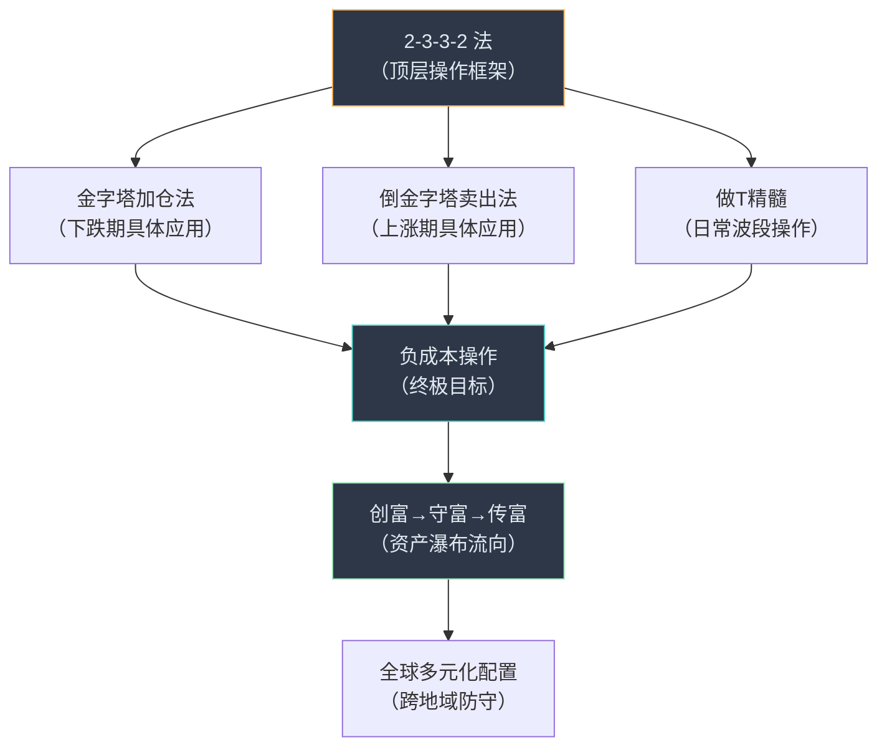

# 版块 C — 仓位管理与资产配置方法论

> **权重**：约 15%（贯穿始终，是整个体系的"底层操作系统"）
> **时间浓度**：贯穿全部 33 个月度合集，2024-05 起系统化输出
> **关联版块**：[A-美股投资实战](file:///Users/johnny/Documents/jjc-money/docs/topology-details/A_美股投资实战.md)

---

## 1. 核心论点清单 (Key Arguments)

### 论点 1：「投资的首要前提是保值/保本，其次才是增值/收益」
> *"投资的首要前提是保值/保本，其次才是增值/收益。"* — 2024-05
> *"赚多少钱是运气，守下多少钱是能力。"* — 2026-02
> *"保值永远优先于增长，防御永远＞进攻。"* — 2026-02

### 论点 2：「成本控制是拿得住的唯一秘诀」
> *"只要你成本够低，一般都能拿得住。"* — 2024-11
> *"因为我的体量比较大，所以习惯性将持仓的个股和指数做成低成本或负成本，这样不会有什么压力和得失的焦虑，往往能拿得住。"* — 2024-12

### 论点 3：「任何时候都不要全仓」
> *"任何时候都不要全仓，8成仓位顶多了，要给自己的操作预留空间。"* — 2024-09
> *"总equity exposure ≤ 80%，always keep 20%+ cash/equivalents。"*

### 论点 4：「看不懂就不碰」
> *"看不懂就不碰 — If you cannot explain the business model and thesis in 3 sentences, you have no business owning it。"*

### 论点 5：「适合自己的才是最好的」
> *"2-3-3-2 也是根据自己的资金体量来量身定做的，不一定适用所有人，每个人要根据自己的情况做一些调整。"* — 2024-11
> *"根据自己的风格和预期来，保守、稳健、进取型，操作和配比会各不一样。"* — 2026-03

---

## 2. 操作系统级方法论 (Core Operating System)

### 2.1 「2-3-3-2 法」— 建仓/减仓分步协议

**首次系统表述**：2024-05《一般从来不一般》
**提及频次**：77次
**定义**：

> *"我个人在二级市场上投资，一般都比较谨慎，看准了比较有把握才下手，有自己的一套方式，姑且称为'2-3-3-2法'吧。"* — 2024-05

#### 建仓方向（上涨通道）

```
Phase 1 (20%): 试探性建仓 → 确认方向
Phase 2 (30%): 价格确认支撑 → 加仓
Phase 3 (30%): 强conviction / 深度回调 → 主力仓
Phase 4 (20%): 最后加仓 / 留给意外深跌
```

#### 减仓方向（逆向 2-3-3-2）

```
Phase 1 (20%): 试探性减仓 → 第一压力位
Phase 2 (30%): 情绪升温 → 加大减仓
Phase 3 (30%): "人声鼎沸" → 接近目标
Phase 4 (20%): 最后一批 OR 保留为"负成本永久仓"
```

#### 灵活变体

> *"每个人根据自身的情况，灵活调整，可以是'3-4-3'，也可以是'5-3-2'之类的。"* — 2024-12
> *"资金体量小，可以2-4-4，也可以2-3-5。"* — 2025-01
> *"里面的每一个数字，都是可以拆分成更小的数字，挺灵活的。"* — 2024-05

#### 作者自评

> *"2-3-3-2 就是进可攻退可守的一种操作。"* — 2024-10
> *"我写的'2-3-3-2'那个就是解决拿不住的问题。"* — 2024-11
> *"2-3-3-2 顶多算外功，招式而已。"* — 2024-10（强调内功心法更重要）

---

### 2.2 「负成本 / 低成本印钞机」

**提及频次**：436次（全文最高频方法论词汇）
**首次出现**：2022-11（首篇即提及）

#### 核心操作

```
Step 1: 买入 → 持有 → 股价上涨
Step 2: 逢高减仓 → 卖出足够回收全部原始成本
Step 3: 剩余仓位 = 纯利润 = "负成本"
Step 4: 心理效应 → 零恐惧 → 拿得更久 → 复利更多
Step 5: 回收的资金 → 流入防守型资产（美债/BRK/高息股）
```

#### 实战案例

| 标的 | 负成本达成时间 | 成本降至 | 操作路径 |
|------|:------------:|---------|---------|
| NVDA | 2024年 | 负成本 | $187.5减仓30%底仓 |
| GOOGL | 2025-09 | <$50 | $226减5%底仓 |
| META | 2025-08 | $149 | $780/$810区间减仓 |
| MSFT | 2025-07 | 负成本 | $503减5%底仓 |
| AAPL | 2024-12 | 负成本 | $240逢高减仓 |
| TSM | 2025-Q4 | 负成本 | 成本和利润放入防守型账户 |

> *"过程中最佳操作，是均实现了负成本/负成本持股，心态非常平和。"* — 2026-01

---

### 2.3 「金字塔补仓法」

**系统阐述**：2025-03
**与2-3-3-2的关系**：金字塔补仓法是 2-3-3-2 中的一种具体应用

> *"金字塔建仓法适合在震荡和下跌时建仓，2-3-3-2是整体思路。"* — 2025-03
> *"金字塔加仓法属于高手用的经典手法。"* — 2025-03
> *"对于资金体量小的，金字塔加仓法+T，就是最好的方法了。"* — 2025-03

#### 操作原理

```
下跌期 → 金字塔加仓法（越跌买越多）
  $100 买 50 股
  $90  买 100 股
  $80  买 150 股
  $70  买 210 股
  → 成本集中在底部，平均成本远低于首次买入价

上涨期 → 倒金字塔加仓法（越涨买越少）
  $100 买 150 股
  $105 买 100 股
  $110 买 50 股
  → 成本集中在低位，不追高
```

#### 实战案例

META 2025-12 金字塔加仓：
> *"从650开始买入，650-627-596-585，买入量比例为1-1-1.5-2，整体买入成本控制在相对底部。"* — 2025-12

NVDA 2026-03 加仓节点设置：
> *"具体的设置是165-155-145-130，买单倍数是1.5-1.5-2-3。"* — 2026-03

---

### 2.4 「倒金字塔卖出法」

> *"倒金字塔减仓法，比如100美元减5%，120美元减10%，150美元减15-20%，逐步增多。"* — 2025-08（获赞424）
> *"2-3-3-2其实是倒金字塔卖出法的一种升级进化版。"* — 2025-03

#### 操作原理

```
卖出时 → 倒金字塔法（越涨卖越多）
  $110 卖 30 股
  $120 卖 50 股
  $130 卖 80 股
  → 尽可能赚到更多的溢价
```

**与金字塔法的配合**：
> *"买卖时可以用金字塔加仓法买入，用倒金字塔法卖出。"* — 2025-03
> *"金字塔和倒金字塔，说起来简单，做起来难，真的需要好好理解和实操多次。"* — 2025-09

---

### 2.5 「做T精髓」

**系统阐述**：2025-03
**核心公式**：底仓 60-70% + 波段 30-40%

> *"做T的精髓，核心是保留60-70%底仓，防止踏空，余下的30-40%做小波段套利，降低成本的同时，给后续留出足够的仓位。"* — 2025-03

#### 做T的目的（按优先级）

> *"做T最重要的目的是腾出资金和仓位，其次才是降低成本。"*
> *"做T的核心精髓，一个是控制成本、仓位和资金；一个是赚部分收益，让自己本金壮大。"* — 2025-09

#### 实战案例

GOOGL 做T操作（2025-07）：
> *"谷歌186减仓节点被触发，做T部分顺利卖出，还有个192未触发，触发后，做T部分将清仓，7成底仓不变。"*
> *"震荡下行时，金字塔加仓法买入，随着上涨，逐步分批卖掉做T的3成仓，这样能降低7成底仓的成本。"*

#### 特殊情况

> *"特斯拉太妖，适合做波段套利。如果是我，55开，5成做底仓，5成做波段。"* — 2025-09（妖股底仓比例降低）

---

---

## 3. 资产配置瀑布 — 「创富→守富→传富」

**提及频次**：22+21次
**首次出现**：2024年

> *"赚到了钱，还要克服人性的贪，把钱守住。富得很稳定，是优点。"* — 2025-10
> *"创富之后，想的就是守富。"* — 2024-09
> *"进攻赢得球迷，防守赢得冠军。"*

### 三层瀑布架构

```
╔══════════════════════════════════════════════════════════╗
║  Tier 1 · 进攻层（创富 CREATE WEALTH）                    ║
║  科技龙头个股 → NVDA/GOOGL/MSFT/META/AMZN/AAPL/TSM      ║
║  高风险高回报 → "印钞机"                                  ║
║  → 利润通过负成本操作提取 ↓                               ║
╠══════════════════════════════════════════════════════════╣
║  Tier 2 · 攻守层（守富 KEEP WEALTH）                      ║
║  QQQ/SPY 宽基指数 + 消费巨头 + 医药保健                    ║
║  中等风险稳定回报 → 缓冲层                                 ║
╠══════════════════════════════════════════════════════════╣
║  Tier 3 · 防守层（传富 TRANSFER WEALTH）                  ║
║  美债/美债ETF + BRK + 可口可乐/强生/SCHD                  ║
║  + 港险/离岸信托/不动产（场外资产）                         ║
║  低风险保值 → 跨代际守护购买力                              ║
╚══════════════════════════════════════════════════════════╝
        💰 资金流向：Tier 1 → Tier 2 → Tier 3（从不反向）
```

### 核心原则

> *"用科技股做'印钞机'，不断赚到收益，并转向配置能守住财富的资产品类。"* — 2025-10
> *"改变未来的科技龙头股，以及不被未来改变的消费/避险股。"* — 2025-10
> *"打江山难，守江山更难。"* — 2026-02

### 作者自身的比例演化

| 时间 | 进取型 | 稳健型 | 防守型 | 方向 |
|------|:------:|:------:|:------:|------|
| 2020-2024 | **85%+** | — | — | 纯进攻 |
| 2025年初 | 58% | 15% | 27% | 开始构建防守 |
| 2026目标 | **40%** | **15%** | **45%** | 防守 > 进攻 |

> *"过去几年，资金超85成押在美股七巨头为主的科技股上，也因此收益丰厚。"* — 2026-01
> *"我前期是进取型，目前整体是稳健型，已经在往防守型的方向过渡。"* — 2026-01

### 资金体量与风格匹配

> *"50万美元以下，集中一两只个股+两个宽基指数ETF就够了。"* — 2026-03
> *"300万美元以下，集中在5-6只个股和宽基指数顶多了。"* — 2026-03
> *"最忌讳目标是稳健型或保守型，却做进取型的操作。"* — 2026-01

| 资金体量 | 推荐风格 | 配置建议 |
|---------|---------|---------|
| <$50万 | 进取型 | 1-2只个股 + QQQ/SPY |
| $50-300万 | 稳健型 | 3-4只七巨头 + QQQ + SPY |
| >$300万 | 分层型 | 进取+稳健+防守三层瀑布 |

---

## 4. 全球多元化配置

### 4.1 离岸账户与工具

| 工具 | 定位 | 说明 |
|------|------|------|
| **盈透证券 (IBKR)** | 主要交易平台 | "手续费香"，作者主用 |
| **汇丰HK** | 港卡/资金通道 | 出海资金桥梁 |
| **港险** | Tier 3 防守资产 | "不断增配优质港险"，不缴税 |
| **新加坡保险** | Tier 3 防守资产 | 与港险对比配置 |
| **离岸信托** | Tier 3 终极防守 | "不能公开说得太明白" |
| **不动产** | Tier 3 防守资产 | "永久产权的房产+土地" |

### 4.2 全球金字塔配置

> *"投资遵循'金字塔'配置，从基础底层的本地资产、现金、保险做起，保障基本生活；再到中层防守型的全球金融资产、实物金银，实现地理和资产类别分散，风险阻断；最后到核心脱钩的离岸信托、身份等，用于应对系统性风险。"* — 2026-01

```
            ╱╲
           ╱  ╲  离岸信托 · 身份隔离（系统性风险对冲）
          ╱────╲
         ╱      ╲  全球金融资产 · 实物金银（地理分散）
        ╱────────╲
       ╱          ╲  本地资产 · 现金 · 保险（基本生活）
      ╱────────────╲
```

### 4.3 汇率操作

| 货币对 | 作者态度 |
|--------|---------|
| **美元** | 全文出现 2,344 次，核心配置货币 |
| **人民币** | 关注 7.25-7.35 关键节点 |
| **日元** | 有宏观判断但无交易体系 |

---

## 5. 方法论关系图



**关系总结**：
- **2-3-3-2** 是顶层框架，金字塔法和倒金字塔法是其子集
- **做T** 是日常操作手段，服务于负成本这个终极目标
- **负成本** 达成后，利润流向防守型资产 = **创富→守富**闭环
- **全球多元化** 是守富层面的地理分散策略

> *"过去这段时间，我把做低成本/负成本、金字塔加仓法、倒金字塔卖出法、'2-3-3-2'操作法等，一个个都已写清楚。"* — 2025-03

---

## 6. 反面教材 / 踩坑记录 (Lessons from Failures)

### 6.1 全仓操作的教训
> *"任何时候都不要全仓，8成仓位顶多了，要给自己的操作预留空间。"* — 2024-09
> 多位读者因全仓被套后无法补仓，丧失主动权。

### 6.2 做T不理解精髓
> *"你这一看就没掌握做T的精髓，没理解，要不就是太贪心，不是每一分钱都要赚的。"* — 2025-03
> *"你要看7成底仓，而不是3成做T。"* — 2025-09

### 6.3 金字塔加仓间距太密
> *"一定提前分配好仓位，要拉开价差，才能游刃有余…抄底太密仓位容易打满。"* — 2025-03

### 6.4 风格错配
> *"用稳健型的预期，去做进取型的配置，最终大概率会因为市场波动过大，自己恐慌而导致操作错误，浮亏严重。"* — 2026-01

### 6.5 SQQQ 做空拿太久
> *读者*："去年5月买的SQQQ和UVIX到现在还拿着。"
> *作者*："不要轻易做空，看空不做空，除非非常有把握。"* — 2026-03

---

## 7. 标志性金句 (Signature Quotes)

| 金句 | 应用场景 |
|------|---------|
| *"2-3-3-2 就是进可攻退可守。"* | 总结操作哲学 |
| *"成本低了，什么都好说。"* | 负成本的心理效应 |
| *"做T最重要的目的是腾出资金和仓位。"* | 纠正"做T = 赚差价"的误解 |
| *"进攻赢得球迷，防守赢得冠军。"* | 资产配置总纲 |
| *"富一世 > 富一时。"* | 长期视角 |
| *"不赚最后一个铜板。"* | 减仓纪律 |
| *"任何时候都不要全仓。"* | 仓位管理铁律 |
| *"金字塔加仓法属于高手用的经典手法。"* | 方法论定位 |
| *"说起来简单，做起来难，需要好好理解和实操多次。"* | 知行合一 |
| *"2-3-3-2 顶多算外功，招式而已。"* | 内功（认知）> 外功（技术） |

---

## 8. 与其他版块的交叉引用 (Cross-References)

| 关联版块 | 交叉方式 |
|---------|---------|
| → **版块 A（美股投资）** | 所有方法论的实战场景，7大个股均有具体操作案例 |
| → **版块 D（宏观经济）** | VIX恐慌指数决定加仓时机；美联储利率影响资产配置比例 |
| → **版块 E（人生哲学）** | "知行合一"是方法论落地的核心难点；"活在欲望之外"解释为何能拿住25倍 |
| → **版块 B（房地产）** | 卖房决策同样使用分步退出思维；房产作为Tier 3防守资产 |
| → **版块 F（育儿）** | 子女账户建仓教学直接使用金字塔加仓法 |

---

## 9. 方法论速查表

| 场景 | 使用方法 | 核心要点 |
|------|---------|---------|
| **看好一只股想建仓** | 2-3-3-2 + 金字塔加仓 | 分4批，越跌买越多 |
| **持仓涨了想减仓** | 2-3-3-2逆向 + 倒金字塔卖出 | 分4批，越涨卖越多 |
| **持仓震荡不动** | 做T（7成底仓+3成波段） | 波段降成本，底仓不动 |
| **持仓大赚想锁利** | 负成本操作 | 卖够回收成本，余仓纯利润 |
| **赚到钱想守住** | 创富→守富瀑布 | 利润流入防守型资产 |
| **资金体量小** | 集中1-2只+宽基ETF | 不要太分散 |
| **VIX = 30** | 开始捞宽基ETF | 恐慌时买入 |
| **VIX = 50** | 重点加仓，资金打掉50%+ | 极度恐慌 = 极度机会 |

---

*本知识卡片基于 33 个月度合集中方法论相关内容的系统提炼。*
*方法论的具体个股应用案例，详见 [版块A — 美股投资实战](file:///Users/johnny/Documents/jjc-money/docs/topology-details/A_美股投资实战.md)。*
