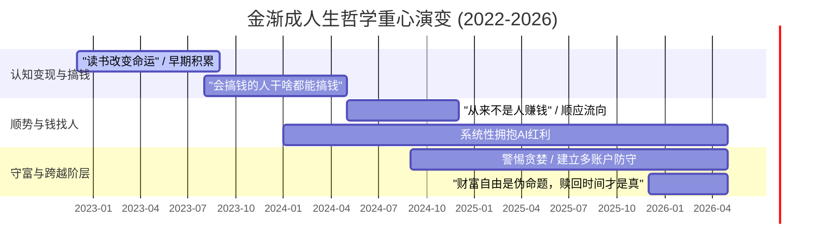

# 版块 E — 人生哲学认知

> **权重**：约 15%（贯穿所有操作的底层灵魂）
> **时间浓度**：从 2022 年底至 2026 年均匀分布，随着财富积累，防守型人生观逐渐强化
> **关联版块**：[A_美股投资实战](file:///Users/johnny/Documents/jjc-money/docs/topology-details/A_美股投资实战.md) · [C_仓位管理与配置](file:///Users/johnny/Documents/jjc-money/docs/topology-details/C_仓位管理与配置.md) · [F_育儿家庭教育](file:///Users/johnny/Documents/jjc-money/docs/topology-details/F_育儿家庭教育.md)

---

## 1. 核心论点清单 (Key Arguments)

### 论点 1：「从来不是人赚钱，是钱在找寻人」
> *"这个流向是会变的，要赚钱，就顺应流向去；从来不是人赚钱，人要赚钱是很难的；但让钱找人，就容易得多。"*
> — 2024-05

- 顺势而为是金渐成哲学的最高原则，无论是买房上车还是美股做龙头，本质都是站在“钱的流向”上。
- **演化脉络**：从早期的“搞钱”实操，逐步升华到对宏观资本流动的敬畏。

### 论点 2：「其实也不难，就是认知到位了」
> *"好多读者对我学生时搞钱的经历和预测模型很感兴趣... 其实也不难，就是认知到位了，钱自然就找上门来了。"*
> — 2023-08《搞钱》

- 财富是认知的变现，认知不到位，凭运气赚来的钱也会凭实力亏掉。
- 白手起家的核心驱动力：“我家庭出身非常一般，自己白手起家，是因为读书才改变命运的。”（2025-08）

### 论点 3：「买在无人问津处，卖在人声鼎沸时」
> *"大佬的跌倒，是命运对贪婪的最好奖励。"* — 2023-08
> *"不要恐慌，震荡期总有机会上车；不要贪婪，钱是赚不完的，人不可能赚尽每一个铜板，要学会止盈。"* — 2025-01

- 人性中的贪婪与恐惧是投资和人生最大的敌人。
- 把反人性操作刻入骨髓，演化出了 2-3-3-2 建仓法则和负成本持股法。

### 论点 4：「人生最正确的投资，就是投资自己」
> *"人生最正确的投资，就是投资自己。自己的学识，人脉，健康！"*
> — 2022-12

- 把自我提升视为终身投资，跨界学习新技能。
- 把这种观念平移到下一代：“育儿也是一门重大投资，我最大的财富就是三个娃。”（2024-09）

---

## 1.5 人生选择逻辑 (Life Choice Thesis)

> *"改变未来的科技龙头股，以及不被未来改变的消费/避险股。"*
> 同样，人生选择也是：拥抱能改变命运的趋势，守住不被外界剥夺的内核。

### 🔷 阶层跨越 —「三代人的接力」
**核心判断**：跨越阶层是一个漫长且困难的系统工程，而跌落阶层却极其容易。
> *"时代背景不同，一个家庭想要彻底跨越阶层，必须要有三代的接力，掉落，半代人就够了，接下来还得相信后来人智慧。"* — 2024-09
> *"最关键的是，这个允许我们大幅跨越阶层特殊的时代，即将过去了。也就是社会上升通道闭合。"* — 2022-12

**生存策略**：
- **进取期**：抓住时代红利（如早期的房地产、当下的AI美股）。
- **防守期**：构筑资产防线（创富→守富→传富体系），防止半代人败光。

### 🟢 财富自由 —「时间与人身的赎回」
**核心判断**：数字上的财富自由是伪命题，真正的自由是选择权。
> *"每个牛马就像青楼女子，试图用不停地劳作赎出自己。能力和价值越高的，就能用越短的时间赎回自己获得自由。能力和价值较低的，哪怕干到人老珠黄也一直干。愿所有人都能够早日得自由，包括财富自由，时间自由，人身自由。"* — 2025-12
> *"至于财富自由，是个伪命题，1000万的时候，想要有1亿，10亿..."* — 2024-09

---

## 2. 子主题分支 (Sub-Topics)

### 2.1 关于“交学费”与知行合一

| 核心态度 | 原文摘录 | 适用场景 |
|------|---------|---------|
| **必须经历** | "知易行难，都是要交学费的... 人生就是'坑-坑-坑-坑-坑'，不断过坑。" (2022-12) | 接受新事物的试错成本 |
| **复盘迭代** | "承认自己认知不到位，是很正常的事... 我们都是人，不是神，认知不到位很正常。面对它，然后搞。" (2025-03) | 投资亏损后的心态调整 |
| **闲钱试水** | "真要炒股，就用自己的闲钱，亏了就当交学费，顶多心疼，而不会伤筋动骨。" (2024-11) | 控制试错的边界和杠杆 |

> **金渐成点评**：新手都需要一个被市场教育的过程。经历才是最好的老师。没有亲自承受过波动的煎熬，别人的经验永远只是文字。

### 2.2 关于“认知低”与人际圈层

| 核心态度 | 原文摘录 | 应对策略 |
|------|---------|---------|
| **警惕降维** | "很多出身底层的年轻人，被认知低下的人给出的建议，草草决定了命运的走向。" (2023-08) | 屏蔽低认知人群的干扰，独立思考 |
| **危险画像** | "没有家底还死要面子、没有权势但脾气冲天、认知低下却自命不凡的人，最危险。" (2025-10) | 及时进行“粪坑检测”，远离消耗型人群 |
| **尊重命运** | "以前在网上还会跟一些认知低的杠精品客吵架，现在直接尊重他们的命运。" (2025-09) | 停止无意义的争论，节省精力搞钱 |

---

## 3. 认知升级的时间线 (Timeline of Cognitive Shifts)

> 记录作者从“进取搞钱”到“防守传承”的哲学重心偏移。

**阶段演化分析**：
1. **早期（2022-2023）**：更多分享个人早期白手起家、学生时代搞钱的经历，强调“读书”和“认知”对改变底层命运的重要性。
2. **中期（2024）**：随着资金体量的进一步扩大，哲学重心转向“顺势而为”和“资金流向”，个人努力退居其次，敬畏周期成为主旋律。
3. **后期（2025-2026）**：防守属性全面觉醒，深刻认识到“跨越阶层需要三代人，掉落只需半代人”，资产配置转向防御（如伯克希尔、美债），追求“赎回自己”的终极自由。

---

## 4. 操作模型在人生中的映射 (Applicable Models)

| 投资模型 | 在人生/职场中的具体应用 |
|------|-------------------|
| **2-3-3-2 分批建仓法** | **小步快跑的试错机制**：不要在一个新领域或新项目中“All in”。先用 20% 的精力/资金去试水（交学费），验证可行性后再分批投入，给自己留足退路。 |
| **负成本持股** | **构建无压力的护城河**：在职业生涯早期用高强度的努力赚取第一桶金（回本），之后用这部分积累的势能去探索长尾收益，消除生活焦虑，让复利自然奔跑。 |
| **粪坑检测 (Cesspit Detector)** | **避坑指南**：识别出结构性下行的赛道、消耗精力的“认知低下”圈层或有毒的人际关系。一旦发现，及时止损，绝不纠缠抄底。 |
| **三账户资产架构** | **人生的三维配置**： 1. 进攻型：提升核心职业技能，抓风口赚大钱。 2. 稳健型：培养能持续带来现金流或快乐的爱好/副业。 3. 防守型：投资健康、教育下一代、购买保险，构筑人生铠甲。 |

---

## 5. 标志性金句 (Signature Quotes)

> *"人生本来就毫无意义，所以需要我们每个人活出自己，赋予它独一无二的意义。" * — 2023-08
>
> *"从来不是人赚钱，人是赚不到钱的；是钱在找寻人，钱在寻找它的主人。"* — 2024-12
>
> *"每个牛马就像青楼女子，试图用不停地劳作赎出自己... 愿所有人都能够早日得自由，包括财富自由，时间自由，人身自由。"* — 2025-12
>
> *"大佬的跌倒，是命运对贪婪的最好奖励。"* — 2023-08

---

## 6. 与其他版块的交叉引用 (Cross-References)

- → **版块 A（美股投资实战）**：【顺势与钱找人】的哲学直接决定了美股操作中对时代红利（如AI半导体）的重仓，而【克服贪婪恐惧】则演化出了负成本持股法。
- → **版块 C（仓位管理与配置）**：【跨越阶层与防守】的认知，促使作者在2025-2026年大幅提升了防守型资产（美债、伯克希尔）的比例，以防“半代人败光”。
- → **版块 F（育儿家庭教育）**：【投资自己与交学费】的观念平移到了子女教育中，强调让孩子早点拿自己的钱去投资“交学费”，提前感受真实世界的规律。
