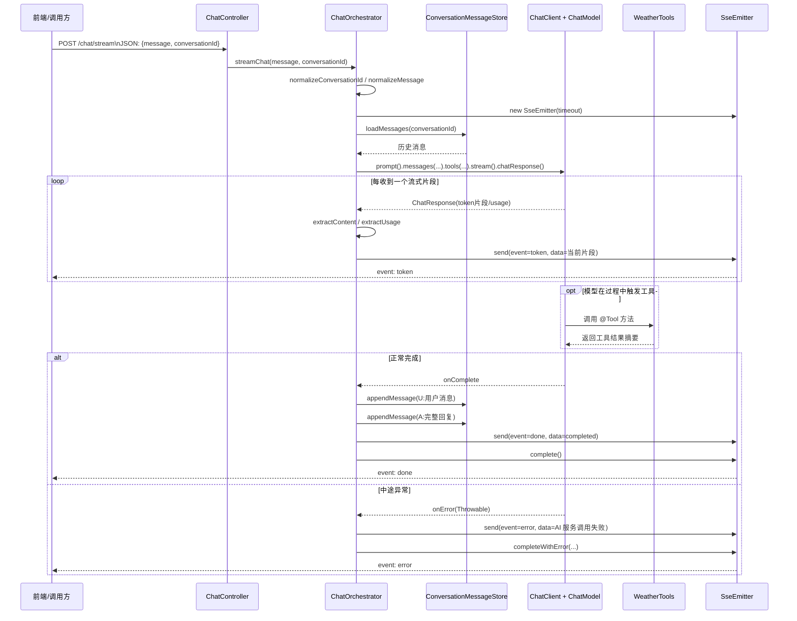
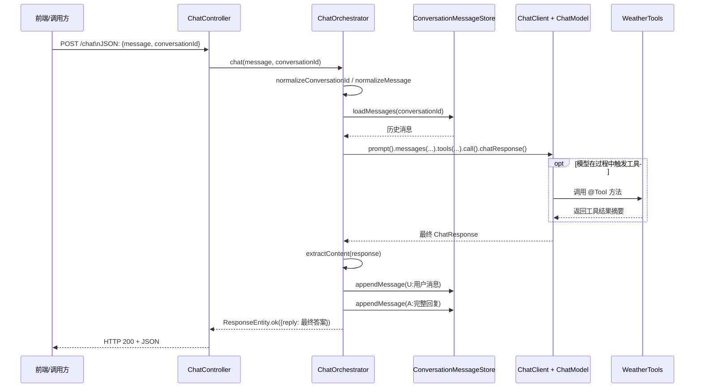

# AI调用链入门指南

你已经熟悉 Spring Boot，这份文档只讲你最需要补齐的 AI 部分：**模型怎么接入、Tool 怎么被模型调用、外部 API 怎么进链路、如何兼容多模型**。

## 1. 先建立一个“AI 调用链”心智模型

在这个项目里，完整链路是：

1. 前端/调用方请求 `POST /chat`
2. `ChatController` 把用户输入交给 `ChatClient`
3. `ChatClient` 把 `WeatherTools`（`@Tool` 方法）注册给模型
4. 模型决定是否调用某个 Tool
5. Tool 内部通过统一客户端 `ExternalJsonPostClient` 调外部 POST JSON API
6. Tool 把外部响应“摘要化”后回传给模型
7. 模型输出最终 `reply`

本质上你可以把它理解为：  
**Spring MVC Controller +（LLM 作为调度器）+ 普通 Java Service/Client 调外部接口**。

---

## 2. 对应你项目里的关键代码位置

## 2.1 对话入口（和普通 Controller 很像）

文件：`src/main/java/com/springailab/lab/web/ChatController.java`

现在这份代码已经演进为：

- `ChatController` 只负责接收 HTTP 请求
- 真正的对话编排放到 `ChatOrchestrator`
- 同时支持：
  - 同步接口：`POST /chat`
  - 流式接口：`POST /chat/stream`

你只要先记住一句话：  
**Controller 不负责 AI 推理细节，只负责收请求、调编排服务、回响应。**

### 2.1.1 `chat(...)` 是什么

代码位置：`src/main/java/com/springailab/lab/web/ChatController.java`

```java
@PostMapping(value = "/chat", consumes = MediaType.APPLICATION_JSON_VALUE)
public ResponseEntity<Map<String, String>> chat(@RequestBody ChatRequest request) {
    return this.chatOrchestrator.chat(request.message(), request.conversationId());
}
```

这里涉及 4 个你需要先熟悉的 Spring Web API：

1. `@PostMapping`
   - 表示这是一个 HTTP POST 接口
   - `value = "/chat"` 表示路径是 `/chat`
   - `consumes = MediaType.APPLICATION_JSON_VALUE` 表示它接收 `application/json`

2. `@RequestBody`
   - 表示把请求体里的 JSON 自动反序列化成 Java 对象
   - 例如前端传：

```json
{
  "message": "杭州天气怎么样",
  "conversationId": "demo-1"
}
```

就会被映射成：

```java
new ChatRequest("杭州天气怎么样", "demo-1")
```

3. `ChatRequest`
   - 这里用了 Java `record`
   - 它是一个很适合做 DTO 的语法糖
   - 等价理解成“一个只有字段、构造器、getter 的轻量对象”

```java
public record ChatRequest(String message, String conversationId) {
}
```

4. `ResponseEntity<Map<String, String>>`
   - `ResponseEntity` 表示“完整 HTTP 响应”
   - 不只是 body，还可以控制状态码、header
   - `Map<String, String>` 表示响应体大概长这样：

```json
{
  "reply": "你好，我来帮你查询..."
}
```

### 2.1.2 `streamChat(...)` 是什么

代码位置：`src/main/java/com/springailab/lab/web/ChatController.java`

```java
@PostMapping(value = "/chat/stream", consumes = MediaType.APPLICATION_JSON_VALUE, produces = MediaType.TEXT_EVENT_STREAM_VALUE)
public SseEmitter streamChat(@RequestBody ChatRequest request) {
    return this.chatOrchestrator.streamChat(request.message(), request.conversationId());
}
```

这个接口和 `/chat` 最大区别是：

- `/chat`：等模型全部生成完，再一次性返回
- `/chat/stream`：模型生成一点，就立刻往前端推一点

这就叫**流式输出**。

这里最关键的 API 有两个：

#### API 1：`produces = MediaType.TEXT_EVENT_STREAM_VALUE`

这句表示这个接口返回的不是普通 JSON，而是 **SSE**（Server-Sent Events）流。

等价 HTTP 响应头可以理解成：

```http
Content-Type: text/event-stream
```

它的意义是：

- 服务端可以持续不断往客户端推送数据
- 客户端不用反复轮询
- 特别适合聊天逐字输出

#### API 2：`SseEmitter`

`SseEmitter` 是 Spring MVC 提供的一个类，用来在传统 Servlet 模式下实现 SSE。

你可以把它理解成：

- Controller 先把连接保留住
- 后续业务代码可以不断 `send(...)`
- 每 `send(...)` 一次，前端就能收到一个事件
- 最后调用 `complete()` 表示流结束

它非常适合“边生成边返回”的场景。

---

## 2.1.3 `ChatOrchestrator.streamChat(...)` 详细拆解

文件：`src/main/java/com/springailab/lab/domain/chat/service/ChatOrchestrator.java`

这是当前流式链路真正工作的地方。下面按执行顺序解释。

### 第 1 步：规范化输入参数

```java
String normalizedConversationId = normalizeConversationId(conversationId);
String normalizedMessage = normalizeMessage(message);
```

这两个方法的作用是“兜底”：

- 如果 `conversationId` 为空，就生成一个新的会话 ID
- 如果 `message` 为空，就给一个默认值 `你好`

这样后续逻辑就不用到处判空。

### 第 2 步：创建 `SseEmitter`

```java
SseEmitter emitter = new SseEmitter(STREAM_TIMEOUT.toMillis());
```

这里的 API 要点：

- `new SseEmitter(timeoutMillis)`：创建一个 SSE 发射器
- 参数是超时时间，单位毫秒
- 当前代码里 `STREAM_TIMEOUT = Duration.ofMinutes(5)`
- 也就是这个流最多保留 5 分钟

你可以理解为：

- `emitter` 代表这次浏览器和服务端之间的“流式通道”
- 后面所有 token 都会通过它发出去

### 第 3 步：记录监控指标

```java
Timer.Sample sample = Timer.start(this.meterRegistry);
Counter.builder("chat_stream_requests_total")
        .register(this.meterRegistry)
        .increment();
```

这部分不是 AI 专属，而是 **Micrometer 指标 API**：

#### `MeterRegistry`
- 可以理解成“指标注册中心”
- 程序里所有计数器、耗时统计都挂在这里

#### `Timer.Sample`
- 用来统计一个流程耗时
- 先 `start(...)`
- 结束时再 `stop(...)`

#### `Counter`
- 用来计数
- 这里的 `chat_stream_requests_total` 表示：流式请求总次数

简单说，这两行是在做：

- 记录“来了一次流式请求”
- 记录“这次请求总共花了多久”

### 第 4 步：准备流式过程中需要保存的状态

```java
AtomicBoolean finished = new AtomicBoolean(false);
AtomicReference<Usage> latestUsage = new AtomicReference<>();
StringBuilder streamedContent = new StringBuilder();
```

这里有三个 Java API：

#### `AtomicBoolean`
- 线程安全的布尔值
- 用来保证“结束逻辑只执行一次”
- 因为 SSE 正常完成、异常完成、超时完成，都可能触发结束动作

#### `AtomicReference<Usage>`
- 线程安全保存一个对象引用
- 这里保存最新一次拿到的 token 使用量 `Usage`

#### `StringBuilder`
- 把流式返回的每一段文本拼起来
- 因为流式过程中收到的是一段一段 token
- 最后要把完整回复保存到会话历史里

### 第 5 步：构造 Spring AI 的流式调用

```java
Flux<ChatResponse> responseFlux = this.chatClient.prompt()
        .messages(buildPromptMessages(normalizedConversationId, normalizedMessage))
        .tools(this.weatherTools)
        .stream()
        .chatResponse();
```

这几行是当前最核心的 Spring AI API。逐段看。

#### 5.1 `this.chatClient.prompt()`
- 表示开始构造一次聊天请求
- 你可以把它理解成“创建一个 prompt builder”

#### 5.2 `.messages(...)`
- 传入这次调用要给模型的消息列表
- 这里不是只传当前用户一句话
- 还会把当前 `conversationId` 对应的历史消息一起带上
- 这样模型才知道上下文

也就是说，这里已经有了“多轮记忆”的基础能力。

#### 5.3 `.tools(this.weatherTools)`
- 把 `WeatherTools` 这个 Bean 里的 `@Tool` 方法注册给模型
- 模型在推理时，可以决定是否调用这些工具

你可以理解成：

- 没有 `.tools(...)`，模型只能“纯文本回答”
- 有了 `.tools(...)`，模型才知道“我可以调用哪些 Java 方法”

#### 5.4 `.stream()`
- 这是同步和流式的分界点
- 如果是同步，一般走 `.call()`
- 现在这里走 `.stream()`，表示要开启流式模式

#### 5.5 `.chatResponse()`
- 表示最终希望拿到的是 `ChatResponse` 流
- 返回类型是：`Flux<ChatResponse>`

### 第 6 步：认识 `Flux<ChatResponse>`

`Flux` 来自 **Project Reactor**，是响应式编程里的一个核心类型。

你可以先用最简单的话理解：

- `Mono<T>`：将来返回 0 或 1 个结果
- `Flux<T>`：将来返回 0 到多个结果

这里为什么是 `Flux<ChatResponse>`？

因为流式输出不是一次只来一个最终结果，而是会不断收到很多片段，例如：

- 第一次：`你`
- 第二次：`好`
- 第三次：`，`
- 第四次：`我`
- ...

所以这里需要一个“可连续产生多个元素”的容器，也就是 `Flux`。

### 第 7 步：订阅流 `subscribe(...)`

```java
Disposable disposable = responseFlux.subscribe(chatResponse -> {
    ...
}, throwable -> {
    ...
}, () -> {
    ...
});
```

这里是 Reactor 最重要的 API 之一。

#### `subscribe(...)` 是干什么的

只有你订阅了，流才真正开始执行。

你可以把它理解成：

- 前面 `this.chatClient.prompt()...` 只是“定义流程”
- `subscribe(...)` 才是“真正启动流程”

#### 三个回调分别是什么

1. `chatResponse -> { ... }`
   - 每来一个流式片段，就执行一次
   - 相当于“onNext”

2. `throwable -> { ... }`
   - 流式过程中出错时执行
   - 相当于“onError”

3. `() -> { ... }`
   - 整个流正常结束时执行
   - 相当于“onComplete”

#### `Disposable`
- 订阅之后会返回一个 `Disposable`
- 它表示这次订阅关系可以被取消
- 后面超时或连接断开时，会调用 `dispose()` 停止订阅

---

## 2.1.4 流过程中每段数据是怎么发送给前端的

在 `onNext` 回调里：

```java
Usage usage = extractUsage(chatResponse);
if (usage != null) {
    latestUsage.set(usage);
}
String token = extractContent(chatResponse);
if (!StringUtils.hasText(token)) {
    return;
}
streamedContent.append(token);
sendEvent(emitter, "token", new ChatEventPayload(normalizedConversationId, token));
```

这里要理解 4 个点。

### 1. `extractUsage(chatResponse)`
- 从这次返回里提取 token 使用量
- 用于后面估算成本
- 不是每个片段都一定带 usage，所以要判空

### 2. `extractContent(chatResponse)`
- 从 `ChatResponse` 里提取当前这一小段文本
- 在流式模式下，通常它不是完整回答，而是一个“增量片段”

### 3. `streamedContent.append(token)`
- 把每次收到的 token 拼接起来
- 最终得到完整回答

### 4. `sendEvent(...)`
- 真正把数据通过 SSE 推给浏览器/前端

再看 `sendEvent(...)` 的实现：

```java
emitter.send(SseEmitter.event()
        .name(eventName)
        .data(payload));
```

这里的 API 含义：

#### `SseEmitter.event()`
- 创建一个 SSE 事件对象

#### `.name(eventName)`
- 给事件命名
- 当前代码会发出：
  - `token`
  - `error`
  - `done`

前端就可以按事件名分别处理

#### `.data(payload)`
- 事件携带的数据内容
- 当前项目传的是 `ChatEventPayload`
- 一般会被序列化成 JSON 发给前端

也就是说，前端收到的大致会是这种语义：

- `event: token` -> 来了一段文本
- `event: error` -> 中途出错
- `event: done` -> 本次输出结束

---

## 2.1.5 流出错时怎么处理

在 `onError` 回调里：

```java
sendEvent(emitter, "error", new ChatEventPayload(normalizedConversationId, "AI 服务调用失败"));
finalizeStream(finished, sample, latestUsage.get(), "true");
emitter.completeWithError(throwable);
```

这里有三个关键动作：

1. 先发一个 `error` 事件给前端
   - 告诉前端这次流失败了

2. `finalizeStream(...)`
   - 做统一收尾
   - 例如记录耗时、统计成本

3. `emitter.completeWithError(throwable)`
   - 告诉 Spring：这个 SSE 连接异常结束

注意这里的设计很实用：

- 先尽量告诉前端“失败了”
- 再结束连接
- 而不是直接什么都不发就断掉

---

## 2.1.6 流正常结束时怎么处理

在 `onComplete` 回调里：

```java
sendEvent(emitter, "done", new ChatEventPayload(normalizedConversationId, "completed"));
appendConversation(normalizedConversationId, normalizedMessage, streamedContent.toString());
finalizeStream(finished, sample, latestUsage.get(), "true");
emitter.complete();
```

这里依次做了 4 件事：

1. 发送 `done` 事件
   - 告诉前端“这次流已经结束”

2. `appendConversation(...)`
   - 把用户消息和 AI 最终完整回复写入会话历史
   - 这样下次同一个 `conversationId` 再来时，能带上上下文

3. `finalizeStream(...)`
   - 统计耗时和估算成本

4. `emitter.complete()`
   - 正常关闭 SSE 连接

---

## 2.1.7 为什么还要写 `onCompletion` 和 `onTimeout`

代码如下：

```java
emitter.onCompletion(disposable::dispose);
emitter.onTimeout(() -> {
    disposable.dispose();
    ...
    emitter.complete();
});
```

这是把 **SSE 生命周期** 和 **Reactor 订阅生命周期** 连起来。

### `emitter.onCompletion(...)`
- 当 SSE 连接结束时触发
- 这里调用 `disposable.dispose()`
- 作用是：前端断了，后端也别继续订阅模型流了

否则就可能出现：
- 浏览器已经关掉页面
- 但后端还在白白接收模型 token
- 浪费资源和费用

### `emitter.onTimeout(...)`
- 当 SSE 超时触发
- 这里会：
  - 停止订阅 `disposable.dispose()`
  - 记录错误指标
  - 停止耗时统计
  - `emitter.complete()` 结束连接

这属于非常典型的“资源回收”写法。

---

## 2.1.8 `buildPromptMessages(...)` 为什么重要

```java
List<String> history = this.conversationMessageStore.loadMessages(conversationId);
```

这个方法会先从 `ConversationMessageStore` 里读取历史消息，然后转成：

- `UserMessage`
- `AssistantMessage`

最后再把当前用户输入追加进去。

也就是说，模型真正拿到的不是单条消息，而是：

- 历史用户消息
- 历史助手回复
- 当前用户消息

这就是多轮对话记忆的基本实现方式。

对于初学者，你可以直接把它理解成：

**conversationId 就像聊天窗口 ID；同一个 ID 下，历史上下文会被继续带给模型。**

---

## 2.1.9 同步接口和流式接口的核心区别

| 维度 | `/chat` | `/chat/stream` |
|------|---------|----------------|
| 返回方式 | 一次性返回完整结果 | 分多次持续返回 |
| Spring API | `ResponseEntity` | `SseEmitter` |
| Spring AI 调用 | `.call()` | `.stream()` |
| 返回类型 | `ChatResponse` 单次结果 | `Flux<ChatResponse>` 多段结果 |
| 适合场景 | 简单问答、接口对接 | 打字机效果、前端聊天窗口 |

所以你可以把这两条链路记成一句最核心的话：

- **同步：`.call()` -> 一次拿完**
- **流式：`.stream()` -> 一段一段拿**

---

## 2.1.10 `streamChat(...)` 时序图（按一次请求发生了什么来理解）

如果你刚开始学，不要一上来盯着每个 API 名字。先把一次请求从头到尾怎么流动记住。



### 你可以把这张图翻译成一句大白话

`/chat/stream` 做的事情就是：

1. 先收下用户消息
2. 把历史会话也一起交给模型
3. 模型每生成一小段，就立刻通过 `SseEmitter` 推给前端
4. 如果模型要调工具，就去调 `@Tool`
5. 全部结束后，把完整对话保存起来

---

## 2.1.11 初学者白话笔记：把这些 API 全部类比成你熟悉的东西

如果你觉得 `SseEmitter`、`Flux`、`Disposable` 这些词太陌生，可以先这样记。

### 1. `@PostMapping`

你熟悉的理解：
- 就是定义一个 POST 接口
- 和你平时写用户、新增订单、提交表单，本质一样

在这里：
- `/chat` 是普通 POST
- `/chat/stream` 也是 POST，只是返回方式不一样

### 2. `@RequestBody`

你熟悉的理解：
- 把前端传来的 JSON 自动转成 Java 对象

在这里：
- 前端发 `message`、`conversationId`
- Spring 自动装进 `ChatRequest`

### 3. `ResponseEntity`

你熟悉的理解：
- 就是“可控制状态码的返回值包装器”
- 适合普通 REST 接口

在这里：
- `/chat` 用它一次性返回最终答案

你可以把它理解成：
- **普通快递包裹，一次性送达**

### 4. `SseEmitter`

你熟悉的理解：
- 它不是一次性把包裹送完
- 而是打开一根“持续推送的小管道”

在这里：
- 模型说一个字，推一个字
- 模型说一句话，推一句话
- 最后再明确告诉前端“结束了”

你可以把它理解成：
- **直播/电话通话**，不是一次性短信

### 5. `ChatClient`

你熟悉的理解：
- 它像是“调用大模型的客户端 SDK 包装器”
- 类似你以前调用第三方支付、短信平台时封装的 client

在这里：
- `prompt()` 开始组装本次请求
- `messages(...)` 放进去要给模型看的消息
- `tools(...)` 告诉模型它可以调哪些工具

### 6. `.call()`

你熟悉的理解：
- 同步请求，等对方全部处理完，再拿最终结果

在这里：
- 对应 `/chat`
- 适合后端对后端，或者你只关心最终答案的场景

### 7. `.stream()`

你熟悉的理解：
- 不是等全部结果，而是边生成边接收

在这里：
- 对应 `/chat/stream`
- 特别适合聊天页面“打字机效果”

### 8. `Flux<ChatResponse>`

你熟悉的理解：
- 普通方法返回一个对象：`OrderDTO`
- 这里不是一个对象，而是一串连续到来的对象

所以可以把它理解成：
- **一个持续冒数据的结果流**

如果一定要类比：
- 普通返回值像“一张照片”
- `Flux` 更像“一段视频帧流”

### 9. `subscribe(...)`

你熟悉的理解：
- 就像“开始监听这个流”
- 不监听，它就不会真正往下跑

在这里三个回调可以简单记成：

- `onNext`：来新数据了
- `onError`：出错了
- `onComplete`：结束了

这三个名字你以后会在很多响应式代码里反复见到。

### 10. `Disposable`

你熟悉的理解：
- 像“这个监听器/订阅”的遥控器
- 不想继续了，就 `dispose()`

在这里：
- 浏览器断开
- 或者超时
- 后端就停止继续接收模型流

### 11. `StringBuilder`

你熟悉的理解：
- 就是把零碎字符串不断拼起来

在这里：
- 每次流式只收到一小段
- 最终要拼成完整回复再保存

### 12. `AtomicBoolean`

你熟悉的理解：
- 一个线程安全的“开关位”

在这里：
- 防止“结束逻辑”执行两次
- 因为正常结束、异常结束、超时结束，都可能进收尾逻辑

### 13. `ConversationMessageStore`

你熟悉的理解：
- 就像聊天记录仓库
- 类似你自己维护一个会话表、消息表

在这里：
- 先读历史消息
- 再把本轮用户消息和 AI 回复存回去

所以它解决的是：
- **同一个 conversationId 能继续聊下去**

---

## 2.1.12 你看这段流式代码时，推荐按这 4 层去读

这是最适合初学者的阅读顺序。

### 第 1 层：先看 Controller 层

看：
- 路径是什么
- 收什么参数
- 返回什么类型

本例里：
- `/chat/stream`
- 收 `ChatRequest`
- 返回 `SseEmitter`

### 第 2 层：再看 Orchestrator 层

看：
- 是谁真正调用大模型
- 是谁拼上下文
- 是谁把 token 推给前端

本例里：
- `ChatOrchestrator.streamChat(...)` 是真正的主流程

### 第 3 层：再看“模型调用配置层”

看：
- `messages(...)` 里传了什么
- `tools(...)` 注册了什么
- `.call()` 还是 `.stream()`

本例里：
- 有历史消息
- 有 `WeatherTools`
- 走的是流式 `.stream()`

### 第 4 层：最后再看资源回收和监控

看：
- 是否处理超时
- 是否处理异常
- 是否记录耗时、计数、成本

本例里：
- 有 `onTimeout`
- 有 `onError`
- 有 `Counter`、`Timer`

也就是说，你不要一开始就陷在 Reactor 语法里。  
先抓主线：**请求进来 -> 调模型 -> token 推前端 -> 结束后收尾**。

---

## 2.1.13 给初学者的最小记忆卡片

你可以先只背下面这几句：

- `@RequestBody`：把 JSON 变成 Java 对象
- `ResponseEntity`：普通 REST 的一次性返回
- `SseEmitter`：流式推送返回
- `.call()`：同步拿完整结果
- `.stream()`：边生成边拿结果
- `Flux`：一串连续结果
- `subscribe()`：真正启动这串结果
- `Disposable`：中途停止订阅
- `conversationId`：同一个聊天窗口的上下文标识

如果这几句你已经记住了，再回头看代码，就不会那么陌生了。

---

## 2.1.14 SSE 实际返回示例：前端到底会收到什么

你现在已经知道 `/chat/stream` 会不断发送事件。下面直接看“前端可能看到的内容长什么样”。

先回到代码里的发送位置：

- [ChatOrchestrator.java:139](src/main/java/com/springailab/lab/domain/chat/service/ChatOrchestrator.java#L139)
- [ChatOrchestrator.java:144](src/main/java/com/springailab/lab/domain/chat/service/ChatOrchestrator.java#L144)
- [ChatOrchestrator.java:148](src/main/java/com/springailab/lab/domain/chat/service/ChatOrchestrator.java#L148)
- [ChatOrchestrator.java:259-263](src/main/java/com/springailab/lab/domain/chat/service/ChatOrchestrator.java#L259-L263)

当前代码会发 3 类事件：

- `token`
- `error`
- `done`

事件的数据结构来自：

- [ChatEventPayload.java:7-24](src/main/java/com/springailab/lab/domain/chat/service/ChatEventPayload.java#L7-L24)

它只有两个字段：

- `conversationId`
- `content`

也就是说，前端收到的数据本质上会像：

```json
{
  "conversationId": "demo-1",
  "content": "你好"
}
```

---

## 2.1.15 SSE 原始报文长什么样

如果你用浏览器 EventSource、前端 fetch 流式解析、或者抓包工具去看，SSE 响应不是普通 JSON，而更像这种连续文本：

```text
event: token
data: {"conversationId":"demo-1","content":"你"}

event: token
data: {"conversationId":"demo-1","content":"好"}

event: token
data: {"conversationId":"demo-1","content":"，我来帮你查一下。"}

event: done
data: {"conversationId":"demo-1","content":"completed"}

```

注意 3 个点：

1. 每个事件都以 `event:` 开头
2. 事件内容在 `data:` 后面
3. 事件和事件之间用空行分隔

这就是 SSE 的标准基本格式。

---

## 2.1.16 对应你这个项目的 3 种事件示例

### 示例 1：`token` 事件

这表示：
- 模型新生成了一小段文本
- 后端立刻把这段文本推给前端

可能长这样：

```text
event: token
data: {"conversationId":"demo-1","content":"杭州今天多云，"}

```

再来一段：

```text
event: token
data: {"conversationId":"demo-1","content":"气温大约 22 度。"}

```

前端通常会把这两段内容拼起来，显示成：

```text
杭州今天多云，气温大约 22 度。
```

### 示例 2：`error` 事件

这表示：
- 流式过程中出错了
- 例如模型调用失败、网络出错、SSE 发送失败等

可能长这样：

```text
event: error
data: {"conversationId":"demo-1","content":"AI 服务调用失败"}

```

前端收到后，通常会：

- 停止继续等待新 token
- 把聊天框标记为失败
- 提示用户重试

### 示例 3：`done` 事件

这表示：
- 本次流式输出已经结束
- 不会再有新的 token

可能长这样：

```text
event: done
data: {"conversationId":"demo-1","content":"completed"}

```

前端收到后，通常会：

- 把“正在生成中”状态去掉
- 把这条消息标记成已完成
- 允许用户继续发下一轮消息

---

## 2.1.17 把一整次 SSE 会话串起来看

假设用户请求：

```json
{
  "message": "杭州天气怎么样",
  "conversationId": "demo-1"
}
```

那么一次较完整的流式过程，前端可能会依次收到：

```text
event: token
data: {"conversationId":"demo-1","content":"杭州今天"}

event: token
data: {"conversationId":"demo-1","content":"天气不错，"}

event: token
data: {"conversationId":"demo-1","content":"预计多云，"}

event: token
data: {"conversationId":"demo-1","content":"气温约 22 度。"}

event: done
data: {"conversationId":"demo-1","content":"completed"}

```

前端页面上的体验就是：

1. 先显示“杭州今天”
2. 再追加“天气不错，”
3. 再追加“预计多云，”
4. 再追加“气温约 22 度。”
5. 最后结束

所以从用户体感上说，它更像：

- 聊天机器人正在一边想一边打字

而不是：

- 后台憋很久，最后一次性吐出整段话

---

## 2.1.18 同步接口的返回示例

再对照看一下同步 `/chat`。

同步接口最终返回的是一个普通 JSON：

```json
{
  "reply": "杭州今天天气不错，预计多云，气温约 22 度。"
}
```

它只有一个特点：

- **只有最终结果，没有中间过程**

也就是说，对于前端来说：

- 发请求后就等着
- 等到后端彻底处理完
- 一次性拿到完整回答

---

## 2.1.19 SSE 和同步版的本质区别

这个问题非常关键。不要只记“一个是流式，一个不是”。要抓住**通信模型**和**用户体验**上的本质差异。

### 本质区别 1：返回的是“一次结果”还是“结果流”

同步版 `/chat`：
- 服务端处理完以后
- 返回 **1 个完整响应**
- 这个响应通常就是一份 JSON

SSE 版 `/chat/stream`：
- 服务端处理过程中
- 返回 **多次连续事件**
- 每次事件只是一小段增量

所以本质上：

- 同步：**单次响应**
- SSE：**持续推送的响应流**

### 本质区别 2：前端拿到的是“最终值”还是“过程值”

同步版：
- 前端拿到的是最终值
- 中间模型想了多久、生成了哪些片段，前端看不到

SSE 版：
- 前端拿到的是过程值
- 可以边收到边展示
- 最终结果其实是把多个 token 片段拼出来的

所以本质上：

- 同步：**只看结果**
- SSE：**结果 + 生成过程可见**

### 本质区别 3：连接使用方式不同

同步版：
- 发起请求
- 后端处理
- 返回响应
- 连接结束

SSE 版：
- 发起请求
- 连接保持一段时间不断开
- 后端持续往这个连接里写事件
- 最后手动 `complete()` 结束

所以本质上：

- 同步：**短连接式的一次完成**
- SSE：**长时间保持连接并不断写出数据**

### 本质区别 4：后端代码组织方式不同

同步版：
- 更像传统 MVC
- 调一次 service
- 拿到结果
- `return ResponseEntity.ok(...)`

SSE 版：
- 需要维护一个持续可写的 `SseEmitter`
- 需要处理 `send(...)`
- 需要处理 `onCompletion / onTimeout / onError`
- 需要考虑订阅取消、资源回收

所以本质上：

- 同步：**请求-响应式代码**
- SSE：**事件驱动式代码**

### 本质区别 5：适合的场景不同

同步版更适合：
- 普通接口调用
- 后端对后端调用
- 不关心中间生成过程
- 只关心最终结果是否正确

SSE 更适合：
- 聊天窗口
- 打字机效果
- 长文本生成
- 希望用户尽早看到部分结果
- 希望减少“系统没反应”的等待感

---

## 2.1.20 用一句最容易记住的话区分两者

你可以这样背：

- 同步版：**服务端想完了再一次性告诉你答案**
- SSE 版：**服务端一边想，一边把正在生成的答案不断推给你**

如果再压缩成更短：

- 同步：**一次返回最终结果**
- SSE：**多次返回增量结果**

---

## 2.1.21 把区别整理成对照表

| 维度 | 同步 `/chat` | SSE `/chat/stream` |
|------|--------------|--------------------|
| HTTP 返回 | 一次性 JSON | 持续事件流 `text/event-stream` |
| 后端返回类型 | `ResponseEntity<Map<String, String>>` | `SseEmitter` |
| Spring AI 调用方式 | `.call()` | `.stream()` |
| 结果形态 | 完整答案 | 多个 token 片段 + done/error |
| 前端体验 | 等全部完成再显示 | 边生成边显示 |
| 连接特点 | 请求结束即关闭 | 保持连接直到流结束 |
| 后端复杂度 | 较低 | 更高，需要处理超时/取消/收尾 |
| 更适合 | 普通接口、服务间调用 | 聊天窗口、长文本实时展示 |

---

## 2.1.22 你在项目里应该怎么理解这两套接口

在这个项目里，可以把它们理解成：

### `/chat`
给：
- Postman 验证
- 后端服务调用
- 只想快速拿完整回答的场景

### `/chat/stream`
给：
- 前端聊天页面
- 需要逐字输出的场景
- 用户体验优先的场景

所以不是谁替代谁，而是：

- **同步接口解决“拿结果”**
- **SSE 接口解决“拿过程 + 更好的交互体验”**

---

## 2.1.23 同步版 `chat(...)` 详细拆解

前面你已经把 SSE 看得比较清楚了。现在再看同步版，你会发现它其实是同一条主链路，只是“返回方式”更简单。

先看入口代码：

- [ChatController.java:40-45](src/main/java/com/springailab/lab/web/ChatController.java#L40-L45)
- [ChatOrchestrator.java:79-103](src/main/java/com/springailab/lab/domain/chat/service/ChatOrchestrator.java#L79-L103)

`ChatController` 里：

```java
@PostMapping(value = "/chat", consumes = MediaType.APPLICATION_JSON_VALUE)
public ResponseEntity<Map<String, String>> chat(@RequestBody ChatRequest request) {
    log.info("Chat request received, messageLength={},request={}",
            request.message() == null ? 0 : request.message().length(), request);
    return this.chatOrchestrator.chat(request.message(), request.conversationId());
}
```

你可以看到它和 `/chat/stream` 一样，仍然是：

1. 收 JSON 请求
2. 把参数交给 `ChatOrchestrator`
3. 返回结果

区别只在于：

- `/chat` 返回 `ResponseEntity<Map<String, String>>`
- `/chat/stream` 返回 `SseEmitter`

也就是：

- 一个是**一次性 HTTP 响应**
- 一个是**持续推送事件流**

---

## 2.1.24 `ChatOrchestrator.chat(...)` 逐行理解

来看核心实现：

```java
public ResponseEntity<Map<String, String>> chat(String message, String conversationId) {
    String normalizedConversationId = normalizeConversationId(conversationId);
    String normalizedMessage = normalizeMessage(message);
    try {
        ChatResponse response = this.chatClient.prompt()
                .messages(buildPromptMessages(normalizedConversationId, normalizedMessage))
                .tools(this.weatherTools)
                .call()
                .chatResponse();
        String content = extractContent(response);
        appendConversation(normalizedConversationId, normalizedMessage, content);
        collectEstimatedCostFromUsage(response, "chat", "false");
        return ResponseEntity.ok(Map.of("reply", content));
    } catch (NonTransientAiException ex) {
        ...
    }
}
```

下面按执行顺序讲。

### 第 1 步：规范化参数

```java
String normalizedConversationId = normalizeConversationId(conversationId);
String normalizedMessage = normalizeMessage(message);
```

这一步和流式版完全一致：

- `conversationId` 为空就自动生成
- `message` 为空就给默认值

也就是说，不管是同步还是流式，真正进入模型之前，都会先把输入处理成“可安全使用”的格式。

### 第 2 步：构造 Prompt

```java
this.chatClient.prompt()
```

这表示开始构造一次对大模型的请求。

你可以把它理解成：

- 新建一个本次聊天调用的 builder
- 后面继续往里面填消息、工具、调用方式

### 第 3 步：放入消息上下文

```java
.messages(buildPromptMessages(normalizedConversationId, normalizedMessage))
```

这一步和流式版也完全一样。

`buildPromptMessages(...)` 会做三件事：

1. 用 `conversationId` 找历史消息
2. 把历史消息转成 `UserMessage` / `AssistantMessage`
3. 再把当前用户消息加进去

所以同步版并不是“无状态的一问一答”，它一样支持多轮上下文。

### 第 4 步：注册 Tool

```java
.tools(this.weatherTools)
```

这一步也和流式版一样。

意思是：

- 本次模型调用时
- 可以使用 `WeatherTools` 中暴露的 `@Tool`
- 模型如果判断有必要，就会调用工具

所以你要特别注意一个常见误区：

- **同步调用 != 不支持 Tool**
- **流式调用 != 才支持 Tool**

实际上：
- `/chat` 和 `/chat/stream` 都可以走 Tool
- 它们的区别不在 Tool 能力，而在返回给前端的方式

### 第 5 步：调用 `.call()`

```java
.call()
```

这就是同步版最关键的 API。

你可以把它理解成：

- 现在正式发起模型调用
- 但不是边收边返回
- 而是等整个结果都生成完成
- 再把最终结果一次性给你

所以 `.call()` 的核心心智模型是：

- **等完整结果**

而 `.stream()` 的核心心智模型是：

- **拿持续片段**

### 第 6 步：拿到 `ChatResponse`

```java
.chatResponse();
```

这里得到的是一个单独的 `ChatResponse` 对象，而不是 `Flux<ChatResponse>`。

这意味着：

- 同步版只有 1 个最终响应对象
- 不会分多次返回
- 不需要 `subscribe(...)`
- 不需要 `SseEmitter.send(...)`

这就是同步版代码明显更短的根本原因。

### 第 7 步：提取最终文本

```java
String content = extractContent(response);
```

这里做的是：

- 从 `ChatResponse` 里把模型最终文本拿出来
- 因为前面的 `response` 是一个完整响应对象
- 所以这里取出来的通常就是最终成品，不是 token 片段

和流式版对比：

- 流式版：每次 `extractContent(chatResponse)` 可能只是一个小片段
- 同步版：这里 `extractContent(response)` 通常就是整段最终回答

### 第 8 步：写入会话历史

```java
appendConversation(normalizedConversationId, normalizedMessage, content);
```

这里和流式版的收尾逻辑本质一样：

- 保存用户消息
- 保存助手回复

这样下次同一个 `conversationId` 继续发消息时，模型就能带着历史上下文继续聊。

### 第 9 步：统计成本

```java
collectEstimatedCostFromUsage(response, "chat", "false");
```

这一步表示：

- 从这次 `ChatResponse` 中提取 usage 信息
- 估算 token 成本
- 把指标记到 Micrometer

这里的 `"false"` 是 `toolInvoked` 标签值。

你可以先简单理解成：
- 这是一次同步 chat 调用的成本统计埋点

### 第 10 步：构造 HTTP 响应

```java
return ResponseEntity.ok(Map.of("reply", content));
```

这一步非常普通 REST：

- `ResponseEntity.ok(...)` 表示 HTTP 200
- body 是：

```json
{
  "reply": "模型最终回答"
}
```

所以同步接口对前端来说真的非常简单：

- 发请求
- 等结果
- 拿一份 JSON

---

## 2.1.25 同步版异常处理怎么理解

同步版 `catch` 的是：

```java
catch (NonTransientAiException ex) {
    ...
}
```

这里你可以先把 `NonTransientAiException` 理解成：

- 一类来自 AI 调用过程中的“不可重试错误”
- 例如认证错误、配置错误、某些明确失败场景

当前代码做了两层处理。

### 情况 1：如果错误信息里包含 `401`

```java
return ResponseEntity.status(HttpStatus.UNAUTHORIZED)
        .body(Map.of("error", "API Key 无效或未配置，请检查环境变量 DASHSCOPE_API_KEY 是否正确设置。",
                "detail", "https://help.aliyun.com/zh/model-studio/error-code#apikey-error"));
```

也就是说：

- 明确返回 HTTP 401
- 给出友好的错误说明
- 还附了一个排查链接

这是很典型的“把技术错误翻译成可理解业务提示”。

### 情况 2：其它 AI 调用失败

```java
return ResponseEntity.status(HttpStatus.INTERNAL_SERVER_ERROR)
        .body(Map.of("error", "AI 服务调用失败", "detail", msg));
```

也就是说：

- 返回 500
- 告诉调用方 AI 服务调用失败
- 同时把异常信息放到 `detail`

所以同步版的错误返回仍然是一个普通 JSON，而不是 SSE 事件流。

这点也非常重要：

- `/chat` 出错 -> 返回标准 HTTP 错误响应
- `/chat/stream` 出错 -> 尽量先发送 `error` 事件，再结束流

---

## 2.1.26 同步版完整时序图



这张图说明了一个关键点：

- 同步版也一样会经过“历史消息 + Tool + 模型响应”这条链路
- 它少掉的只是“逐段推送前端”那部分

---

## 2.1.27 把同步版和 SSE 放到同一张脑图里理解

其实这两个接口，前半段几乎一样：

1. 收到用户请求
2. 规范化参数
3. 查历史消息
4. 构建 prompt messages
5. 注册 Tool
6. 调用模型

真正分叉的地方主要在第 7 步：

### 同步版分叉点

- 调 `.call()`
- 直接等最终结果
- `return ResponseEntity.ok(...)`

### SSE 版分叉点

- 调 `.stream()`
- 订阅 `Flux<ChatResponse>`
- 每拿到一段就 `emitter.send(...)`
- 最后 `complete()`

所以你可以把它们记成：

- **前半段是同一套“AI 调用链”**
- **后半段是两种不同“返回协议”**

这句话非常重要，因为它能帮你避免一个误解：

> 并不是“同步版是一套逻辑，SSE 又是完全另一套逻辑”。

实际上：

- 它们的 AI 编排思想是同源的
- 只是在“如何把结果交给前端”这里分叉

---

## 2.1.28 代码层面的直接对照

下面是最适合你现在记忆的对照方式。

### 同步版关键代码

```java
ChatResponse response = this.chatClient.prompt()
        .messages(buildPromptMessages(normalizedConversationId, normalizedMessage))
        .tools(this.weatherTools)
        .call()
        .chatResponse();

String content = extractContent(response);
return ResponseEntity.ok(Map.of("reply", content));
```

阅读重点：

- `call()`：一次性调用
- `ChatResponse`：单个结果
- `extractContent(response)`：提取最终文本
- `ResponseEntity.ok(...)`：一次性返回

### SSE 版关键代码

```java
Flux<ChatResponse> responseFlux = this.chatClient.prompt()
        .messages(buildPromptMessages(normalizedConversationId, normalizedMessage))
        .tools(this.weatherTools)
        .stream()
        .chatResponse();

Disposable disposable = responseFlux.subscribe(chatResponse -> {
    String token = extractContent(chatResponse);
    sendEvent(emitter, "token", new ChatEventPayload(normalizedConversationId, token));
}, throwable -> {
    sendEvent(emitter, "error", new ChatEventPayload(normalizedConversationId, "AI 服务调用失败"));
}, () -> {
    sendEvent(emitter, "done", new ChatEventPayload(normalizedConversationId, "completed"));
    emitter.complete();
});
```

阅读重点：

- `stream()`：流式调用
- `Flux<ChatResponse>`：多个连续结果
- `subscribe(...)`：逐段处理
- `sendEvent(...)`：逐段推送
- `complete()`：结束流

---

## 2.1.29 给初学者的最终结论

如果你现在只想抓最核心的差别，就记住下面这段：

### 两者共同点

- 都会带历史上下文
- 都能注册 Tool
- 都会调用同一个大模型
- 都会把最终对话写入会话历史

### 两者不同点

- `/chat`：适合“拿最终结果”
- `/chat/stream`：适合“实时看到生成过程”

### 代码上最关键的分界线

- 同步：`.call()`
- 流式：`.stream()`

### Web 返回上最关键的分界线

- 同步：`ResponseEntity`
- 流式：`SseEmitter`

所以你以后再看这类代码时，第一眼就先找这两个点：

1. 它是 `.call()` 还是 `.stream()`？
2. 它是 `ResponseEntity` 还是 `SseEmitter`？

只要这两个点看懂了，整条链路就不会迷路。

---

## 2.1.30 `ChatOrchestrator` 私有方法详解（初学者版）

前面你已经理解了主流程。现在再看私有方法，会更容易明白：

- 为什么能带历史上下文
- 为什么能把结果保存起来
- 为什么 SSE 能正确发事件
- 为什么代码里到处不用手写判空

相关代码位置：

- [ChatOrchestrator.java:207-267](src/main/java/com/springailab/lab/domain/chat/service/ChatOrchestrator.java#L207-L267)

---

### 1. `buildPromptMessages(String conversationId, String message)`

代码位置：
- [ChatOrchestrator.java:207-220](src/main/java/com/springailab/lab/domain/chat/service/ChatOrchestrator.java#L207-L220)

源码核心：

```java
private List<Message> buildPromptMessages(String conversationId, String message) {
    List<String> history = this.conversationMessageStore.loadMessages(conversationId);
    List<Message> messages = new ArrayList<>();
    for (String item : history) {
        if (item.startsWith("U:")) {
            messages.add(new UserMessage(item.substring(2)));
            continue;
        }
        if (item.startsWith("A:")) {
            messages.add(new AssistantMessage(item.substring(2)));
        }
    }
    messages.add(new UserMessage(message));
    return messages;
}
```

它做的事情很简单，但非常关键：

1. 先根据 `conversationId` 读取历史消息
2. 历史里如果是 `U:` 开头，就转成 `UserMessage`
3. 历史里如果是 `A:` 开头，就转成 `AssistantMessage`
4. 最后把本轮用户输入再追加进去

### 为什么要这样做

因为模型真正需要的不是：

- 只有当前一句话

而是：

- 之前用户说过什么
- 之前助手回过什么
- 当前这一轮用户又说了什么

这样模型才知道上下文。

### 你可以把它白话理解成

它就像在做一件事：

- **把聊天记录重新整理成模型能看懂的格式**

### 这里的格式规则是什么

当前仓库里历史消息存成简单字符串：

- `U:你好`
- `A:你好，请问有什么可以帮你？`

然后再转回 Spring AI 认识的对象：

- `UserMessage`
- `AssistantMessage`

所以这其实是一个“小型消息格式转换器”。

---

### 2. `appendConversation(String conversationId, String userMessage, String assistantReply)`

代码位置：
- [ChatOrchestrator.java:223-226](src/main/java/com/springailab/lab/domain/chat/service/ChatOrchestrator.java#L223-L226)

源码核心：

```java
private void appendConversation(String conversationId, String userMessage, String assistantReply) {
    this.conversationMessageStore.appendMessage(conversationId, "U:" + userMessage);
    this.conversationMessageStore.appendMessage(conversationId, "A:" + assistantReply);
}
```

这个方法的作用就是：

- 把本轮对话存回去

而且是按顺序存两条：

1. 用户消息：`U:`
2. 助手回复：`A:`

### 为什么这样存

因为下次同一个 `conversationId` 再来时，`buildPromptMessages(...)` 就能把这些消息重新读出来。

所以它和 `buildPromptMessages(...)` 是一对：

- 一个负责**读历史并组装上下文**
- 一个负责**写本轮结果回历史**

你可以把它记成：

- `buildPromptMessages(...)`：读档
- `appendConversation(...)`：存档

---

### 3. `normalizeConversationId(String conversationId)`

代码位置：
- [ChatOrchestrator.java:228-233](src/main/java/com/springailab/lab/domain/chat/service/ChatOrchestrator.java#L228-L233)

源码核心：

```java
private static String normalizeConversationId(String conversationId) {
    if (StringUtils.hasText(conversationId)) {
        return conversationId.trim();
    }
    return "conversation-" + UUID.randomUUID();
}
```

它做的事情是：

- 如果前端传了 `conversationId`，就用前端的
- 如果没传，就自动生成一个新的

### 为什么需要它

因为系统必须知道：

- 这条消息属于哪个会话

否则就没法做多轮上下文。

### `trim()` 是干什么的

它会去掉前后空格，比如：

- `" demo-1 " -> "demo-1"`

这样可以减少因为输入格式不规范带来的问题。

### `UUID.randomUUID()` 是干什么的

它会生成一个几乎不会重复的唯一 ID。

所以当用户没传会话 ID 时，系统也能自己开一个新的聊天窗口。

---

### 4. `normalizeMessage(String message)`

代码位置：
- [ChatOrchestrator.java:235-240](src/main/java/com/springailab/lab/domain/chat/service/ChatOrchestrator.java#L235-L240)

源码核心：

```java
private static String normalizeMessage(String message) {
    if (!StringUtils.hasText(message)) {
        return "你好";
    }
    return message.trim();
}
```

它的作用是：

- 如果用户没传消息，或者全是空白
- 就给一个默认值 `你好`

### 为什么这样做

这是典型的“兜底处理”：

- 避免把 `null` 或空串直接送给模型
- 避免后面到处写判空逻辑

对于初学者，你可以先把它理解成：

- **把脏输入处理成干净输入**

---

### 5. `extractContent(ChatResponse response)`

代码位置：
- [ChatOrchestrator.java:242-251](src/main/java/com/springailab/lab/domain/chat/service/ChatOrchestrator.java#L242-L251)

源码核心：

```java
private static String extractContent(ChatResponse response) {
    if (response == null || response.getResult() == null || response.getResult().getOutput() == null) {
        return "";
    }
    String text = response.getResult().getOutput().getText();
    if (text == null) {
        return "";
    }
    return text;
}
```

这个方法做的是：

- 从 `ChatResponse` 里把文本提出来

### 为什么写成一个单独方法

因为这个取值链比较长：

- `response`
- `response.getResult()`
- `response.getResult().getOutput()`
- `response.getResult().getOutput().getText()`

如果每次都手写，会：

- 冗长
- 容易漏判空
- 不好维护

所以抽成一个统一方法更清晰。

### 为什么要这么多判空

因为任何一层如果是 `null`，直接继续 `.getXxx()` 就会报空指针异常。

所以这里的写法本质上是在做：

- 安全提取文本
- 提取不到就返回空串

### 它在同步和流式里分别怎么用

- 同步里：提取最终完整答案
- 流式里：提取当前这个流式片段的文本

所以同一个方法，在两种模式里语义不同：

- 同步：更像“取成品”
- 流式：更像“取当前片段”

---

### 6. `extractUsage(ChatResponse response)`

代码位置：
- [ChatOrchestrator.java:253-257](src/main/java/com/springailab/lab/domain/chat/service/ChatOrchestrator.java#L253-L257)

源码核心：

```java
private static Usage extractUsage(ChatResponse response) {
    if (response == null || response.getMetadata() == null) {
        return null;
    }
    return response.getMetadata().getUsage();
}
```

它做的事情是：

- 从 `ChatResponse` 的 metadata 里提取 usage

这里的 `usage` 一般包含：

- prompt token 数
- completion token 数

### 为什么要提它

因为系统后面要做：

- token 成本估算
- 调用监控

所以它属于“给监控/计费逻辑准备数据”的工具方法。

### 为什么返回 `null` 而不是空对象

因为这里表达的是：

- 当前拿不到 usage

然后上层代码再判断：

- 如果 `usage == null`，就跳过成本统计

这也是很常见的 Java 写法。

---

### 7. `sendEvent(SseEmitter emitter, String eventName, ChatEventPayload payload)`

代码位置：
- [ChatOrchestrator.java:260-267](src/main/java/com/springailab/lab/domain/chat/service/ChatOrchestrator.java#L260-L267)

源码核心：

```java
private static void sendEvent(SseEmitter emitter, String eventName, ChatEventPayload payload) {
    try {
        emitter.send(SseEmitter.event()
                .name(eventName)
                .data(payload));
    } catch (IOException ex) {
        throw new IllegalStateException("SSE send failed", ex);
    }
}
```

这就是流式版真正把数据发给前端的地方。

### 它做了哪三件事

1. 创建一个 SSE 事件
2. 给事件命名（例如 `token` / `error` / `done`）
3. 把 `payload` 作为数据发出去

### 为什么还要包一层 `try-catch`

因为 `emitter.send(...)` 可能抛 `IOException`，比如：

- 连接断开
- 客户端提前关闭
- 网络写出失败

这里没有静默吞掉异常，而是转成：

```java
throw new IllegalStateException("SSE send failed", ex);
```

这表示：

- 发送失败是一个真正的非法状态
- 应该让上层感知到，而不是假装成功

---

## 2.1.31 这些私有方法在整体流程里的分工图

你可以把它们这样记：

| 方法 | 职责 |
|------|------|
| `normalizeConversationId` | 处理会话 ID 输入 |
| `normalizeMessage` | 处理消息输入 |
| `buildPromptMessages` | 读取历史并组装模型输入 |
| `extractContent` | 从模型响应里提取文本 |
| `extractUsage` | 从模型响应里提取 token 使用量 |
| `appendConversation` | 把本轮消息写回历史 |
| `sendEvent` | 把 SSE 事件推给前端 |

如果你把主流程想成一条流水线，那么这些私有方法就是：

- 有的负责“进料前清洗”
- 有的负责“中间取值”
- 有的负责“结果入库”
- 有的负责“结果外发”

---

## 2.1.32 前端怎么接 SSE：先说最重要的一点

你这个项目的 `/chat/stream` 是：

- `POST`
- 请求体是 JSON
- 响应是 `text/event-stream`

这一点非常关键，因为它影响前端接法。

### 为什么这点重要

浏览器原生 `EventSource` 有一个限制：

- 它只支持 GET
- 不支持自定义 POST JSON 请求体

所以对于你这个接口：

- **不能直接用最朴素的 `new EventSource("/chat/stream")` 去调用**

如果前端要调用你当前这个 `POST /chat/stream`，更常见的做法是：

- `fetch(...)`
- 然后读取返回流
- 自己解析 SSE 文本格式

这点我下面会直接给你示例。

---

## 2.1.33 前端消费 SSE 的方式一：理解 EventSource 的场景

先说 `EventSource`，因为很多教程会先讲它。

### EventSource 适合什么情况

如果后端接口是：

- GET
- 并且直接返回 `text/event-stream`

前端可以这样写：

```js
const es = new EventSource('/some-sse-endpoint');

es.addEventListener('token', (event) => {
  const data = JSON.parse(event.data);
  console.log('token', data.content);
});

es.addEventListener('done', (event) => {
  const data = JSON.parse(event.data);
  console.log('done', data);
  es.close();
});

es.addEventListener('error', (event) => {
  console.error('sse error', event);
  es.close();
});
```

### 但你当前项目为什么不直接推荐它

因为你当前接口是：

- `POST /chat/stream`
- 还要传 JSON body：

```json
{
  "message": "杭州天气怎么样",
  "conversationId": "demo-1"
}
```

而原生 `EventSource` 没法这样发。

所以对你当前项目，**更贴近真实可用的方案是 `fetch + ReadableStream`**。

---

## 2.1.34 前端消费 SSE 的方式二：`fetch + 流读取` 示例

下面这个例子更适合你当前后端接口。

```js
async function streamChat() {
  const response = await fetch('/chat/stream', {
    method: 'POST',
    headers: {
      'Content-Type': 'application/json'
    },
    body: JSON.stringify({
      message: '杭州天气怎么样',
      conversationId: 'demo-1'
    })
  });

  if (!response.ok) {
    throw new Error(`HTTP ${response.status}`);
  }

  const reader = response.body.getReader();
  const decoder = new TextDecoder('utf-8');
  let buffer = '';

  while (true) {
    const { value, done } = await reader.read();
    if (done) {
      break;
    }

    buffer += decoder.decode(value, { stream: true });

    const events = buffer.split('\n\n');
    buffer = events.pop() || '';

    for (const block of events) {
      const lines = block.split('\n');
      let eventName = '';
      let dataText = '';

      for (const line of lines) {
        if (line.startsWith('event:')) {
          eventName = line.slice(6).trim();
        }
        if (line.startsWith('data:')) {
          dataText = line.slice(5).trim();
        }
      }

      if (!eventName || !dataText) {
        continue;
      }

      const data = JSON.parse(dataText);

      if (eventName === 'token') {
        console.log('收到 token:', data.content);
      }

      if (eventName === 'done') {
        console.log('流结束:', data);
      }

      if (eventName === 'error') {
        console.error('流失败:', data);
      }
    }
  }
}
```

这个例子虽然比普通 `fetch('/chat')` 长很多，但它最重要的意义是：

- 它让你看到前端为什么要“边读边解析”
- 因为后端返回的不是一份完整 JSON
- 而是一段一段不断到来的 SSE 文本块

---

## 2.1.35 这段前端代码你应该怎么理解

### 第 1 步：发 POST 请求

```js
const response = await fetch('/chat/stream', {
  method: 'POST',
  headers: {
    'Content-Type': 'application/json'
  },
  body: JSON.stringify({
    message: '杭州天气怎么样',
    conversationId: 'demo-1'
  })
});
```

这一步和普通接口调用很像，区别只在于：

- 返回体不是一次性读完
- 而是后面要按流读取

### 第 2 步：拿到底层流读取器

```js
const reader = response.body.getReader();
```

你可以把 `reader` 理解成：

- 一个“从响应体里不断读新数据”的读取器

### 第 3 步：把字节转成字符串

```js
const decoder = new TextDecoder('utf-8');
```

因为网络流里读出来的是字节，不是直接可读文本，所以要解码。

### 第 4 步：循环读取

```js
const { value, done } = await reader.read();
```

它的意思是：

- 继续读一块数据
- `value` 是读到的字节块
- `done` 表示整个流是否结束

### 第 5 步：按 SSE 协议切块

```js
const events = buffer.split('\n\n');
```

因为 SSE 的事件之间是靠空行分隔的，所以这里按 `\n\n` 去切。

### 第 6 步：解析 `event:` 和 `data:`

```js
if (line.startsWith('event:')) { ... }
if (line.startsWith('data:')) { ... }
```

这一步就是把 SSE 文本协议重新拆成：

- 事件名
- 事件数据

### 第 7 步：根据事件类型更新 UI

```js
if (eventName === 'token') {
  console.log('收到 token:', data.content);
}
```

真实前端里这里一般不会只是 `console.log`，而是：

- 把 `data.content` 追加到聊天消息框里

例如：

```js
assistantText += data.content;
renderMessage(assistantText);
```

这就是为什么聊天页面会呈现“逐字输出”。

---

## 2.1.36 如果是同步接口，前端会简单多少

如果调用 `/chat`，前端通常只要这样：

```js
async function chat() {
  const response = await fetch('/chat', {
    method: 'POST',
    headers: {
      'Content-Type': 'application/json'
    },
    body: JSON.stringify({
      message: '杭州天气怎么样',
      conversationId: 'demo-1'
    })
  });

  const data = await response.json();
  console.log(data.reply);
}
```

你可以一眼看出它简单很多，因为：

- 不需要 `getReader()`
- 不需要 `TextDecoder`
- 不需要按 `\n\n` 切事件
- 不需要手动解析 `event:` / `data:`

这也再次说明：

- 同步接口简单，适合拿最终结果
- SSE 接口复杂，但换来了实时输出体验

---

## 2.1.37 给你一个最实用的前后端联调理解

你现在可以把前后端联调分成这两种模式：

### 模式 A：同步 `/chat`

后端：
- 返回一份最终 JSON

前端：
- `await response.json()`
- 直接拿 `reply`

### 模式 B：流式 `/chat/stream`

后端：
- 持续发送 `token/error/done` 事件

前端：
- 持续读取响应流
- 解析事件
- 把 token 逐段追加到界面

所以如果你未来做聊天页面，这个判断会很有用：

- 如果只是验证功能通不通，先用 `/chat`
- 如果要做真实聊天体验，再接 `/chat/stream`

---

## 2.1.38 这一阶段你最值得记住的结论

1. `ChatOrchestrator` 的私有方法不是“细枝末节”，它们其实是主流程的基础零件。
2. `buildPromptMessages` + `appendConversation` 共同组成了最基础的多轮记忆机制。
3. `extractContent` / `extractUsage` 是从 Spring AI 响应里安全取值的辅助方法。
4. `sendEvent` 是流式输出真正写给前端的最后一步。
5. 你的 `/chat/stream` 因为是 **POST + JSON body**，前端更适合用 `fetch + 流读取`，不是原生 `EventSource` 直连。

---

## 2.2 Tool 层（模型可调用的方法）

文件：`src/main/java/com/springailab/lab/tools/WeatherTools.java`

- `@Component`：Tool 现在是 Spring Bean，可注入依赖
- `@Tool`：声明模型可调用的方法
- `getWeather(...)`、`lookupDemoLine(...)`：两个不同契约入口
- 失败统一返回短文案（不把堆栈回给模型）
- 成功后做“关键字段摘要”，避免把大 JSON 全量塞回模型

你可以把 `@Tool` 当成“模型可调用的 Service API”。

## 2.3 外部 API 统一出口（你最熟悉的客户端模式）

文件：

- `src/main/java/com/springailab/lab/external/ExternalJsonPostClient.java`
- `src/main/java/com/springailab/lab/external/RestClientExternalJsonPostClient.java`
- `src/main/java/com/springailab/lab/external/ExternalJsonPostConfiguration.java`

设计点：

- 统一方法：`postJson(profileKey, body)`
- 固定协议：POST + `application/json`
- 配置驱动 endpoint（`profileKey -> baseUrl/path`）
- 超时、HTTP 错误、网络异常统一映射到 `ExternalPostException`

这和你平时做“第三方网关 SDK 封装层”是同一套路。

---

## 3. 配置层：多模型兼容（当前项目已支持 profile 切换）

### 3.1 共享配置

文件：`src/main/resources/application.yml`

- 只保留共享项（`spring.application.*`、`lab.external.post.*`）
- 当前默认：`spring.profiles.active: qwen`

### 3.2 DeepSeek 配置

文件：`src/main/resources/application-deepseek.yml`

- `spring.ai.openai.base-url: https://api.deepseek.com`
- `model: deepseek-chat`
- `api-key: ${SPRING_AI_OPENAI_API_KEY:}`

### 3.3 Qwen（DashScope OpenAI 兼容）配置

文件：`src/main/resources/application-qwen.yml`

- `base-url: https://dashscope.aliyuncs.com/compatible-mode/v1`
- `model: qwen3.5-plus`（以控制台实际模型名为准）
- `api-key: ${DASHSCOPE_API_KEY:}`

### 3.4 如何切换模型

- 环境变量：`SPRING_PROFILES_ACTIVE=deepseek` 或 `qwen`
- 或 JVM 参数：`--spring.profiles.active=deepseek`

注意：你的代码层（Controller/Tool）不需要随切换改动，核心改动在配置层。

---

## 4. 你作为 Java 工程师最该关注的 5 个工程点

1. **密钥管理**：必须走环境变量，禁止明文入库
2. **异常与降级**：Tool 对外返回短错误，别把堆栈暴露给模型
3. **摘要策略**：对外部响应只取关键字段，控制 token 成本
4. **可测试性**：用 MockWebServer 测出站调用，不依赖公网
5. **职责边界**：Controller 薄、Tool 编排、External 层负责 HTTP 细节

---

## 5. 常见误区（AI 初学者高频）

1. 误区：模型会“自动知道怎么调我的 API”  
   现实：必须把能力显式暴露成 `@Tool`，并描述参数语义

2. 误区：把外部接口原始 JSON 全部返回给模型  
   现实：应做摘要/截断，不然 token 和延迟都会爆

3. 误区：把业务流程写死在 Prompt  
   现实：Prompt 管行为倾向，稳定流程仍靠 Java 代码和配置

4. 误区：切模型要大改代码  
   现实：OpenAI 兼容生态里，通常先改 `base-url/api-key/model` 即可

---

## 6. 下一步学习建议（按难度递进）

1. 先新增第 3 个 `@Tool`（例如查询订单摘要），沿用 `ExternalJsonPostClient`
2. 给 Tool 增加参数校验与输入长度限制
3. 增加统一 traceId 日志，串联 `Controller -> Tool -> 外部 API`
4. 再考虑引入重试/熔断（如 Resilience4j）

这样你会从“会调用模型”升级到“会做可上线的 AI 服务”。

---

## 7. 本地联调清单（含 Postman 样例）

下面按“最短路径可跑通”给你一个实操步骤。

### 7.1 启动前检查

1. JDK 版本确认是 17（本项目 Spring Boot 3.4 需要）
2. 选模型 profile：
   - DeepSeek：`SPRING_PROFILES_ACTIVE=deepseek`
   - Qwen：`SPRING_PROFILES_ACTIVE=qwen`
3. 设置对应密钥（Windows PowerShell 示例）：

```powershell
$env:SPRING_PROFILES_ACTIVE="qwen"
$env:DASHSCOPE_API_KEY="你的key"
# 如果切 deepseek，则改为
# $env:SPRING_PROFILES_ACTIVE="deepseek"
# $env:SPRING_AI_OPENAI_API_KEY="你的key"
```

> 注意：你项目里 `application.yml` 目前默认是 `qwen`，如果你不设 profile，启动会按 qwen 走。

### 7.2 启动应用

```powershell
mvn spring-boot:run
```

看到 `Tomcat started on port(s): 8080` 或类似日志即表示启动成功。

### 7.3 用 Postman 调 `/chat`

- Method: `POST`
- URL: `http://localhost:8080/chat`
- Header: `Content-Type: application/json`
- Body（raw / JSON）：

```json
{
  "message": "帮我查一下杭州天气"
}
```

如果模型判断需要调用 Tool，会走 `WeatherTools.getWeather(...)`，然后由 `ExternalJsonPostClient` 发起外部 POST。

### 7.4 第二个 Tool 的触发样例

```json
{
  "message": "请帮我查询 order-123 的演示信息"
}
```

模型更可能触发 `lookupDemoLine(...)`，用于验证“多 Tool / 多契约”是否工作。

### 7.5 你当前代码下的预期现象（重要）

`lab.external.post.endpoints` 在 `application.yml` 配的是 `127.0.0.1:1`（占位地址），所以默认会走到：

- `外部服务连接超时或不可用`
- 或 `外部服务暂时不可用`

这是**符合预期**的。要联调真实结果，你需要把：

- `lab.external.post.endpoints.weather.base-url/path`
- `lab.external.post.endpoints.demo-echo.base-url/path`

改成真实可访问的测试服务地址（或本地 mock 服务地址）。

### 7.6 快速排障清单

1. 返回 401/403：先查 key 是否匹配当前 profile 对应厂商
2. 返回调用失败：检查 `base-url`、`path`、网络可达性
3. 模型不调用 Tool：看你的 `message` 是否明确表达了工具语义；必要时加强 `@Tool(description=...)`
4. 启动失败：优先检查 JDK 版本与环境变量是否生效

### 7.7 最小验收标准（你可以当 checklist）

- [ ] `POST /chat` 能返回 `reply`
- [ ] 能触发至少一个 `@Tool`（看日志 `Tool getWeather invoked...`）
- [ ] 错误时返回短文案，不暴露堆栈
- [ ] 切换 `deepseek/qwen` 只改 profile 与 key，不改 Java 代码
