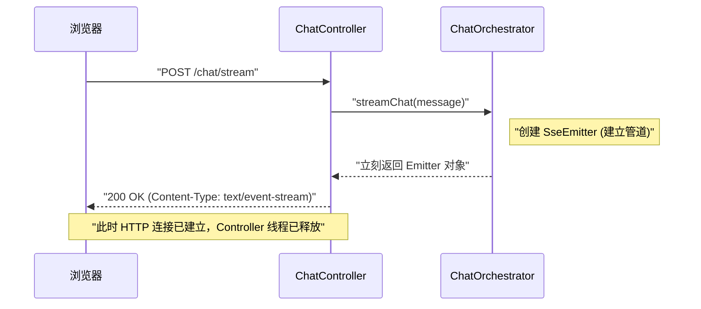
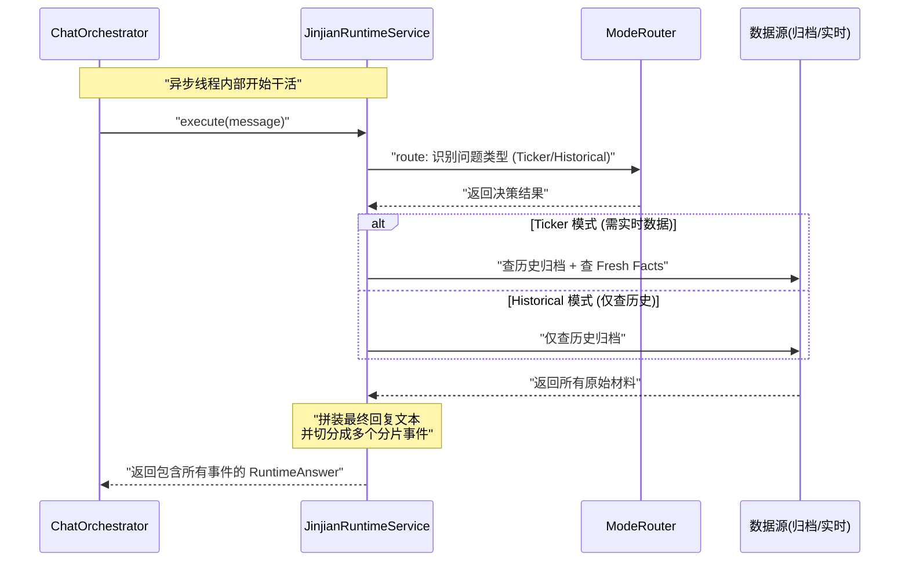
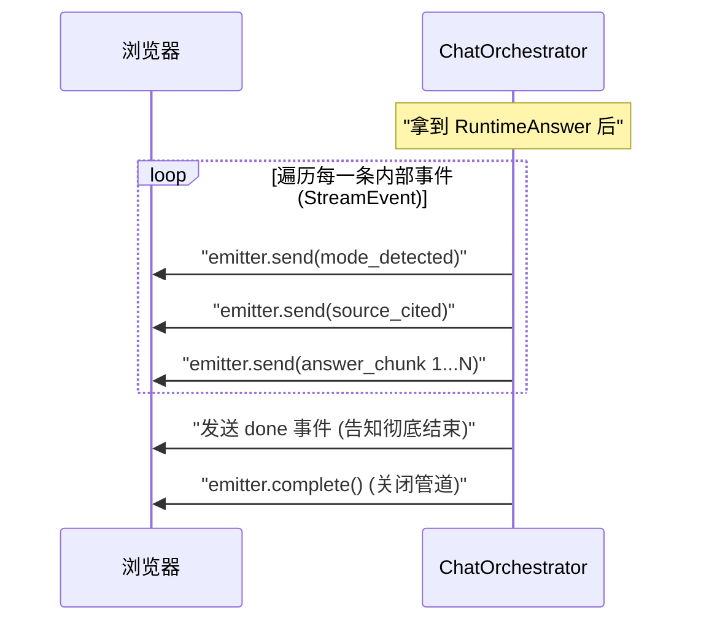

# ChatController streamChat 链路深度拆解

流式聊天接口的逻辑较长，我们将其拆分为：**一个总览 + 三个核心阶段**。

---

## 0. 总览：三大角色分工
在看具体代码前，先记住这三个角色的职责，这是理解整条链路的基石。

```mermaid
graph TD
    Client(前端/浏览器) -- 1. 发起 POST 请求 --> Controller[ChatController <br/> 负责接客, 快速响应]
    Controller -- 2. 调度异步任务 --> Orchestrator[ChatOrchestrator <br/> 负责流程控制, 吐出 SSE 事件]
    Orchestrator -- 3. 执行核心逻辑 --> Runtime[JinjianRuntimeService <br/> 负责查归档, 拿数据, 拼答案]
    Runtime -. 4. 返回完整答案 .-> Orchestrator
    Orchestrator -. 5. 推送流式分片 .-> Client
```

---

## 1. 第一阶段：请求接管与异步握手
**重点**：为什么 AI 思考很久，你的 Web 页面却不会卡死？
因为 Controller 把活儿扔给异步线程后就立刻“下班”了。



---

## 2. 第二阶段：AI 运行时核心逻辑 (The Brain)
**重点**：这一步在 `JinjianRuntimeService` 内部执行，是真正的“思考”过程。



---

## 3. 第三阶段：流式事件推送
**重点**：答案是怎么像打字机一样出来的？
Orchestrator 遍历 Runtime 准备好的事件，一个个塞进第一阶段建好的“管道”里。



---

## 总结：如果你要调试代码...
- **前端收不到任何返回**：查 `ChatController`。
- **SSE 连接秒断或超时**：查 `ChatOrchestrator` 的超时设置。
- **回答内容不对/没引用证据**：查 `JinjianRuntimeService` 和 `ModeRouter`。
- **打字机效果不流畅**：查 `JinjianRuntimeService` 里的文本切片逻辑。
